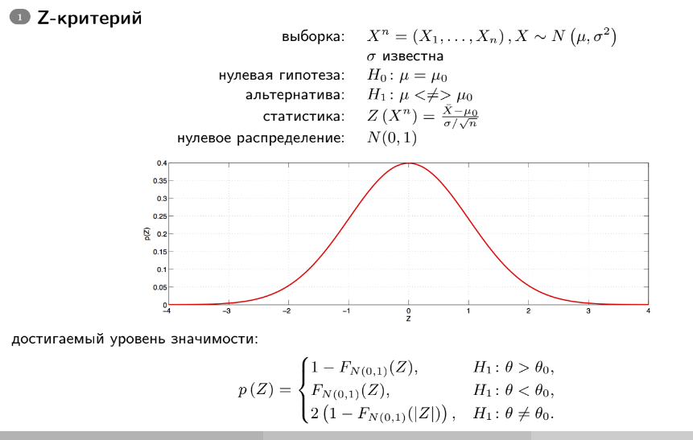
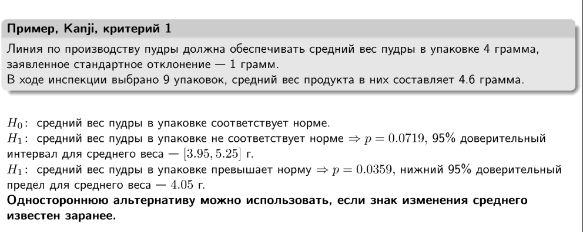
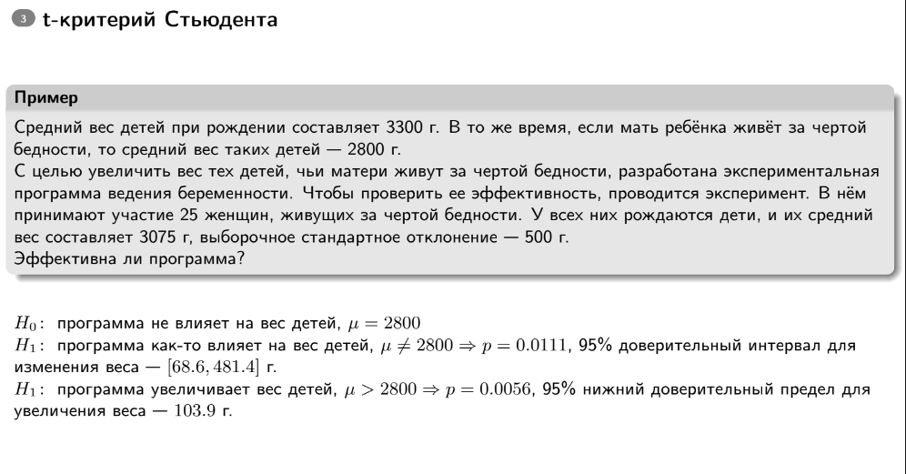
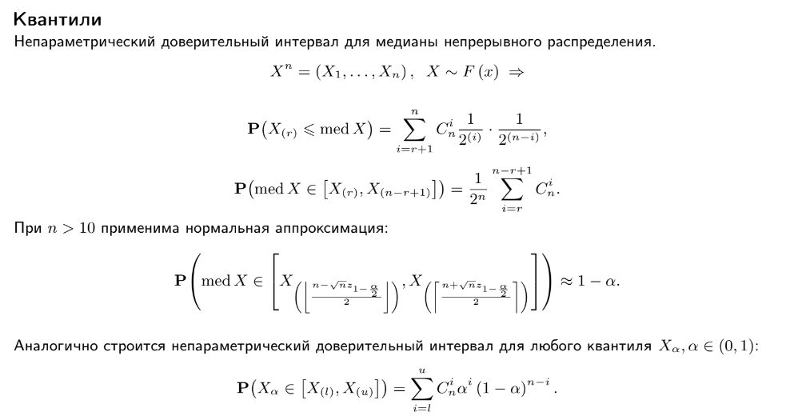
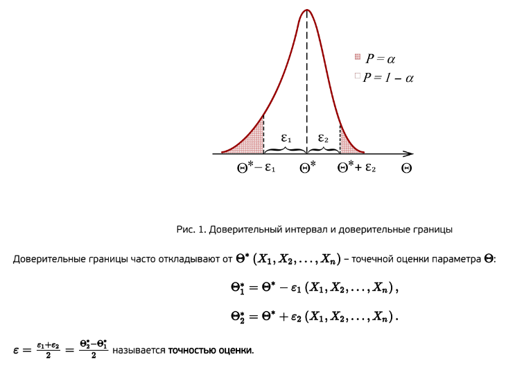

# Билет №2
2. [2. Проверка гипотез, критерии для среднего и доли, T-критерии и Z-критерии, доверительный интервал, P-value, параметрические и непараметрические критерии, бутстрэп метод]
2.1. [Проверка параметрических гипотез - общие обозначения. Виды задач. (слайды + САД-Практика-Задачи к практике Проверка статистических гипотез)](#13-проверка-параметрических-гипотез---общие-обозначения-виды-задач)
2.2. [Z-критерий. Условия для проведения проверки. Пример.(слайды)](#14-z-критерий-условия-для-проведения-проверки-пример)
2.3. [t-критерий Стьюдента. Условия для проведения проверки. Пример.](#16-t-критерий-стьюдента-условия-для-проведения-проверки-пример)
2.4. [Проверка непараметрических гипотез. Виды задач и варианты двухвыборочных гипотез.](#20-проверка-непараметрических-гипотез-виды-задач-и-варианты-двухвыборочных-гипотез)
2.5. [Квантили и построение доверительных интервалов. (слайды + САД-Практика (с теорией)-Статистические оценки параметров распределения)](#6-квантили-и-построение-доверительных-интервалов)
2.6. [Доверительные интервалы. Интервальные оценки с помощью квантилей. Правило двух сигм. Предсказательный интервал. Отличия предсказательного и доверительного интервалов](#7-доверительные-интервалы-интервальные-оценки-с-помощью-квантилей-правило-двух-сигм-предсказательный-интервал-отличия-предсказательного-и-доверительного-интервалов)
2.7. [Построение доверительных интервалов для среднего. z-интервал. t-интервал](#9-построение-доверительных-интервалов-для-среднего-z-интервал-t-интервал)
2.8. [Построение доверительных интервалов для доли.](#10-построение-доверительных-интервалов-для-доли)
2.9. [Построение доверительных интервалов для двух долей](#11-построение-доверительных-интервалов-для-двух-долей)
2.10. [Бутстреп и бутстреповский доверительный интервал. (слайды 51-56)](#12-бутстреп-и-бутстреповский-доверительный-интервал)


# БИЛЕТ №2
## 2. Проверка гипотез, критерии для среднего и доли, T-критерии и Z-критерии, доверительный интервал, P-value, параметрические и непараметрические критерии, бутстрэп метод

# ---

**Теория:**

- **Проверка гипотез**:
  - Нулевая гипотеза (\(H_0\)): базовое утверждение.
  - Альтернативная гипотеза (\(H_1\)): противоположное утверждение.

- **T-критерии и Z-критерии**:
  - T-тест: для малых выборок, неизвестна дисперсия.
  - Z-тест: для больших выборок, известна дисперсия.

- **P-value**:
  - Вероятность получить результаты, такие же экстремальные или более экстремальные, если \(H_0\) верна.

- **Бутстрэп**:
  - Метод переподборки для оценки параметров распределения.

**Код:**

```python
from scipy.stats import ttest_ind, norm

# Генерация данных
group1 = np.random.normal(50, 10, 30)
group2 = np.random.normal(55, 10, 30)

# T-тест
t_stat, p_val = ttest_ind(group1, group2)
print(f"T-статистика: {t_stat}, P-значение: {p_val}")

# Бутстрэп
bootstrap_samples = 1000
means = []
for _ in range(bootstrap_samples):
    sample = np.random.choice(group1, size=len(group1), replace=True)
    means.append(np.mean(sample))

plt.hist(means, bins=30, alpha=0.7)
plt.title("Бутстрэп распределение среднего")
plt.show()
```

---

## 2.1. Проверка параметрических гипотез - общие обозначения. Виды задач.


[Вернуться к вопросам](#ответы-на-вопросы-по-теории)

## 2.2. Z-критерий. Условия для проведения проверки. Пример.




Z-тест, известный также как z-критерий Фишера, представляет собой набор статистических методов для проверки гипотез, которые базируются на предположении о нормальном распределении данных. Эти методы часто используются для анализа, являются ли средние значения двух наборов данных одинаковыми, при условии, что дисперсия генеральной совокупности известна. Расчёт Z-статистики производится путём деления разности между анализируемой случайной величиной и её математическим ожиданием на стандартную ошибку этой величины:

$$z={\frac {{\overline {X}}-\,m}{\mathrm {SE} }}$$

где X случайная величина выборочного среднего, m - значение математического ожидания, SE - стандартная ошибка этой величины.

### Условия для проведения теста

Чтобы результаты Z-теста были валидными, необходимо использовать случайную выборку из генеральной совокупности. Случайная выборка дает репрезентативность данных, что важно для точности выводов, сделанных на основе статистического анализа.

Z-тест требует, чтобы анализируемые данные были непрерывными. Непрерывные данные могут принимать любое значение внутри определенного диапазона и часто измеряются с использованием дробных или десятичных чисел.

Данные должны следовать нормальному распределению. Однако благодаря центральной предельной теореме, это предположение можно игнорировать, если размер выборки достаточно велик , что позволяет распределению средних выборочных значений приближаться к нормальному распределению даже если распределение в генеральной совокупности отличается от нормального.

В случае сравнения двух выборок, Z-тест требует, чтобы выборки были независимы. Это означает, что данные одной выборки не должны влиять на данные другой.

Ну и наконец, необходимо знать стандартное отклонение генеральной совокупности. Это требование отличает Z-тест от t-теста, который используется, когда стандартное отклонение генеральной совокупности неизвестно.

### Пример



### Шаги решения задачи с помощью Z-критерия:

1. **Формулировка гипотез:**
   - **H0 (нулевая гипотеза):** Средний вес пудры в упаковке равен 4 граммам.
   - **H1 (альтернативная гипотеза):** Средний вес пудры в упаковке не равен 4 граммам.

2. **Известные данные:**
   - Средний вес в выборке (среднее выборочное) $\bar{x} = 4.6$ грамма.
   - Заявленное стандартное отклонение $\sigma = 1$ грамм.
   - Число наблюдений $n = 9$.

3. **Расчёт статистики Z:**
   Статистика Z для среднего значения вычисляется по формуле:
   
   $$Z = \frac{\bar{x} - \mu}{\frac{\sigma}{\sqrt{n}}}$$

   Где:
   - $\bar{x}$ — среднее выборочное (наблюдаемое среднее).
   - $\mu$ — гипотетическое среднее (в данном случае 4 грамма).
   - $\sigma$ — стандартное отклонение генеральной совокупности.
   - $n$ — размер выборки.

   Подставляя известные значения:

   $$Z = \frac{4.6 - 4}{\frac{1}{\sqrt{9}}} = \frac{0.6}{\frac{1}{3}} = 1.8$$

4. **Принятие решения:**
   - Для двусторонней альтернативы (когда проверяется не равенство 4 граммам) критическое значение Z для уровня значимости $\alpha = 0.05$ (двусторонняя проверка) составляет приблизительно 1.96.
   - Так как полученное значение Z (1.8) меньше критического значения (1.96), нет оснований отвергать нулевую гипотезу на уровне значимости 0.05. Это означает, что средний вес пудры в упаковке не отличается статистически значимо от заявленного норматива 4 грамма.

5. **Вывод:**
   - На основе Z-критерия можно заключить, что данных недостаточно, чтобы отвергнуть заявленную нулевую гипотезу о том, что средний вес пудры в упаковке равен 4 граммам.

[Вернуться к вопросам](#ответы-на-вопросы-по-теории)

## 2.3. t-критерий Стьюдента. Условия для проведения проверки. Пример.


t-критерий Стьюдента — общее название для класса методов статистической проверки гипотез (статистических критериев), основанных на распределении Стьюдента. Наиболее частые случаи применения t-критерия связаны с проверкой равенства средних значений в двух выборках.

t-статистика строится обычно по следующему общему принципу: в числителе — случайная величина с нулевым математическим ожиданием (при выполнении нулевой гипотезы), а в знаменателе — выборочное стандартное отклонение этой случайной величины, получаемое как квадратный корень из несмещённой оценки дисперсии.

### Условия для проведения проверки

Для применения данного критерия необходимо, чтобы выборочные средние имели нормальное распределение. При маленьких выборках это означает требование нормальности исходных значений. В случае применения двухвыборочного критерия для независимых выборок также необходимо соблюдение условия равенства дисперсий. Существуют, однако, альтернативы критерию Стьюдента для ситуации с неравными дисперсиями.

Также не вполне корректно применять t-критерий Стьюдента при наличии в данных значительного числа выбросов. При несоблюдении этих условий при сравнении выборочных средних должны использоваться аналогичные методы непараметрической статистики, среди которых наиболее известными являются U-критерий Манна — Уитни (в качестве двухвыборочного критерия для независимых выборок), а также критерий знаков и критерий Уилкоксона (используются в случаях зависимых выборок).

### Пример



1. **Формулировка гипотез:**
   - **H0 (нулевая гипотеза):** Программа не влияет на вес детей, средний вес равен 2800 г.
   - **H1 (альтернативная гипотеза):** Программа влияет на вес детей, средний вес отличается от 2800 г.

2. **Известные данные:**
   - Средний вес детей при рождении в контрольной группе (матери живут за чертой бедности): $\bar{x} = 3075$ г.
   - Выборочное стандартное отклонение в контрольной группе: $s = 500$ г.
   - Размер выборки (число наблюдений): $n = 25$.
   - Гипотетическое среднее (для нулевой гипотезы): $\mu_0 = 2800$ г.

3. **Вычисление статистики t:**
   Статистика t для среднего значения вычисляется по формуле:
   
   $$t = \frac{\bar{x} - \mu_0}{\frac{s}{\sqrt{n}}}$$

   Где:
   - $\bar{x}$ — среднее выборочное (наблюдаемое среднее).
   - $\mu_0$ — гипотетическое среднее (в данном случае 2800 г).
   - $s$ — выборочное стандартное отклонение.
   - $n$ — размер выборки.

   Подставляя известные значения:
   
   $$t = \frac{3075 - 2800}{\frac{500}{\sqrt{25}}} = \frac{275}{100} = 2.75$$

4. **Определение критической области и принятие решения:**
   - Для двусторонней альтернативы (когда проверяется не равенство 2800 г) и уровня значимости $\alpha = 0.05$, критическое значение t с 24 степенями свободы составляет примерно 2.064.
   - Так как полученное значение t (2.75) больше критического значения (2.064), мы отвергаем нулевую гипотезу на уровне значимости 0.05.
   - Это означает, что есть статистически значимые доказательства в пользу того, что программа влияет на вес детей, чьи матери живут за чертой бедности.

5. **Вывод:**
   - На основе t-критерия Стьюдента можно сделать вывод о статистической значимости эффекта программы на вес новорожденных детей.

[Вернуться к вопросам](#ответы-на-вопросы-по-теории)

## 2.4. Проверка непараметрических гипотез. Виды задач и варианты двухвыборочных гипотез.

Непараметрические гипотезы в статистике касаются тестов, которые не предполагают конкретную форму распределения данных. В отличие от параметрических методов, которые предполагают, что данные следуют определенному распределению (например, нормальному), непараметрические методы более гибки и могут использоваться для анализа данных, которые не подчиняются этим предположениям.

Вот несколько ключевых моментов о непараметрических гипотезах:

- Отсутствие предположений о распределении: Непараметрические методы не требуют предположений о форме распределения данных, что делает их полезными в ситуациях, когда форма распределения неизвестна или не является нормальной.

- Применение к малым выборкам: Эти методы часто применяются к малым выборкам, где параметрические методы могут быть ненадежными.

- Примеры тестов: К наиболее известным непараметрическим тестам относятся критерий знаков, критерий Манна-Уитни, критерий Краскела-Уоллиса и критерий Каплана-Мейера. Эти тесты используются для сравнения медиан, рангов или выживаемости между группами.

- Использование рангов: Многие непараметрические тесты основаны на ранжировании данных, что позволяет им быть устойчивыми к выбросам и отклонениям от нормальности.


[Вернуться к вопросам](#ответы-на-вопросы-по-теории)

## 2.5. Квантили и построение доверительных интервалов.

### Квантили



**Квантили** — это значения, разделяющие упорядоченный набор данных на равные доли. Например, медиана является вторым квартилем (т.е. 50%-квантилью).

### Выборочный $\alpha$-квантиль
Выборочный $\alpha$-квантиль $Q_\alpha$ — это значение, которое делит упорядоченную выборку так, что доля элементов выборки, меньших $Q_\alpha$, равна $\alpha$.

### Построение доверительных интервалов

**Доверительный интервал** — это интервал, который оценивает неизвестный параметр генеральной совокупности на основе выборочных данных с заданной вероятностью.

#### Параметрический метод

Параметрический метод используется, когда предполагается известная форма распределения данных и известные параметры этого распределения. Например, если данные приближаются нормальным распределением, то используются формулы для построения доверительных интервалов на основе стандартного нормального распределения или распределения Стьюдента в зависимости от известности или неизвестности дисперсии.

**Пример**

Доверительный интервал для среднего с известной дисперсией:
  $$\left( \overline{X} - z_{\alpha/2} \frac{\sigma}{\sqrt{n}}, \; \overline{X} + z_{\alpha/2} \frac{\sigma}{\sqrt{n}} \right)$$
  
  где $\overline{X}$ — выборочное среднее, $\sigma$ — известное стандартное отклонение, $z_{\alpha/2}$ — квантиль стандартного нормального распределения.

#### Наивный метод

Наивный метод (или метод "по-быстрому") используется без предположений о распределении данных или их параметрах. Он основывается на статистической интуиции и может быть применен в ситуациях, когда нет точной информации о распределении или мало данных для более сложных методов.

**Пример:**

Доверительный интервал для доли:
  $$\left( \hat{p} - z_{\alpha/2} \sqrt{\frac{\hat{p}(1 - \hat{p})}{n}}, \; \hat{p} + z_{\alpha/2} \sqrt{\frac{\hat{p}(1 - \hat{p})}{n}} \right)$$

  где $\hat{p}$ — выборочная доля, $z_{\alpha/2}$ — квантиль стандартного нормального распределения.

#### Бутстрэп

Бутстрэп — это метод, который позволяет оценить распределение выборочной статистики путем повторного выбора элементов из исходной выборки с возвращением. Этот метод особенно полезен, когда данные сложно распределены или необходимо оценить нестандартные статистики.

**Пример:**

Процесс бутстрэпа:
  1. Сгенерировать много подвыборок (бутстреп-выборок) из исходной выборки.
  2. Для каждой бутстреп-выборки вычислить интересующую статистику (например, среднее, медиану, долю и т.д.).
  3. Построить распределение статистики на основе бутстреп-выборок и вычислить доверительный интервал, например, через квантили полученного распределения.

Бутстрэп позволяет оценить доверительные интервалы для статистик даже в случае сложных данных или нестандартных распределений, где параметрические методы могут быть неприменимы.




[Вернуться к вопросам](#ответы-на-вопросы-по-теории)

## 2.6. Доверительные интервалы. Интервальные оценки с помощью квантилей. Правило двух сигм. Предсказательный интервал. Отличия предсказательного и доверительного интервалов.

### Доверительные интервалы

**Определение**

Доверительный интервал — это интервал значений, который с заданной вероятностью содержит истинное значение параметра генеральной совокупности. Он используется для оценки неизвестных параметров на основе выборочных данных.

### Интервальные оценки с помощью квантилей

**Определение**

Интервальные оценки с помощью квантилей используются для оценки диапазона значений параметра с заданной вероятностью.

**Пример использования**

Интервальная оценка с использованием квантилей может быть построена для среднего значения, медианы или других параметров на основе выборочных данных и соответствующих квантилей распределений.

### Правило двух сигм

Правило двух сигм основано на нормальном распределении данных и гласит, что примерно 95% всех наблюдений лежат в интервале, равном двум стандартным отклонениям в обе стороны от выборочного среднего.

### Предсказательный интервал

Предсказательный интервал используется для оценки диапазона значений будущего наблюдения или значения случайной величины с учетом неопределенности в данных или модели.

### Отличия предсказательного и доверительного интервалов
**Суть различия**

**Доверительный интервал** оценивает параметры генеральной совокупности с заданной вероятностью.

**Предсказательный интервал** оценивает будущие наблюдения или значения с учетом неопределенности в данных или модели.

[Вернуться к вопросам](#ответы-на-вопросы-по-теории)

## 2.7. Построение доверительных интервалов для среднего. z-интервал. t-интервал

### Построение доверительных интервалов для среднего

Построение доверительных интервалов для среднего состоит в нахождении интервала значений, в котором с определенной степенью уверенности (обычно 95% или 99%) находится истинное среднее значение генеральной совокупности. Этот процесс включает несколько шагов в зависимости от того, известна ли дисперсия генеральной совокупности и от размера выборки. 

### z-интервал

z-интервал используется для построения доверительного интервала для среднего, когда известна дисперсия генеральной совокупности и размер выборки достаточно большой (обычно $n > 30$).

#### Формула
Если $X_1, X_2, \ldots, X_n$ — выборка из нормального распределения с известной дисперсией $\sigma^2$, то доверительный интервал для среднего $\mu$ с уровнем доверия $(1 - \alpha)$ вычисляется по формуле:

$$\left( \overline{X} - z_{\alpha/2} \frac{\sigma}{\sqrt{n}}, \; \overline{X} + z_{\alpha/2} \frac{\sigma}{\sqrt{n}} \right)$$

- $\overline{X}$ — выборочное среднее,
- $\sigma$ — известное стандартное отклонение,
- $n$ — размер выборки,
- $z_{\alpha/2}$ — квантиль стандартного нормального распределения уровня $1 - \frac{\alpha}{2}$.

#### Пример
Пусть $\overline{X} = 100$, $\sigma = 15$, $n = 50$, и уровень доверия $95\%$ ($\alpha = 0.05$):

$$z_{0.025} \approx 1.96$$

$$\left( 100 - 1.96 \cdot \frac{15}{\sqrt{50}}, \; 100 + 1.96 \cdot \frac{15}{\sqrt{50}} \right)$$

$$\left( 100 - 4.15, \; 100 + 4.15 \right)$$

$$\left( 95.85, \; 104.15 \right)$$

### t-интервал

t-интервал используется для построения доверительного интервала для среднего, когда дисперсия генеральной совокупности неизвестна и размер выборки малый (обычно $n \leq 30$).

#### Формула
Если $X_1, X_2, \ldots, X_n$ — выборка из нормального распределения с неизвестной дисперсией, то доверительный интервал для среднего $\mu$ с уровнем доверия $(1 - \alpha)$ вычисляется по формуле:

$$ \left( \overline{X} - t_{\alpha/2, n-1} \frac{S}{\sqrt{n}}, \; \overline{X} + t_{\alpha/2, n-1} \frac{S}{\sqrt{n}} \right) $$

- $\overline{X}$ — выборочное среднее,
- $S$ — выборочное стандартное отклонение,
- $n$ — размер выборки,
- $t_{\alpha/2, n-1}$ — квантиль распределения Стьюдента с $n-1$ степенями свободы.

#### Пример
Пусть $\overline{X} = 100$, $S = 15$, $n = 20$, и уровень доверия $95\%$ ($\alpha = 0.05$):

$$t_{0.025, 19} \approx 2.093$$

$$\left( 100 - 2.093 \cdot \frac{15}{\sqrt{20}}, \; 100 + 2.093 \cdot \frac{15}{\sqrt{20}} \right)$$

$$\left( 100 - 7.01, \; 100 + 7.01 \right)$$

$$\left( 92.99, \; 107.01 \right)$$

[Вернуться к вопросам](#ответы-на-вопросы-по-теории)

## 2.8. Построение доверительных интервалов для доли.

Построение доверительного интервала для доли используется для оценки истинной доли (пропорции) в генеральной совокупности на основе выборочных данных. Доверительный интервал дает диапазон значений, в котором с заданной вероятностью находится истинная доля.

### Формула

Если $p$ — выборочная доля, $n$ — размер выборки, и $z_{\alpha/2}$ — квантиль стандартного нормального распределения уровня $1 - \frac{\alpha}{2}$, то доверительный интервал для истинной доли $P$ с уровнем доверия $(1 - \alpha)$ вычисляется по формуле:

$$\left( p - z_{\alpha/2} \sqrt{\frac{p(1 - p)}{n}}, \; p + z_{\alpha/2} \sqrt{\frac{p(1 - p)}{n}} \right)$$

где:
- $p = \frac{x}{n}$ — выборочная доля (отношение числа успехов $x$ к общему числу наблюдений $n$),
- $z_{\alpha/2}$ — квантиль стандартного нормального распределения уровня $1 - \frac{\alpha}{2}$.

### Пример
Пусть $x = 120$ — число успехов, $n = 200$ — размер выборки, и уровень доверия $95\%$ ($\alpha = 0.05$):

- Выборочная доля:

  $$p = \frac{120}{200} = 0.60$$

- Квантиль стандартного нормального распределения:

  $$z_{0.025} \approx 1.96$$

- Доверительный интервал:

  $$\left( 0.60 - 1.96 \sqrt{\frac{0.60 \cdot (1 - 0.60)}{200}}, \; 0.60 + 1.96 \sqrt{\frac{0.60 \cdot (1 - 0.60)}{200}} \right)$$

  $$\left( 0.60 - 1.96 \sqrt{\frac{0.24}{200}}, \; 0.60 + 1.96 \sqrt{\frac{0.24}{200}} \right)$$

  $$\left( 0.60 - 1.96 \sqrt{0.0012}, \; 0.60 + 1.96 \sqrt{0.0012} \right)$$

  $$\left( 0.60 - 1.96 \cdot 0.0346, \; 0.60 + 1.96 \cdot 0.0346 \right)$$

  $$\left( 0.60 - 0.0678, \; 0.60 + 0.0678 \right)$$

  $$\left( 0.5322, \; 0.6678 \right)$$

Таким образом, с уровнем доверия $95\%$ истинная доля находится в интервале от $0.5322$ до $0.6678$.

## Условия применения
- Размер выборки должен быть достаточно большим, чтобы центральная предельная теорема была применима (обычно $np \geq 5$ и $n(1 - p) \geq 5$).
- Выборка должна быть случайной и независимой.

[Вернуться к вопросам](#ответы-на-вопросы-по-теории)

## 2.9. Построение доверительных интервалов для двух долей

Построение доверительного интервала для разности двух долей используется для оценки разности между двумя пропорциями (долями) в двух независимых выборках. Доверительный интервал дает диапазон значений, в котором с заданной вероятностью находится истинная разность долей.

### Формула
Пусть $p_1$ и $p_2$ — выборочные доли из двух независимых выборок размером $n_1$ и $n_2$ соответственно, и $z_{\alpha/2}$ — квантиль стандартного нормального распределения уровня $1 - \frac{\alpha}{2}$. Тогда доверительный интервал для разности истинных долей $P_1 - P_2$ с уровнем доверия $(1 - \alpha)$ вычисляется по формуле:

$$\left( (p_1 - p_2) - z_{\alpha/2} \sqrt{\frac{p_1(1 - p_1)}{n_1} + \frac{p_2(1 - p_2)}{n_2}}, \; (p_1 - p_2) + z_{\alpha/2} \sqrt{\frac{p_1(1 - p_1)}{n_1} + \frac{p_2(1 - p_2)}{n_2}} \right)$$

где:
- $p_1 = \frac{x_1}{n_1}$ — выборочная доля первой выборки (отношение числа успехов $x_1$ к общему числу наблюдений $n_1$),
- $p_2 = \frac{x_2}{n_2}$ — выборочная доля второй выборки (отношение числа успехов $x_2$ к общему числу наблюдений $n_2$),
- $z_{\alpha/2}$ — квантиль стандартного нормального распределения уровня $1 - \frac{\alpha}{2}$.

### Пример
Пусть $x_1 = 120$ — число успехов в первой выборке размером $n_1 = 200$, $x_2 = 150$ — число успехов во второй выборке размером $n_2 = 250$, и уровень доверия $95\%$ ($\alpha = 0.05$):
- Выборочная доля первой выборки:

  $$p_1 = \frac{120}{200} = 0.60$$

- Выборочная доля второй выборки:

  $$p_2 = \frac{150}{250} = 0.60$$

- Квантиль стандартного нормального распределения:

  $$z_{0.025} \approx 1.96$$

- Доверительный интервал:

  $$\left( (0.60 - 0.60) - 1.96 \sqrt{\frac{0.60(1 - 0.60)}{200} + \frac{0.60(1 - 0.60)}{250}}, \; (0.60 - 0.60) + 1.96 \sqrt{\frac{0.60(1 - 0.60)}{200} + \frac{0.60(1 - 0.60)}{250}} \right)$$

  $$\left( 0 - 1.96 \sqrt{\frac{0.24}{200} + \frac{0.24}{250}}, \; 0 + 1.96 \sqrt{\frac{0.24}{200} + \frac{0.24}{250}} \right)$$

  $$\left( 0 - 1.96 \sqrt{0.0012 + 0.00096}, \; 0 + 1.96 \sqrt{0.0012 + 0.00096} \right)$$

  $$\left( 0 - 1.96 \sqrt{0.00216}, \; 0 + 1.96 \sqrt{0.00216} \right)$$

  $$\left( 0 - 1.96 \cdot 0.0465, \; 0 + 1.96 \cdot 0.0465 \right)$$

  $$\left( -0.0911, \; 0.0911 \right)$$

Таким образом, с уровнем доверия $95\%$ истинная разность долей находится в интервале от $-0.0911$ до $0.0911$.

### Условия применения
- Размер выборок должен быть достаточно большим, чтобы центральная предельная теорема была применима (обычно $n_1 p_1 \geq 5$, $n_1 (1 - p_1) \geq 5$, $n_2 p_2 \geq 5$, и $n_2 (1 - p_2) \geq 5$).
- Выборки должны быть случайными и независимыми.

[Вернуться к вопросам](#ответы-на-вопросы-по-теории)

## 2.10. Бутстреп и бутстреповский доверительный интервал.


## Бутстреп и бутстреповский доверительный интервал

Бутстреп (bootstrap) — это метод, который используется для оценки распределения выборочной статистики путём многократного извлечения выборок из исходной выборки с возвращением. Он позволяет оценивать стандартные ошибки и доверительные интервалы для различных статистик без необходимости предполагать конкретное распределение исходной генеральной совокупности.

### Принцип работы бутстрепа:

1. **Исходная выборка**: Представляет собой набор данных, доступных для анализа.

2. **Ресемплирование с замещением**: Из исходной выборки случайным образом выбираются выборки того же размера, что и исходная, с замещением (то есть одни и те же элементы могут попасть в бутстрепную выборку несколько раз).

3. **Вычисление статистики интереса**: На каждой бутстрепной выборке вычисляется статистика интереса (например, среднее значение, медиана, стандартное отклонение и т.д.).

4. **Формирование распределения**: Собираются значения статистики интереса из множества бутстрепных выборок.

5. **Оценка доверительного интервала**: На основе полученного распределения вычисляются квантили для получения доверительного интервала заданного уровня.

### Преимущества бутстрепа:

- **Непараметрический метод**: Не требует предположений о форме распределения исходной генеральной совокупности.
- **Универсальность**: Может быть применён для оценки практически любой статистики, включая квантили, корреляции, регрессионные коэффициенты и другие.
- **Робастность**: Обычно дает хорошие результаты даже при наличии небольших выборок или выбросов.

### Пример бутстреповского доверительного интервала:

Предположим, что у нас есть выборка размера $n$, и мы хотим построить 95%-й бутстреповский доверительный интервал для среднего значения. Мы бы ресемплировали выборки из исходной выборки, вычисляли бы среднее значение на каждой бутстрепной выборке и затем находили бы 2.5% и 97.5% квантили полученного распределения для получения доверительного интервала.

[Вернуться к вопросам](#ответы-на-вопросы-по-теории)
