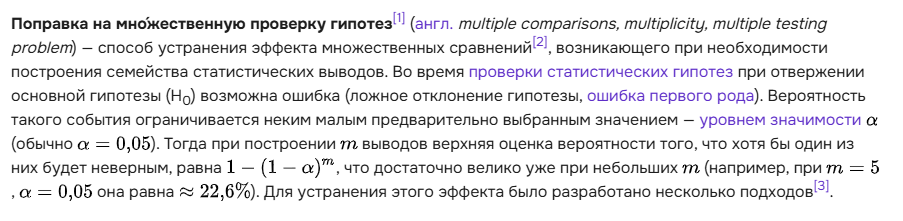
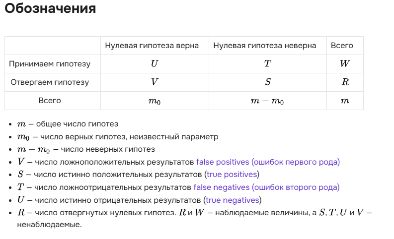
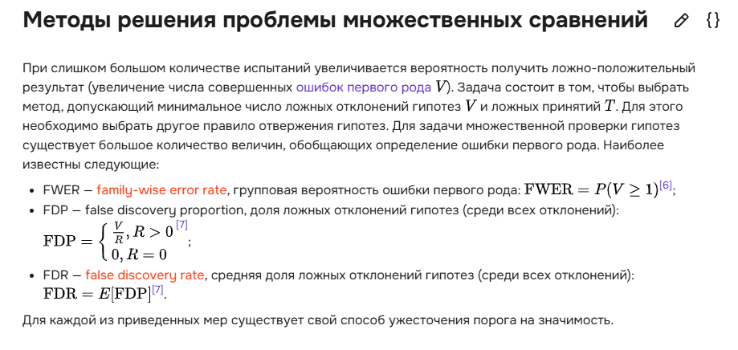
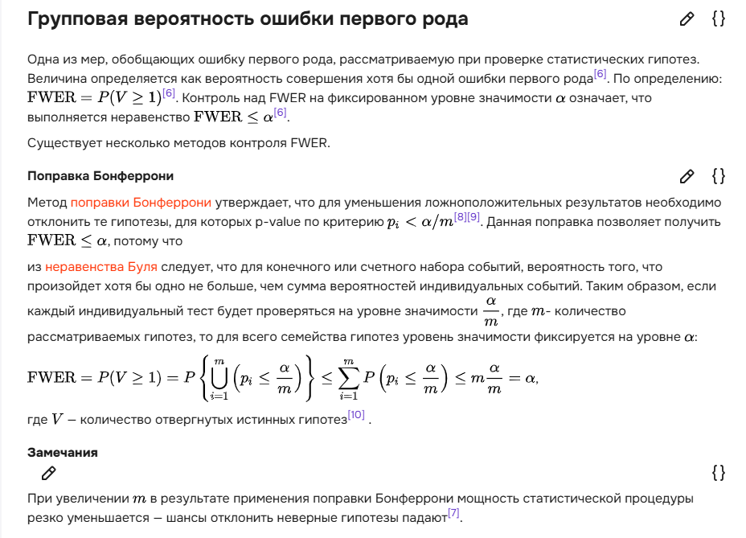
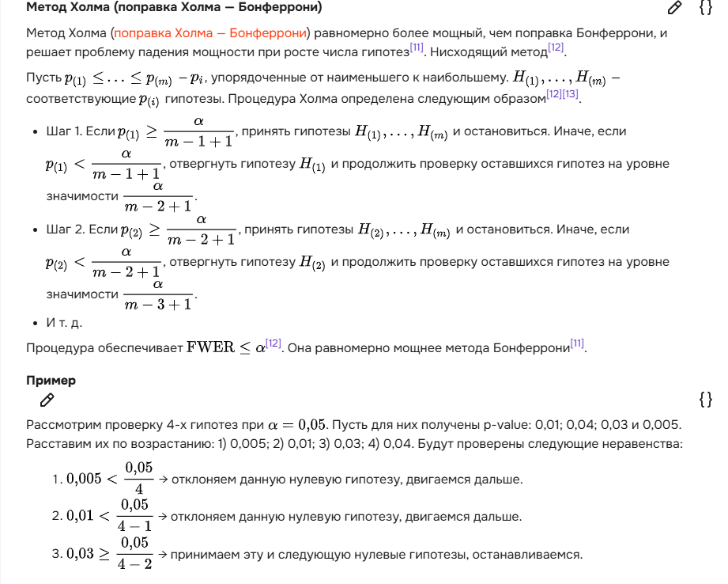
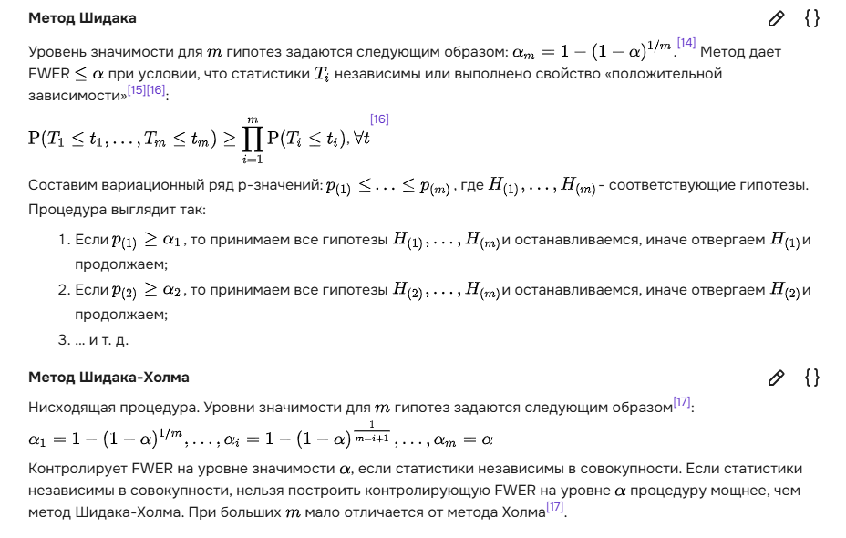
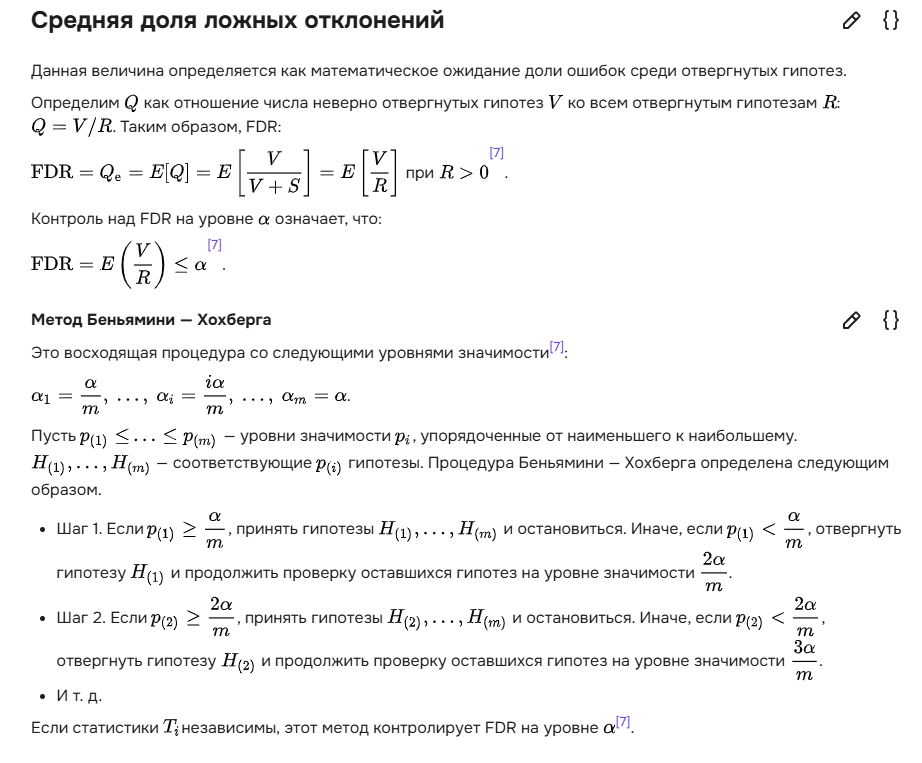
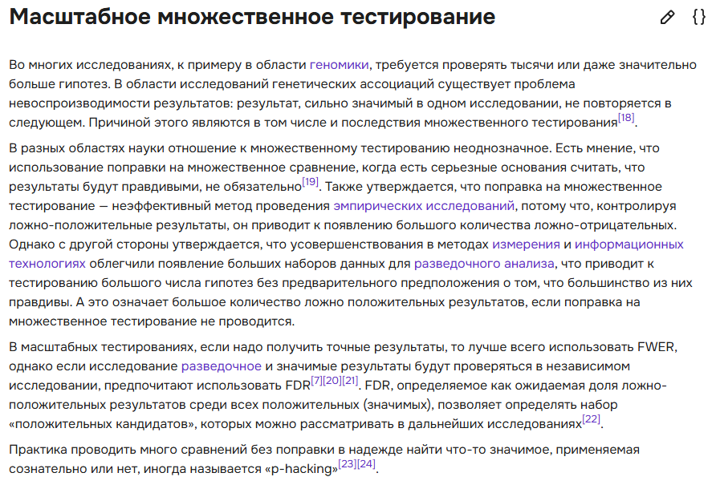

# Билет №3( здесь нужно по максимуму дописать тк совсем нет нужной инфы)
3. [Множественная проверка гипотез, поправки, плюсы и минусы использования]


## БИЛЕТ №3

## 3. **Множественная проверка гипотез, поправки, плюсы и минусы использования**
# ---

**Теория:**

- Проблема множественной проверки: увеличение ложноположительных результатов.
- **Поправки**:
  - Метод Бонферрони.
  - Метод Холма.
  - FDR (False Discovery Rate).
  
- **Плюсы и минусы**:
  - Плюсы: уменьшение ложных открытий.
  - Минусы: уменьшение статистической мощности.

**Код:**

```python
from statsmodels.stats.multitest import multipletests

# Генерация p-значений
p_values = np.random.uniform(0, 0.1, 20)
adjusted_p = multipletests(p_values, method='bonferroni')[1]

print("Оригинальные P-значения:", p_values)
print("Поправленные P-значения:", adjusted_p)
```

# ---






















