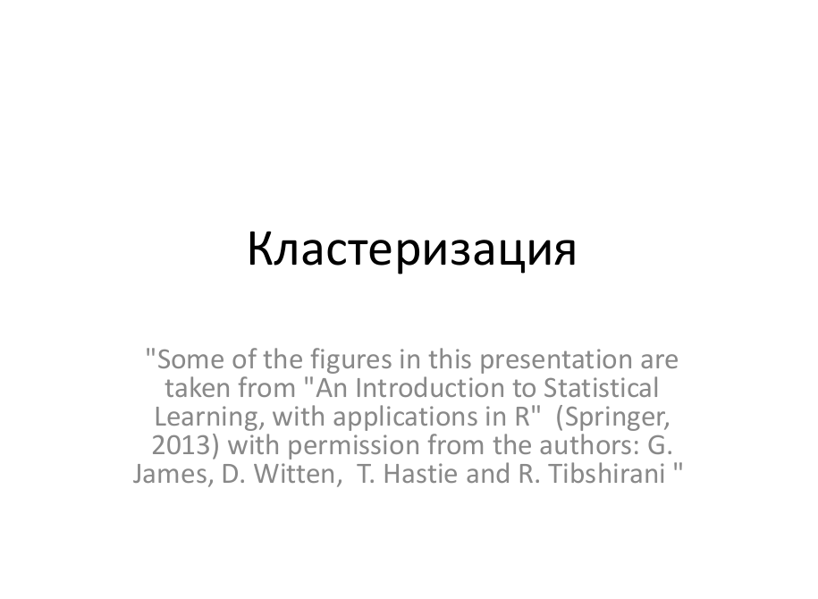
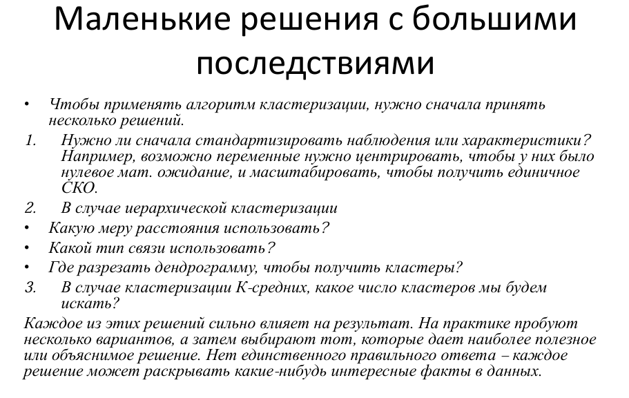

# Билет №5
## 5. Кластеризация, типы: метрические, модельные, иерархические, плюсы/минусы. Гиперпараметры, методы поиска гиперпараметров, внешняя и внутренняя оценка качества.


# БИЛЕТ №5
## 5. --- **Кластеризация, типы: метрические, модельные, иерархические, плюсы/минусы. Гиперпараметры, методы поиска гиперпараметров, внешняя и внутренняя оценка качества.**

# ---

**Теория:**

- **Кластеризация**:
  - Разделение данных на группы (кластеры) на основе сходства.
  
- **Типы кластеризации**:
  1. **Метрическая** (например, K-средних):
     - Использует расстояние между точками.
     - Плюсы: простота.
     - Минусы: чувствительность к шуму и выбросам.
  2. **Модельная** (например, Gaussian Mixture Models):
     - Предполагает вероятностную модель для кластеров.
     - Плюсы: более гибкие.
     - Минусы: сложность выбора модели.
  3. **Иерархическая**:
     - Построение дерева кластеров (дендрограммы).
     - Плюсы: визуализация.
     - Минусы: вычислительная сложность.

- **Гиперпараметры**:
  - Количество кластеров (K).
  - Расстояния (евклидово, косинусное).

- **Методы оценки качества кластеризации**:
  - **Внутренние**: силуэт, инерция.
  - **Внешние**: ARI, NMI (если известна разметка).

**Код:**

```python
from sklearn.cluster import KMeans
from sklearn.metrics import silhouette_score
from sklearn.datasets import make_blobs

# Генерация данных
X, y = make_blobs(n_samples=300, centers=4, cluster_std=0.6, random_state=42)

# K-средних
kmeans = KMeans(n_clusters=4, random_state=42)
y_kmeans = kmeans.fit_predict(X)

# Визуализация
plt.scatter(X[:, 0], X[:, 1], c=y_kmeans, cmap='viridis', alpha=0.6)
plt.scatter(kmeans.cluster_centers_[:, 0], kmeans.cluster_centers_[:, 1], s=300, c='red', marker='X')
plt.title("Кластеризация K-средних")
plt.show()

# Силуэт
sil_score = silhouette_score(X, y_kmeans)
print(f"Силуэт оценка: {sil_score}")
```

# ---






# Гиперпараметрический поиск и оптимизация моделей

При создании моделей машинного обучения существует одна важная составляющая, которая часто остается за кадром, но имеет решающее значение для достижения высокой производительности и точности — это гиперпараметры.

Как архитекторы строят основу для здания, так и выбор гиперпараметров определяет фундамент для моделей машинного обучения. Гиперпараметры — это параметры, которые настраиваются до начала процесса обучения и определяют как саму структуру модели, так и способ её обучения. Их правильный выбор может значительно повлиять на результаты обучения, тогда как неправильно подобранные значения гиперпараметров могут привести к нежелательным и недооцененным моделям.

Способность модели к обобщению данных — ключевой аспект, определяющий её ценность в реальных задачах. Гиперпараметры влияют на эту способность, играя роль "регуляторов" модели. Правильно подобранные гиперпараметры помогают сбалансировать между "подгонкой" модели под обучающие данные (переобучение) и слишком обобщенным представлением, которое может упустить важные закономерности (недообучение).

Основы гиперпараметров
1. Определение гиперпараметров и их отличие от параметров модели
Гиперпараметры и параметры — это два ключевых аспекта, которые формируют модель машинного обучения. Они играют разные роли в процессе обучения и влияют на поведение и производительность модели.

**Гиперпараметры** — это настройки модели, которые определяют её общую структуру и способ обучения. Эти параметры устанавливаются до начала процесса обучения и не изменяются в процессе обучения модели. Гиперпараметры оказывают влияние на то, как модель будет обучаться, какие признаки будут учитываться, и какие ограничения будут наложены на процесс обучения. Примерами гиперпараметров могут быть количество слоев и нейронов в нейронной сети, скорость обучения, шаг градиентного спуска, коэффициент регуляризации и т.д.

Параметры модели, с другой стороны, являются внутренними весами или коэффициентами, которые модель обучает в процессе обучения на основе обучающих данных. Эти параметры изменяются в процессе обучения с целью минимизации функции потерь и достижения наилучшего соответствия между прогнозами модели и реальными значениями целевой переменной. В случае нейронных сетей, параметры включают веса между нейронами в разных слоях.

Различие между гиперпараметрами и параметрами модели заключается в том, что гиперпараметры задаются вручную до начала обучения и определяют характеристики всего процесса обучения, в то время как параметры модели вычисляются в процессе обучения на основе данных и оптимизируются для достижения наилучшей производительности. Гиперпараметры можно сравнить с настройками инструмента, с помощью которого вы создаете модель, а параметры модели - это результат работы этого инструмента на конкретных данных.

Понимание разницы между гиперпараметрами и параметрами модели является ключевым для правильного настройки моделей машинного обучения и достижения оптимальных результатов.

2. Примеры типичных гиперпараметров для разных алгоритмов
Каждый алгоритм машинного обучения имеет свои особенности и требует настройки определенных параметров, чтобы обеспечить оптимальное обучение и предсказания. Некоторые примеры типичных гиперпараметров для различных алгоритмов:

**Случайный лес (Random Forest)**:

**Количество деревьев (n_estimators)**: Определяет, сколько деревьев будет построено в ансамбле.

**Максимальная глубина деревьев (max_depth)**: Ограничивает глубину каждого дерева, предотвращая переобучение.

**Минимальное количество объектов в листе (min_samples_leaf)**: Задает минимальное количество объектов, которые должны находиться в каждом листе дерева.

**Максимальное количество признаков для разбиения (max_features)**: Определяет максимальное количество признаков, которые рассматриваются при каждом разбиении узла.

**Метод опорных векторов (SVM)**:

**Параметр регуляризации (C)**: Определяет баланс между настройкой модели под обучающие данные и минимизацией ошибки на тестовых данных.

**Тип функции ядра (kernel)**: Выбор функции, которая преобразует данные в пространство более высокой размерности.

**Параметр ядра (gamma)**: Влияет на "гладкость" границы решения, контролируя радиус влияния одного образца.

## Нейронные сети:

**Количество слоев и нейронов в каждом слое**: Определяет архитектуру нейронной сети и её способность обобщать данные.

**Скорость обучения (learning rate)**: Управляет размером шага градиентного спуска при обновлении весов нейронов.

**Функции активации**: Определяют, как нейроны будут "возбуждаться" при передаче сигнала.

**Градиентный бустинг (Gradient Boosting)**:

**Количество деревьев (n_estimators)**: Определяет, сколько деревьев будет добавлено в ансамбль.

**Шаг обучения (learning rate)**: Контролирует вес нового дерева при добавлении его в ансамбль.

**Максимальная глубина деревьев (max_depth)**: Предотвращает переобучение ансамбля путем ограничения глубины деревьев.


# **Гиперпараметрический поиск: Стратегии и методы**
Выбор подходящих гиперпараметров — это чрезвычайно важный этап в создании моделей машинного обучения. Неправильный выбор гиперпараметров может привести к неудовлетворительным результатам, долгим сессиям обучения и переобучению. В этой секции мы рассмотрим несколько распространенных стратегий и методов для эффективного гиперпараметрического поиска и оптимизации.

**Решетчатый (Grid Search) подход**
Один из наиболее распространенных способов настройки гиперпараметров — это решетчатый подход. Этот метод предполагает задание наборов значений для каждого гиперпараметра, которые затем "перебираются" систематически для нахождения наилучшей комбинации. Для каждой комбинации гиперпараметров производится обучение модели и оценка её производительности на валидационных данных.

Пример кода на Python:

```
from sklearn.model_selection import GridSearchCV
from sklearn.ensemble import RandomForestClassifier

# Определение параметров и их значений для перебора
param_grid = {
    'n_estimators': [50, 100, 150],
    'max_depth': [None, 10, 20],
    'min_samples_leaf': [1, 2, 4]
}

# Создание модели и настройка с использованием решетчатого поиска
rf_model = RandomForestClassifier()
grid_search = GridSearchCV(rf_model, param_grid, cv=5)
grid_search.fit(X_train, y_train)

# Вывод наилучших гиперпараметров и оценки
print("Best Hyperparameters:", grid_search.best_params_)
print("Best Cross-Validation Score:", grid_search.best_score_)
```
Плюсы решетчатого подхода в том, что он гарантирует полный перебор всех заданных комбинаций гиперпараметров, что может помочь найти наилучшие значения. Однако это может быть очень ресурсозатратным, особенно при большом числе гиперпараметров и значений.

Случайный поиск (Random Search) гиперпараметров
Другой метод — это случайный поиск гиперпараметров. Вместо того чтобы перебирать все комбинации, случайный поиск выбирает случайные наборы значений для каждого гиперпараметра. Этот метод может быть более эффективным по времени, так как он обычно требует меньше итераций, чтобы найти хорошие значения.


Пример кода на Python:
```
from sklearn.model_selection import RandomizedSearchCV
from sklearn.ensemble import RandomForestClassifier
from scipy.stats import randint

# Определение диапазонов значений для случайного поиска
param_dist = {
    'n_estimators': randint(50, 200),
    'max_depth': [None, 10, 20, 30, 40, 50],
    'min_samples_leaf': [1, 2, 4]
}

# Создание модели и настройка с использованием случайного поиска
rf_model = RandomForestClassifier()
random_search = RandomizedSearchCV(rf_model, param_distributions=param_dist, n_iter=100, cv=5)
random_search.fit(X_train, y_train)

# Вывод наилучших гиперпараметров и оценки
print("Best Hyperparameters:", random_search.best_params_)
print("Best Cross-Validation Score:", random_search.best_score_)
Случайный поиск может быть эффективнее в поиске оптимальных гиперпараметров, особенно когда ресурсы ограничены. Однако есть вероятность упустить некоторые комбинации, которые могли бы быть лучшими.
```


Оптимизация с использованием байесовских методов (Bayesian Optimization)
**Байесовская оптимизация** — это метод, который сочетает вероятностные модели с методами оптимизации для эффективного поиска оптимальных гиперпараметров. Он основан на идее моделирования функции оценки производительности модели и использования этой модели для выбора следующей точки для оценки. Байесовская оптимизация часто требует меньше итераций, чем решетчатый или случайный поиск, чтобы достичь лучших результатов.


Пример кода на Python с использованием библиотеки scikit-optimize:
```
from skopt import BayesSearchCV
from skopt.space import Integer, Real

# Определение пространства поиска гиперпараметров
param_space = {
    'n_estimators': Integer(50, 200),
    'max_depth': Integer(10, 50),
    'min_samples_leaf': Integer(1, 4),
    'max_features': Real(0.1, 1.0, prior='uniform')
}

# Создание модели и настройка с использованием байесовской оптимизации
rf_model = RandomForestClassifier()
bayes_search = BayesSearchCV(rf_model, param_space, n_iter=50, cv=5)
bayes_search.fit(X_train, y_train)

# Вывод наилучших гиперпараметров и оценки
print("Best Hyperparameters:", bayes_search.best_params_)
print("Best Cross-Validation Score:", bayes_search.best_score_)
```


Применение алгоритмов глубокого обучения для гиперпараметрического поиска
Глубокие нейронные сети могут быть использованы для оптимизации гиперпараметров. Например, можно использовать рекуррентные нейронные сети или сверточные нейронные сети для предсказания производительности модели с разными гиперпараметрами. Этот метод требует большого объема вычислительных ресурсов, но он может быть эффективным для сложных моделей.


Пример кода на Python (концептуальный пример):
```
from tensorflow.keras.models import Sequential
from tensorflow.keras.layers import Dense
from sklearn.metrics import accuracy_score

# Создание функции для оценки производительности модели с разными гиперпараметрами
def evaluate_model(params):
    model = Sequential()
    model.add(Dense(params['units'], activation='relu', input_shape=(input_dim,)))
    model.add(Dense(num_classes, activation='softmax'))
    model.compile(optimizer='adam', loss='categorical_crossentropy', metrics=['accuracy'])

    model.fit(X_train, y_train, epochs=params['epochs'], batch_size=params['batch_size'], verbose=0)
    y_pred = model.predict(X_val)
    accuracy = accuracy_score(np.argmax(y_val, axis=1), np.argmax(y_pred, axis=1))
    return -accuracy  # Минимизация

# Пространство поиска гиперпараметров
param_space = {
    'units': (16, 256),
    'epochs': (10, 100),
    'batch_size': (16, 128)
}

# Использование метода оптимизации (например, генетический алгоритм или оптимизация через градиент)
optimized_params = optimize_method(evaluate_model, param_space)

print("Optimal Hyperparameters:", optimized_params)
```


Выбор метода зависит от доступных ресурсов, сложности модели и поставленной задачи. Опыт и эксперименты помогут вам найти наилучший способ настройки гиперпараметров для вашей задачи.

Инструменты для гиперпараметрического поиска в Python
Scikit-learn: использование GridSearchCV и RandomizedSearchCV
Scikit-learn — одна из наиболее популярных библиотек для машинного обучения в Python. Она предоставляет удобные инструменты для гиперпараметрического поиска, такие как GridSearchCV и RandomizedSearchCV.

GridSearchCV позволяет провести решетчатый поиск по заданным наборам гиперпараметров. Этот метод применяет кросс-валидацию для каждой комбинации гиперпараметров и выбирает наилучшие.

Пример использования GridSearchCV для модели случайного леса:
```
from sklearn.model_selection import GridSearchCV
from sklearn.ensemble import RandomForestClassifier

param_grid = {
    'n_estimators': [50, 100, 150],
    'max_depth': [None, 10, 20],
    'min_samples_leaf': [1, 2, 4]
}

rf_model = RandomForestClassifier()
grid_search = GridSearchCV(rf_model, param_grid, cv=5)
grid_search.fit(X_train, y_train)

best_params = grid_search.best_params_
best_score = grid_search.best_score_
```
RandomizedSearchCV работает аналогично, но вместо перебора всех возможных комбинаций случайным образом выбирает заданное количество наборов гиперпараметров.


Пример использования RandomizedSearchCV:
```
from sklearn.model_selection import RandomizedSearchCV
from sklearn.ensemble import RandomForestClassifier
from scipy.stats import randint

param_dist = {
    'n_estimators': randint(50, 200),
    'max_depth': [None, 10, 20, 30, 40, 50],
    'min_samples_leaf': [1, 2, 4]
}

rf_model = RandomForestClassifier()
random_search = RandomizedSearchCV(rf_model, param_distributions=param_dist, n_iter=100, cv=5)
random_search.fit(X_train, y_train)

best_params = random_search.best_params_
best_score = random_search.best_score_
```
Эти методы из scikit-learn предоставляют удобные способы поиска оптимальных гиперпараметров, но они ограничены в выборе стратегий оптимизации.


Hyperopt: библиотека для оптимизации гиперпараметров с использованием байесовского метода
Hyperopt — библиотека, которая предоставляет гибкий подход к гиперпараметрическому поиску с использованием байесовской оптимизации. Этот метод основан на моделировании функции оценки производительности и выборе следующего набора гиперпараметров на основе вероятностной модели.

Пример использования Hyperopt:
```
from hyperopt import hp, fmin, tpe, Trials

space = {
    'n_estimators': hp.choice('n_estimators', [50, 100, 150]),
    'max_depth': hp.choice('max_depth', [None, 10, 20]),
    'min_samples_leaf': hp.choice('min_samples_leaf', [1, 2, 4])
}

def objective(params):
    model = RandomForestClassifier(**params)
    score = cross_val_score(model, X_train, y_train, cv=5).mean()
    return -score

trials = Trials()
best = fmin(fn=objective, space=space, algo=tpe.suggest, max_evals=100, trials=trials)
```
Hyperopt позволяет использовать различные алгоритмы для оптимизации (в данном случае, tpe.suggest), и его гибкий подход делает его подходящим для сложных задач.


Optuna: библиотека для автоматической оптимизации гиперпараметров
**Optuna** — это библиотека, которая предоставляет высокоуровневый интерфейс для оптимизации гиперпараметров. Она использует адаптивное методологическое пространство для эффективного поиска оптимальных значений.

Пример использования Optuna:
```
import optuna

def objective(trial):
    n_estimators = trial.suggest_int('n_estimators', 50, 200)
    max_depth = trial.suggest_categorical('max_depth', [None, 10, 20, 30, 40, 50])
    min_samples_leaf = trial.suggest_categorical('min_samples_leaf', [1, 2, 4])

    model = RandomForestClassifier(n_estimators=n_estimators, max_depth=max_depth, min_samples_leaf=min_samples_leaf)
    score = cross_val_score(model, X_train, y_train, cv=5).mean()
    return score

study = optuna.create_study(direction='maximize')
study.optimize(objective, n_trials=100)

best_params = study.best_params
best_score = study.best_value
```
Optuna обеспечивает удобство в использовании и поддерживает разнообразные стратегии оптимизации.


Рекомендации по гиперпараметрическому поиску
Определение диапазонов гиперпараметров на основе предварительного анализа
Прежде чем начать гиперпараметрический поиск, важно провести предварительный анализ данных и задачи. Изучите характеристики ваших данных, исследуйте различные аспекты задачи, такие как количество признаков, баланс классов и тип задачи (классификация или регрессия). Это поможет вам определить диапазоны значений для гиперпараметров, которые имеют смысл для вашей задачи.

Например, если вы работаете с алгоритмом случайного леса, вы можете рассмотреть следующие подходы к определению диапазонов:
```
# Определение диапазонов гиперпараметров на основе анализа данных
n_estimators_range = [50, 100, 150, 200]
max_depth_range = [None, 10, 20, 30]
min_samples_leaf_range = [1, 2, 4]
Выбор критерия оценки для сравнения моделей с разными гиперпараметрами
Оценка производительности моделей с разными гиперпараметрами является сложной задачей. Выбор подходящего критерия оценки зависит от задачи и данных. Для задач классификации, например, можно использовать метрики, такие как точность (accuracy), полноту (recall), точность (precision) и F1-меру.

from sklearn.metrics import accuracy_score, precision_score, recall_score, f1_score

# Пример вычисления различных метрик
y_pred = model.predict(X_val)
accuracy = accuracy_score(y_val, y_pred)
precision = precision_score(y_val, y_pred)
recall = recall_score(y_val, y_pred)
f1 = f1_score(y_val, y_pred)

print("Accuracy:", accuracy)
print("Precision:", precision)
print("Recall:", recall)
print("F1-Score:", f1)
```
Выбор критерия оценки также зависит от бизнес-целей задачи. Если вы сталкиваетесь с задачей детекции редких событий, то может быть важно сосредоточиться на максимизации полноты, чтобы убедиться, что вы не упускаете важные случаи.


# Кросс-валидация и оценка стабильности производительности модели
**Кросс-валидация** — важный инструмент для оценки производительности моделей с разными гиперпараметрами. Она позволяет оценить, насколько хорошо модель generalizует на новых данных. При настройке гиперпараметров всегда используйте кросс-валидацию, чтобы избежать переобучения.

Пример использования кросс-валидации:
```
from sklearn.model_selection import cross_val_score
from sklearn.ensemble import RandomForestClassifier

# Создание модели с выбранными гиперпараметрами
model = RandomForestClassifier(n_estimators=100, max_depth=20, min_samples_leaf=2)

# Кросс-валидация и оценка производительности
cv_scores = cross_val_score(model, X_train, y_train, cv=5, scoring='accuracy')
average_score = cv_scores.mean()

print("Cross-Validation Scores:", cv_scores)
print("Average Score:", average_score)
```

Кроме того, обратите внимание на стабильность производительности модели. Если производительность модели сильно изменяется при изменении небольших гиперпараметров, это может указывать на недостаточную стабильность.

Автоматизация гиперпараметрического поиска
В поиске оптимальных гиперпараметров для моделей машинного обучения часто требуется значительное количество времени и ресурсов. Чтобы облегчить этот процесс и ускорить достижение лучших результатов, были разработаны методы автоматической оптимизации гиперпараметров.

Применение методов AutoML для автоматической оптимизации гиперпараметров
AutoML — это подход, который стремится автоматизировать различные этапы создания моделей машинного обучения, включая выбор алгоритмов, настройку гиперпараметров и даже предобработку данных. Это особенно полезно, когда у нас ограничены временные и вычислительные ресурсы, а также когда необходимо получить наилучший результат с минимальной затратой усилий.

Одной из наиболее важных задач в рамках AutoML является автоматическая оптимизация гиперпараметров. Это позволяет облегчить процесс подбора оптимальных значений, освободив пользователя от необходимости вручную изменять их и проводить множество экспериментов.


Auto-sklearn: автоматический выбор алгоритма и оптимизация гиперпараметров
Auto-sklearn — это библиотека, разработанная на основе scikit-learn, которая предоставляет автоматическую оптимизацию гиперпараметров и выбор алгоритмов. Она использует байесовскую оптимизацию для настройки гиперпараметров и автоматически выбирает лучший алгоритм для данной задачи.

Пример использования Auto-sklearn:
```
import autosklearn.classification
import sklearn.model_selection
import sklearn.datasets

# Загрузка данных
X, y = sklearn.datasets.load_digits(return_X_y=True)

# Разделение на обучающую и тестовую выборки
X_train, X_test, y_train, y_test = sklearn.model_selection.train_test_split(X, y, random_state=1)

# Создание объекта Auto-sklearn и выполнение оптимизации
automl = autosklearn.classification.AutoSklearnClassifier(time_left_for_this_task=3600)  # Ограничение времени в секундах
automl.fit(X_train, y_train)

# Получение предсказаний на тестовой выборке
y_pred = automl.predict(X_test)

# Оценка производительности
accuracy = sklearn.metrics.accuracy_score(y_test, y_pred)
print("Accuracy:", accuracy)
```
Auto-sklearn самостоятельно выбирает оптимальные гиперпараметры и алгоритмы на основе проведенных экспериментов. Это делает процесс оптимизации гораздо более эффективным и автоматизированным.


Примеры успешного гиперпараметрического поиска
Кейс-стади: оптимизация гиперпараметров нейронных сетей для задачи классификации
Представим, что у нас есть задача классификации на датасете, и мы хотим оптимизировать гиперпараметры нейронной сети для достижения максимальной точности. Мы будем использовать библиотеку Keras и TensorFlow для создания и обучения нейронных сетей.

Пример оптимизации гиперпараметров нейронной сети с помощью GridSearchCV:
```
import numpy as np
from sklearn.model_selection import GridSearchCV
from sklearn.model_selection import train_test_split
from keras.models import Sequential
from keras.layers import Dense
from keras.wrappers.scikit_learn import KerasClassifier

# Загрузка и подготовка данных
# X, y = load_data()

# Разделение на обучающую и тестовую выборки
X_train, X_test, y_train, y_test = train_test_split(X, y, test_size=0.2, random_state=42)

# Создание функции для создания модели
def create_model(neurons=64, activation='relu', optimizer='adam'):
    model = Sequential()
    model.add(Dense(neurons, input_dim=X_train.shape[1], activation=activation))
    model.add(Dense(1, activation='sigmoid'))
    model.compile(loss='binary_crossentropy', optimizer=optimizer, metrics=['accuracy'])
    return model

# Оборачиваем функцию в KerasClassifier
model = KerasClassifier(build_fn=create_model, verbose=0)

# Определение сетки параметров для поиска
param_grid = {
    'neurons': [32, 64, 128],
    'activation': ['relu', 'sigmoid'],
    'optimizer': ['adam', 'rmsprop']
}

# Создание объекта GridSearchCV
grid = GridSearchCV(estimator=model, param_grid=param_grid, cv=3, scoring='accuracy')
grid_result = grid.fit(X_train, y_train)

# Вывод результатов
print("Best: %f using %s" % (grid_result.best_score_, grid_result.best_params_))
```


В этом примере мы используем GridSearchCV для поиска оптимальных значений гиперпараметров нейронной сети. Мы задаем различные значения для количества нейронов, активации и оптимизатора. После завершения поиска, мы можем вывести наилучший результат и соответствующие гиперпараметры.

Улучшение производительности алгоритмов на стандартных датасетах с помощью гиперпараметрического поиска
Для второго примера мы будем использовать датасет Iris, который является одним из стандартных датасетов для задач классификации. Мы будем оптимизировать гиперпараметры случайного леса с помощью RandomizedSearchCV.


Пример оптимизации гиперпараметров случайного леса на датасете Iris:
```
from sklearn.datasets import load_iris
from sklearn.ensemble import RandomForestClassifier
from sklearn.model_selection import RandomizedSearchCV

# Загрузка данных
iris = load_iris()
X, y = iris.data, iris.target

# Создание модели случайного леса
rf_model = RandomForestClassifier()

# Определение диапазонов гиперпараметров
param_dist = {
    'n_estimators': [50, 100, 150],
    'max_depth': [None, 10, 20, 30],
    'min_samples_split': [2, 5, 10],
    'min_samples_leaf': [1, 2, 4],
    'bootstrap': [True, False]
}

# Создание объекта RandomizedSearchCV
random_search = RandomizedSearchCV(rf_model, param_distributions=param_dist, n_iter=100, cv=5, n_jobs=-1)
random_search.fit(X, y)

# Вывод результатов
print("Best Score:", random_search.best_score_)
print("Best Params:", random_search.best_params_)
```


В этом примере мы используем RandomizedSearchCV для оптимизации гиперпараметров случайного леса на датасете Iris. Мы определяем диапазоны для различных гиперпараметров, и библиотека проводит случайный поиск, чтобы найти наилучшие параметры. В результате мы можем вывести наилучший результат и соответствующие гиперпараметры.

Заключение
Гиперпараметрический поиск — ключевой этап в создании устойчивых и точных моделей машинного обучения. Отбор оптимальных значений гиперпараметров существенно влияет на обобщающую способность моделей. Благодаря современным инструментам и методам, таким как AutoML и оптимизация с использованием байесовских методов, мы можем автоматизировать и усовершенствовать этот процесс, ускоряя достижение впечатляющих результатов.


# Внешние метрики кластеризации
### Внешние метрики кластеризации

Внешние метрики кластеризации используются для оценки качества кластеризации, основываясь на сравнении результатов алгоритма кластеризации с эталонным (истинным) разбиением данных. Эти метрики измеряют, насколько хорошо кластеры совпадают с заранее известными категориями (например, в случае задачи классификации).

Основные внешние метрики включают:

---

### 1. **Точность (Accuracy)**

**Формула:**

$ Accuracy = (Количество правильно классифицированных объектов)\(Общее количество объектов)$

**Объяснение:**
Точность показывает долю объектов, правильно отнесённых к своим истинным классам. Этот показатель понятен и полезен, если алгоритм может точно соотнести кластеры с известными классами.

---

### 2. **Индекс RAND (Rand Index, RI)**

**Формула:**

$ RI = (TP + TN)\(TP + TN + FP + FN)$ 


**Где:**
- TP (True Positive) — пары объектов, которые в истинной разметке и в кластеризации находятся в одном кластере.
- TN (True Negative) — пары объектов, которые в истинной разметке и в кластеризации находятся в разных кластерах.
- FP (False Positive) — пары объектов, которые в кластеризации находятся в одном кластере, но в истинной разметке — в разных.
- FN (False Negative) — пары объектов, которые в кластеризации находятся в разных кластерах, но в истинной разметке — в одном.

**Объяснение:**
Индекс RAND оценивает, насколько верно кластеризация совпадает с истинной разметкой, учитывая как совпадения внутри кластеров, так и различия между ними.

---

### 3. **Скорректированный индекс RAND (Adjusted Rand Index, ARI)**

**Формула:**


**Где:**
- RI — обычный индекс RAND.
- E[RI] — ожидаемое значение индекса RAND для случайной кластеризации.

**Объяснение:**
ARI улучшает RI, корректируя его значение с учётом вероятности случайного совпадения кластеров. Значение ARI лежит в диапазоне от -1 до 1, где 1 соответствует идеальному совпадению кластеров с истинной разметкой.

---

### 4. **Индекс Джаккарда (Jaccard Index)**

**Формула:**

$ J = TP\(TP + FP + FN)$

**Объяснение:**
Индекс Джаккарда измеряет долю объектов, которые находятся в одних и тех же кластерах как в разметке, так и в кластеризации, относительно общего количества объектов в истинных и предсказанных кластерах.

---

### 5. **F-мера (F-measure)**

**Формула:**

$F = \frac{2 \cdot Precision \cdot Recall}{Precision + Recall}$

**Где:**
- Precision = \frac{TP}{TP + FP} — точность предсказаний.
- Recall = \frac{TP}{TP + FN} — полнота предсказаний.

**Объяснение:**
F-мера комбинирует точность и полноту, давая сбалансированное представление о качестве кластеризации. Высокое значение F-меры указывает на то, что кластеры хорошо соответствуют истинным классам.

---

### 6. **Взаимная информация (Mutual Information, MI)**

**Формула:**


**Где:**
- P(i, j) — вероятность того, что объект принадлежит i-му истинному классу и j-му кластеру.
- P(i), P(j) — вероятности для i-го класса и j-го кластера соответственно.

**Объяснение:**
MI измеряет количество общей информации между истинной разметкой и предсказанными кластерами. Чем больше значение, тем лучше кластеризация отражает истинные классы.

---

### 7. **Скорректированная взаимная информация (Adjusted Mutual Information, AMI)**

**Формула:**

$AMI = \frac{MI - E[MI]}{\max(MI) - E[MI]}$

**Объяснение:**
AMI корректирует взаимную информацию на случайные совпадения, аналогично тому, как ARI корректирует индекс RAND.

---

### 8. **V-мера**

**Формула:**

$V = \frac{(1 + \beta) \cdot Homogeneity \cdot Completeness}{(\beta \cdot Homogeneity) + Completeness}$

**Где:**
- **Homogeneity (Однородность):** Все объекты в одном кластере принадлежат одному классу.
- **Completeness (Полнота):** Все объекты одного класса попадают в один кластер.

**Объяснение:**
V-мера комбинирует однородность и полноту, где параметр \beta позволяет регулировать их важность.

---


### Таблица True и False для оценки кластеризации(Матрица неточностей)

Таблица True и False (или **матрица сопряжённости** пар объектов) используется для анализа качества кластеризации. Она фиксирует количество пар объектов, которые:

- **Правильно** или **неправильно** отнесены к одному или разным кластерам(сегментам).
- Выделяются по их истинной принадлежности к  истинным классам.

#### Основные категории:

- **True Positive (TP)**: Пары объектов, которые:
  - В истинной разметке находятся в одном классе.
  - В кластеризации находятся в одном кластере.

- **True Negative (TN)**: Пары объектов, которые:
  - В истинной разметке находятся в разных классах.
  - В кластеризации находятся в разных кластерах.

- **False Positive (FP)**: Пары объектов, которые:
  - В истинной разметке находятся в разных классах.
  - В кластеризации находятся в одном кластере.

- **False Negative (FN)**: Пары объектов, которые:
  - В истинной разметке находятся в одном классе.
  - В кластеризации находятся в разных кластерах.

---

### Таблица сопряжённости

Таблицу True/False можно записать следующим образом:

|                         | В одном кластере (предсказание) | В разных кластерах (предсказание) |
|-------------------------|--------------------------------|-----------------------------------|
| **В одном классе (истина)**  | True Positive (TP)             | False Negative (FN)              |
| **В разных классах (истина)** | False Positive (FP)            | True Negative (TN)               |

---

### Пример: Разберём на числовом примере

Допустим, у нас есть 6 объектов: A, B, C, D, E, F, которые разбиты на истинные классы и предсказанные кластеры:

- **Истинные классы**: 
  - Класс 1: A, B, C
  - Класс 2: D, E, F

- **Кластеры**:
  - Кластер 1: A, B, D
  - Кластер 2: C, E, F

Теперь определим пары объектов:
1. **Истинные пары в одном классе:**
   - A, B; A, C; B, C (из Класса 1).
   - D, E; D, F; E, F (из Класса 2).

2. **Предсказанные пары в одном кластере:**
   - A, B; A, D; B, D (из Кластера 1).
   - C, E; C, F; E, F (из Кластера 2).

**Считаем TP, TN, FP, FN:**
- **TP**: Истинные пары в одном классе и одном кластере:
  - A, B, E, F — всего 2 пары.

- **TN**: Истинные пары в разных классах и разных кластерах:
  - A, E, A, F, B, E, B, F, C, D — всего 5 пар.

- **FP**: Истинные пары в разных классах, но в одном кластере:
  - A, D, B, D — всего 2 пары.

- **FN**: Истинные пары в одном классе, но в разных кластерах:
  - A, C, B, C, D, E, D, F — всего 4 пары.

---

### Формулы для расчёта метрик

1. **Precision (Точность):**
   $Precision = \frac{TP}{TP + FP}$

2. **Recall (Полнота):**
   $Recall = \frac{TP}{TP + FN}$

3. **F-мера (F1-score):**
   $F = \frac{2 \cdot Precision \cdot Recall}{Precision + Recall}$

4. **Индекс RAND (RI):**
   $RI = \frac{TP + TN}{TP + TN + FP + FN}$

5. **Индекс Джаккарда (J):**
   $J = \frac{TP}{TP + FP + FN}$

6. **Энтропия** 

$$
H(X) = - \sum_{i=1}^{n} P(x_i) \log_b P(x_i)
$$


Где:
-  H(X)  — энтропия случайной величины  X .
-  P(x_i)  — вероятность события  x_i .
-  n  — количество возможных состояний случайной величины.
-  \log_b  — логарифм с основанием  b  (обычно  b = 2 , что означает использование двоичного логарифма).

Энтропия измеряет "неопределённость" или "среднее количество информации" в системе: чем равномернее распределение вероятностей событий, тем больше энтропия.
7. **Чистота(Purity)**

### Формула чистоты (Purity)

Чистота — это метрика для оценки качества кластеризации, которая показывает, насколько кластеры состоят из объектов одного истинного класса.

Формула чистоты:

$$
Purity = \frac{1}{N} \sum_{k=1}^{K} \max_{j} \left| C_k \cap T_j \right|
$$

---

### Обозначения:
- N  — общее количество объектов.
- K  — количество кластеров.
- C_k  — множество объектов, принадлежащих кластеру k .
- T_j  — множество объектов, принадлежащих истинному классу j .
- \left| C_k \cap T_j \right|  — количество объектов, одновременно принадлежащих кластеру k  и истинному классу j .

---

### Пояснение:
1. Для каждого кластера C_k  ищется наиболее частый истинный класс T_j  (то есть класс с максимальным пересечением с кластером C_k ).
2. Размер этого пересечения \max_j \left| C_k \cap T_j \right|  добавляется к числителю.
3. Общая сумма делится на количество объектов N , чтобы нормализовать значение.

---

### Свойства чистоты:
- Значения чистоты находятся в диапазоне [0, 1] .
- Purity = 1 , если каждый кластер состоит только из объектов одного истинного класса.
- Purity \to 0 , если кластеры случайно разбросаны без связи с истинными классами.

---

Пример: Если кластеризация идеально совпадает с истинной разметкой, чистота будет равна 1.
### Заключение

Таблица True/False даёт базу для оценки кластеризации, показывая, где алгоритм ошибается, а где справляется. Эта информация позволяет выбрать подходящие метрики и проанализировать, как улучшить алгоритм.

# RAND Матрица неточностей  Purity Энтропия 


# Внутренние метрики кластеризации

### Внутренние метрики кластеризации

Внутренние метрики кластеризации используются для оценки качества кластеризации **без использования истинных меток**. Они основываются на анализе структуры данных: компактности, разделимости и других характеристик кластеров. Рассмотрим основные понятия и метрики, связанные с внутренними метриками.

---

### 1. **Компактность**
Компактность измеряет, насколько объекты внутри одного кластера близки друг к другу. Внутренняя компактность важна для оценки того, насколько кластер "сжат" вокруг своего центра.

Формула для компактности (внутригрупповая дисперсия):

$$
W_k = \sum_{x \in C_k} \| x - \mu_k \|^2
$$

Где:
- W_k — внутрикластерная дисперсия для кластера k.
- x — объект из кластера C_k.
- \mu_k — центр кластера k.

Общая внутрикластерная дисперсия для всех кластеров:

$$
WCSS = \sum_{k=1}^{K} W_k = \sum_{k=1}^{K} \sum_{x \in C_k} \| x - \mu_k \|^2
$$

**Пояснение**:
- Чем меньше WCSS, тем более компактны кластеры, что указывает на хорошее качество кластеризации.

---

### 2. **Минимизация внутригрупповой дисперсии**
Минимизация внутригрупповой дисперсии заключается в том, чтобы расстояния между объектами внутри одного кластера были как можно меньше.

Формула минимизации внутригрупповой дисперсии:

$$
WCSS = \sum_{k=1}^{K} \sum_{x \in C_k} \| x - \mu_k \|^2
$$

Меньшее значение этой метрики свидетельствует о том, что объекты в кластере сильно схожи друг с другом, то есть кластеры являются компактными.

---

### 3. **Отделимость**
Отделимость измеряет, насколько хорошо кластеры разделены друг от друга. Для этого используется **межкластерная дисперсия**.

#### Межгрупповая дисперсия:
Формула для межгрупповой дисперсии:

$$
B_k = \sum_{k=1}^{K} n_k \| \mu_k - \mu \|^2
$$

Где:
- B_k — межгрупповая дисперсия для кластера k.
- n_k — количество объектов в кластере k.
- \mu_k — центр кластера k.
- \mu — глобальный центр всех объектов.

**Пояснение**:
- Чем больше B_k, тем лучше кластеры разделены друг от друга.

---

### 4. **Разделимость: Силуэт**
Индекс силуэта оценивает качество кластеризации, сравнивая внутрикластерную и межкластерную разделимость.

Формула для силуэта:

$$
s(i) = \frac{b(i) - a(i)}{\max(a(i), b(i))}
$$

Где:
- a(i) — среднее расстояние от объекта i до всех объектов в его кластере.
- b(i) — среднее расстояние от объекта i до объектов ближайшего соседнего кластера.

**Пояснение**:
- Если s(i) близко к 1, это означает, что объект хорошо расположен внутри своего кластера.
- Если s(i) близко к 0, это значит, что объект находится на границе двух кластеров.
- Если s(i) отрицательно, это указывает на плохую кластеризацию, когда объект ближе к другому кластеру, чем к своему.

---

### 5. **Score Function (Функция оценки)**
Score Function оценивает разделимость кластеров, обычно через отношение внутрикластерной и межкластерной дисперсии.

Формула для функции оценки:

$$
S = \frac{D_{inter}}{D_{intra}}
$$

Где:
- D_{inter} — среднее расстояние между центрами кластеров (межкластерное расстояние).
- D_{intra} — среднее внутрикластерное расстояние.

**Пояснение**:
- Чем выше значение S, тем лучше разделены кластеры.

---

### 6. **Межгрупповая и внутригрупповая дисперсия**

Межгрупповая дисперсия измеряет, насколько хорошо разделены кластеры, а внутригрупповая дисперсия показывает, насколько объекты внутри одного кластера схожи.

#### Формула для межгрупповой дисперсии:

$$
B_k = \sum_{k=1}^{K} n_k \| \mu_k - \mu \|^2
$$

#### Формула для внутригрупповой дисперсии:

$$
W_k = \sum_{x \in C_k} \| x - \mu_k \|^2
$$

**Пояснение**:
- Большие значения B_k и маленькие значения W_k означают хорошую кластеризацию.

---

### 7. **Усреднение числа кластеров по нескольким метрикам**
Для выбора оптимального числа кластеров, можно использовать усреднение нескольких метрик, например, WCSS, силуэта и индекса Дэвиса-Болдина.

Формула для усреднения метрик:

$$
Score(K) = \frac{1}{M} \sum_{m=1}^{M} Metric_m(K)
$$

Где:
- M — количество метрик.
- Metric_m(K) — значение m-й метрики для K кластеров.

**Пояснение**:
- Чем выше значение метрики, тем лучше кластеризация.
- Это позволяет выбрать оптимальное количество кластеров K, учитывая различные аспекты качества кластеризации.

---

### Итоги

- **Компактность** минимизирует внутригрупповую дисперсию, что делает кластеры более сжатыми.
- **Отделимость** и **межгрупповая дисперсия** максимизируют разделение между кластерами, что улучшает их различимость.
- **Разделимость** через силуэт помогает оценить, насколько объекты внутри одного кластера отличаются от объектов в других кластерах.
- **Score Function** оценивает качество разделимости кластеров через отношение межкластерной и внутрикластерной дисперсии.
- Использование усреднения нескольких метрик помогает выбрать оптимальное количество кластеров.

Эти метрики и подходы помогают эффективно оценивать и улучшать качество кластеризации, не полагаясь на истинные метки классов.