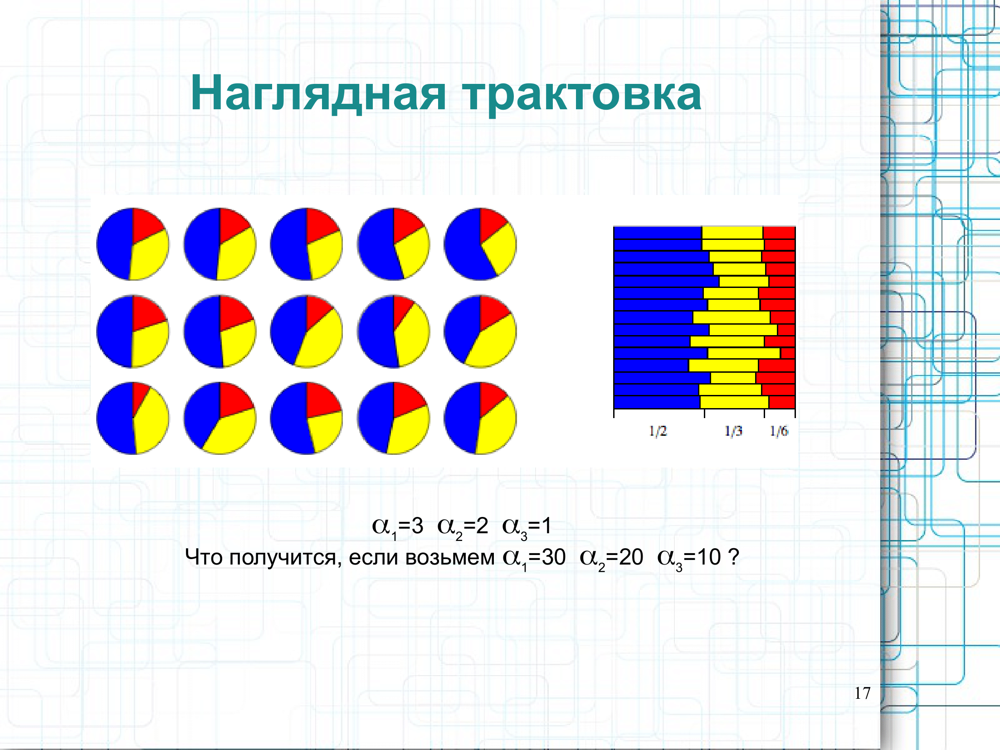

# Билет №6
## 6. Тематическое моделирование, принципы построения, LSA/LDA, примеры (ПО максимумум добавить инфу)


# БИЛЕТ №6
6. ### 6. **Тематическое моделирование, принципы построения, LSA/LDA, примеры**

# ---

**Теория:**

- **Тематическое моделирование**:
  - Выделение тем из текстов.

- **LSA (Latent Semantic Analysis)**:
  - Метод SVD для анализа взаимосвязи терминов.

- **LDA (Latent Dirichlet Allocation)**:
  - Генеративная вероятностная модель.

**Код:**

```python
from sklearn.decomposition import LatentDirichletAllocation
from sklearn.feature_extraction.text import CountVectorizer

# Пример текстов
texts = [
    "I love programming and data analysis.",
    "Data science is about analyzing data and building models.",
    "Python is great for machine learning.",
    "Machine learning and AI are transforming industries."
]

# Векторизация текста
vectorizer = CountVectorizer(stop_words='english')
X = vectorizer.fit_transform(texts)

# Тематическое моделирование с LDA
lda = LatentDirichletAllocation(n_components=2, random_state=42)
lda.fit(X)

# Вывод тем
terms = vectorizer.get_feature_names_out()
for idx, topic in enumerate(lda.components_):
    print(f"Тема {idx + 1}:")
    print([terms[i] for i in topic.argsort()[-5:]])
```

# ---





