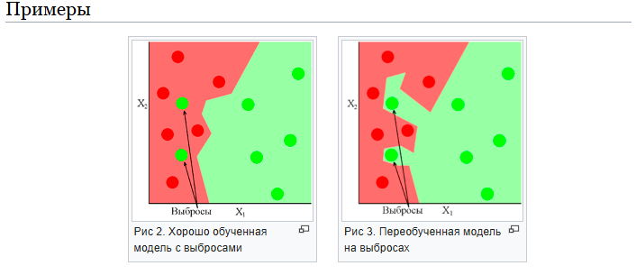
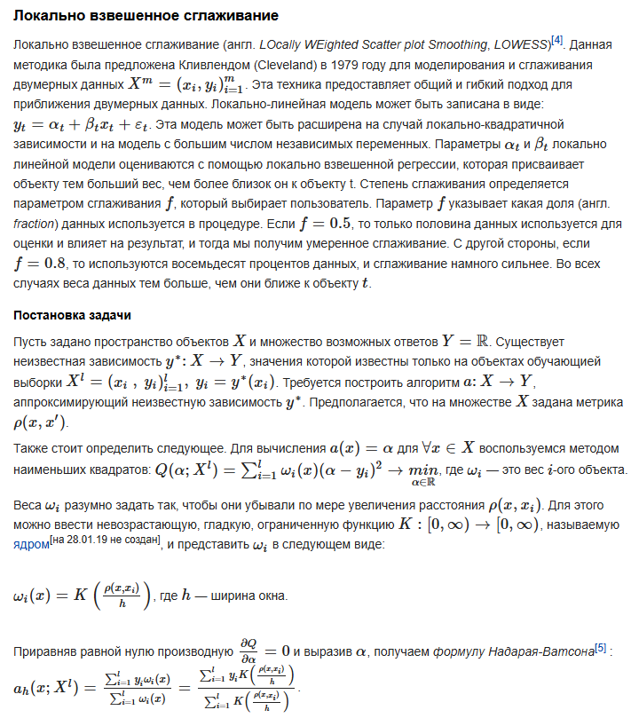
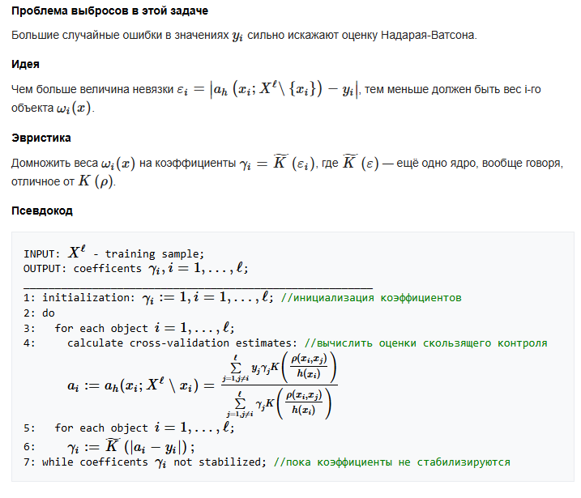
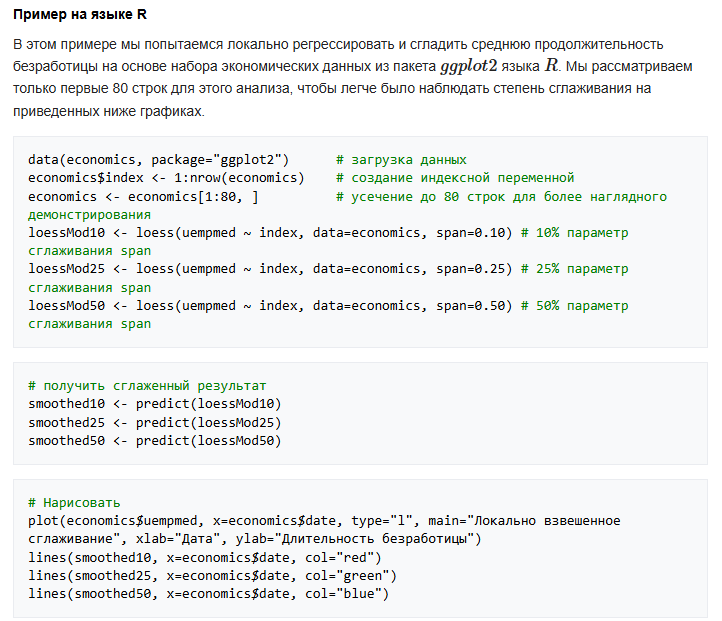
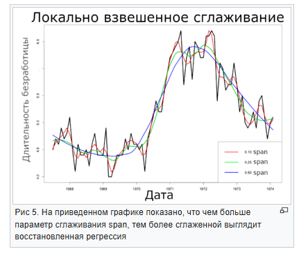

# БИЛЕТ №9
## 9. Выбросы, методы их поиска и борьбы с ними(ПО максимумум добавить инфу)


# БИЛЕТ №9
## 9. Выбросы, методы их поиска и борьбы с ними

# ---

**Теория:**

- **Выбросы**:
  - Наблюдения, которые значительно отклоняются от остальных данных.
  
- **Методы обнаружения выбросов**:
  - Статистические:
    - Z-оценка.
    - Метод межквартильного размаха (IQR).
  - Машинное обучение:
    - Isolation Forest.
    - DBSCAN.

- **Борьба с выбросами**:
  - Удаление.
  - Замена средним/медианой.
  - Трансформация (например, логарифмирование).

**Код:**

```python
from sklearn.ensemble import IsolationForest
from scipy.stats import zscore

# Генерация данных
np.random.seed(42)
data = np.random.normal(50, 10, 100)
data = np.append(data, [100, 120])  # Добавление выбросов

# Z-оценка
z_scores = np.abs(zscore(data))
outliers = np.where(z_scores > 3)
print(f"Выбросы по Z-оценке: {data[outliers]}")

# Isolation Forest
clf = IsolationForest(contamination=0.05, random_state=42)
outlier_pred = clf.fit_predict(data.reshape(-1, 1))

plt.scatter(range(len(data)), data, c=outlier_pred, cmap='coolwarm', label='Выбросы')
plt.title("Обнаружение выбросов с помощью Isolation Forest")
plt.legend()
plt.show()
```

# ---

# **Выброс (англ. outlier)**

Выброс — это экстремальные значения во входных данных, которые находятся далеко за пределами других наблюдений. 

### Пример:
Все предметы на кухне имеют температуру около **22-25 градусов Цельсия**, а **духовка — 220 градусов**.

---

### Влияние выбросов:
1. **Чувствительность алгоритмов**  
   Многие алгоритмы машинного обучения чувствительны к разбросу и распределению значений признаков обрабатываемых объектов. 

2. **Искажение процесса обучения**  
   - Выбросы во входных данных могут:  
     - Искажать процесс обучения алгоритмов.  
     - Увеличивать время обучения.  
     - Снижать точность моделей.  

3. **Ошибочные интерпретации**  
   Даже до построения предсказательных моделей выбросы:  
   - Могут приводить к неправильным представлениям о данных.  
   - Влияют на интерпретацию собранной информации.  

---

Выбросы требуют особого внимания при анализе данных, чтобы минимизировать их негативное влияние на результаты моделей.


# Виды выбросов
### На основе размерности изучаемого массива данных выбросы подразделяют на одномерные и многомерные.

**Одномерные выбросы**
Точка является выбросом только по одной из своих координат.

**Многомерные выбросы**
Точка является выбросом сразу по нескольким координатам.

### Другой подход классификации выбросов — по их окружению.

**Точечные выбросы**
Единичные точки, выбивающиеся из общей картины. Точечные аномалии часто используются в системах контроля транзакций для выявления мошенничества, например, когда с украденной карты совершается крупная покупка.

**Контекстуальные выбросы**
Для того, чтобы определить, является ли точка выбросом необходим контекст. Например, в Петербурге +15 градусов Цельсия. Зимой такая температура является выбросом, а летом нет.

**Коллективные выбросы**
Здесь выбросом является не точка, а группа точек. Примером таких выбросов могут служить, например, задержки поставок на фабрике. Одна задержка не является выбросом. Но если их много, значит это может стать проблемой.


### Причины возникновения выбросов

- **Сбой работы оборудования**  
  Нарушение функционирования оборудования, приводящее к несанкционированным выбросам веществ в окружающую среду.

- **Человеческий фактор**  
  Ошибки, допущенные персоналом при выполнении операций, недостаточная квалификация или нарушение инструкций.

- **Случайность**  
  Непредвиденные события, которые невозможно было предусмотреть или предотвратить.

- **Уникальные явления**  
  Редкие и необычные природные или технологические события, такие как стихийные бедствия или сбои из-за сложных взаимодействий в системе.

- **и др.**  
  Другие возможные причины, не включенные в список, но потенциально способные привести к выбросам.




# Методы обнаружения и борьбы с выбросами
## Методы обнаружения выбросов

#### 1. Экстремальный анализ данных(англ. extreme value analysis). При таком анализе не применяются какие-либо специальные статистические методы. Обычно этот метод применим для одномерного случая. Алгоритм использования таков:
* Визуализировать данные, используя диаграммы и гистограммы для нахождения экстремальных значений;
* Задействовать распределение, например Гауссовское, и найти значения, чье стандартное отклонение отличается в 2-3 раза от математического ожидания или в полтора раза от первой либо третьей квартилей;
* Отфильтровать предполагаемые выбросы из обучающей выборки и оценить работу модели;
#### 2. Аппроксимирующий метод (англ. proximity method). Чуть более сложный метод, заключающийся в применении кластеризующих методов;
* Использовать метод кластеризации для определения кластеров в данных;
* Идентифицировать и отметить центроиды каждого кластера;
* Соотнести кластеры с экземплярами данных, находящимися на фиксированном расстоянии или на процентном удалении от центроида соответствующего кластера;
* Отфильтровать предполагаемые выбросы из обучающей выборки и оценить работу модели;
#### 3. Проецирующие методы (англ. projections methods). Эти методы довольно быстро и просто определяют выбросы в выборке;
* Использовать один из проецирующих методов, например, метод главных компонент (англ. principal component analysis, PCA[1]) или самоорганизующиеся карты Кохонена(англ. self-organizing map, SOM[2]) или проекцию Саммона(англ. Sammon mapping, Sammon projection[3]), для суммирования обучающих данных в двух измерениях;
* Визуализировать отображение;
* Использовать критерий близости от проецируемых значений или от вектора таблицы кодирования (англ. codebook vector) для идентифицирования выбросов;
* Отфильтровать предполагаемые выбросы из обучающей выборки и оценить работу модели.











# Другие алгоритмы борьбы с выбросами
В статистике методы, устойчивые к нарушениям модельных предположений о данных, называются робастными. Метод локально взвешенного сглаживания относится к робастным методам, так как он устойчив к наличию небольшого количества выбросов.

* Дерево принятия решения (англ. decision tree[6]). Это дерево, как и уже описанный алгоритм локально взвешенного сглаживания, относится к робастным методам;
* Робастная регрессия (англ. robust regression[7]). В отличие от регрессии, использующей, например, метод наименьших квадратов, в этом алгоритме не строится идеализированное предположение, что вектор ошибок ε
 распределен согласно нормальному закону. Однако на практике зачастую имеют место отклонения от этого предположения. Тогда можно применить метод наименьших модулей (англ. Least Absolute Deviation, LAD [8]) в случае, если распределение ошибок измерений подчиняется распределению Лапласа (англ. Laplace distribution [9]).