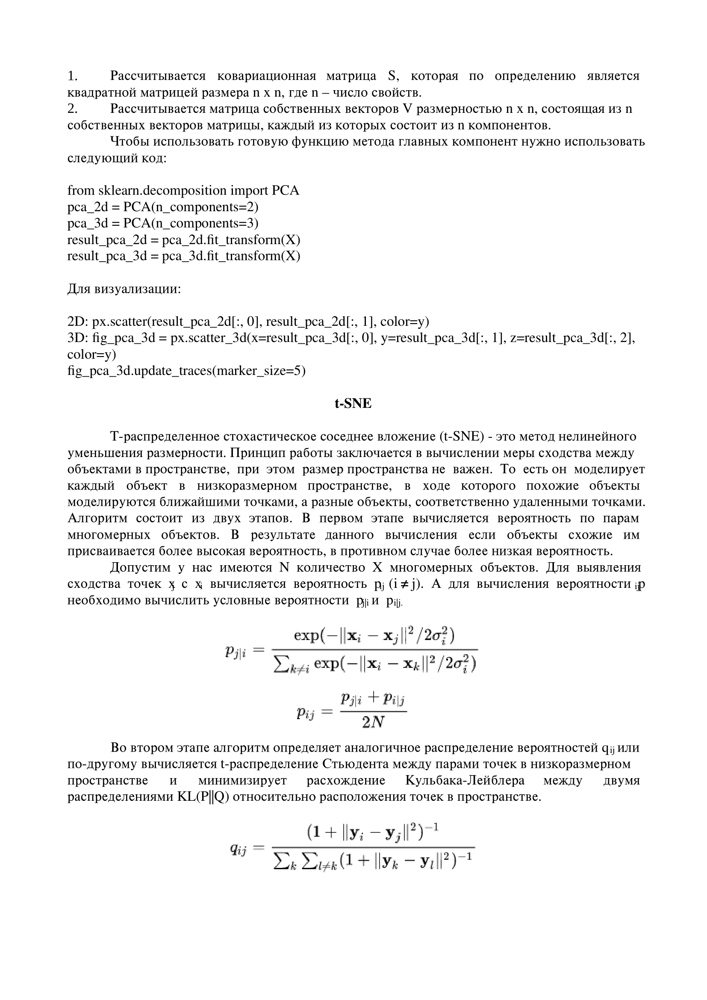

# БИЛЕТ №10
## 10. Повышение и понижение размерностей, методы. Проклятие размерностей(ПО максимумум добавить инфу)

# БИЛЕТ №10
## 10. Повышение и понижение размерностей, методы. Проклятие размерностей

# ---

**Теория:**

- **Проклятие размерностей**:
  - Увеличение размерности данных делает анализ сложным из-за разреженности.

- **Методы повышения размерности**:
  - Полиномиальные признаки.
  - Преобразование с ядровыми методами.

- **Методы понижения размерности**:
  - PCA (Principal Component Analysis).
  - t-SNE.
  - UMAP.

**Код:**

```python
from sklearn.decomposition import PCA
from sklearn.manifold import TSNE
from sklearn.datasets import make_classification

# Генерация данных
X, y = make_classification(n_samples=500, n_features=10, random_state=42)

# PCA
pca = PCA(n_components=2)
X_pca = pca.fit_transform(X)

plt.scatter(X_pca[:, 0], X_pca[:, 1], c=y, cmap='viridis', alpha=0.6)
plt.title("Понижение размерности с помощью PCA")
plt.show()

# t-SNE
tsne = TSNE(n_components=2, random_state=42)
X_tsne = tsne.fit_transform(X)

plt.scatter(X_tsne[:, 0], X_tsne[:, 1], c=y, cmap='viridis', alpha=0.6)
plt.title("Понижение размерности с помощью t-SNE")
plt.show()
```

# ---

# Понижение размерности





# Уменьшение размерности с помощью автоэнкодеров в Python

Уменьшение размерности
Уменьшение размерности - это процесс уменьшения количества измерений в данных либо путем исключения менее полезных функций (выбор функции), либо преобразования данных в меньшие размеры (извлечение функции). Уменьшение размерности предотвращает переобучение. Переобучение - это явление, при котором модель слишком хорошо усваивает обучающий набор данных и не может хорошо обобщить невидимые реальные данные.

Типы выбора функций для уменьшения размерности,

Устранение рекурсивных функций
Выбор генетических функций
Последовательный прямой выбор
Типы извлечения функций для уменьшения размерности,

АвтоЭнкодеры
Анализ основных компонентов (PCA)
Линейный детерминантный анализ (LDA)
В этом посте давайте подробно рассмотрим автоэнкодеры для уменьшения размерности.

АвтоЭнкодеры
АвтоЭнкодер - это неконтролируемая искусственная нейронная сеть, которая пытается закодировать данные путем сжатия их до более низких измерений (уровень узкого места или код), а затем декодирует данные для восстановления исходного ввода. Уровень "узкого места" (или код) содержит сжатое представление входных данных.

В автоэнкодере количество выходных единиц должно быть равно количеству входных единиц, поскольку мы пытаемся восстановить входные данные. АвтоЭнкодеры обычно состоят из кодера и декодера. Кодировщик кодирует предоставленные данные в меньшее измерение, которое является размером уровня узкого места, а декодер декодирует сжатые данные в их первоначальную форму.

Количество нейронов в слоях кодера будет уменьшаться по мере продвижения к дальнейшим слоям, тогда как количество нейронов в слоях декодера будет увеличиваться по мере продвижения к дальнейшим слоям. В следующем примере в кодере и декодере используются три уровня. Кодер содержит 32, 16 и 7 единиц измерения в каждом слое соответственно, а декодер содержит 7, 16 и 32 единицы измерения в каждом слое соответственно. Размер кода / количество нейронов в bottle-neck должно быть меньше количества объектов в данных.

Перед подачей данных в АвтоЭнкодер данные обязательно должны быть масштабированы от 0 до 1 с помощью MinMaxScaler, поскольку мы собираемся использовать функцию активации сигмоида в выходном слое, которая выводит значения от 0 до 1.

Когда мы используем автоэнкодеры для уменьшения размерности, мы извлекаем слой с узким местом и используем его для уменьшения размеров. Этот процесс можно рассматривать как извлечение объектов.

Тип автоэнкодера, который мы используем, - это глубокий автоэнкодер, где кодер и декодер симметричны. Автоэнкодеры не обязательно имеют симметричный кодер и декодер, но мы можем иметь кодер и декодер также несимметричными.

Доступны следующие типы автоэнкодеров,

Глубокое автоэнкодирование
Разреженный автоэнкодер
В разделе полное автоэнкодирование
Вариационный автоэнкодер
Автоэнкодер LSTM
Гиперпараметры автоэнкодера
Размер кода или количество блоков в слое "узкого места"
Размер входных и выходных данных, который представляет собой количество объектов в данных
Количество нейронов или узлов на слой
Количество слоев в кодере и декодере.
Функция активации
Функция оптимизации
Уменьшение размерности с помощью гиперпараметра автоэнкодеров

Источник: https://commons.wikimedia.org/wiki/File:Autoencoder_structure.png

Приложения автоэнкодеров
Уменьшение размерности
Обнаружение аномалий
Шумоподавление изображения
Сжатие изображений
Генерация изображений
В этом посте давайте углубимся в уменьшение размерности с помощью автоэнкодеров.

Уменьшение размерности с помощью автоэнкодеров
Импортируйте необходимые библиотеки и разделите данные для обучения и тестирования.

импорт математики 
импорт pandas как pd 
импорт tensorflow как tf 
импорт kerastuner.tuners как kt 
импорт matplotlib.pyplot как plt 
из tensorflow.keras импортируйте модель 
из tensorflow.keras Импортируйте последовательно 
из sklearn.preprocessing импортируйте StandardScaler 
из tensorflow.keras.слои импортируются плотными, выпадающими 
из sklearn.model_selection импортирует train_test_split 
из tensorflow.keras.losses импортирует MeanSquaredLogarithmicError

# данные в Google colab
TRAIN_DATA_PATH = '/content/sample_data/california_housing_train.csv'
TEST_DATA_PATH = '/content/sample_data/california_housing_test.csv'
TARGET_NAME = 'median_house_value'

train_data = pd.read_csv(TRAIN_DATA_PATH) 
test_data = pd.read_csv(TEST_DATA_PATH)

x_train, y_train = train_data.drop(TARGET_NAME, axis=1), train_data[TARGET_NAME]
x_test, y_test = test_data.drop(ИМЯ_ЦЕЛЕВОГО ОБЪЕКТА, ось=1), test_data[ИМЯ_ЦЕЛЕВОГО ОБЪЕКТА]

Масштабируйте набор данных с помощью MinMaxScaler.

от sklearn.предварительная обработка импорта MinMaxScaler

определение scale_datasets(x_train, x_test):
 """
 Стандартный масштаб тестовых и обучающих данных 
""" 
 standard_scaler = MinMaxScaler()
 x_train_scaled = pd.DataFrame( 
standard_scaler.fit_transform(x_train), 
 columns=x_train.columns
 )
 x_test_scaled = pd.DataFrame( 
standard_scaler.transform(x_test), 
 columns = x_test.columns
 ) 
 возвращает x_train_scaled, x_test_scaled
 
x_train_scaled, x_test_scaled = scale_datasets(x_train, x_test)
Обучите автоэнкодер с помощью обучающих данных.

автоэнкодеры класса (модель):
```
 def __init__(self, output_units):

 super().__init__() 
 self.encoder = Последовательный(
 [ 
 Плотный (32, активация="relu"), 
 Плотный (16, активация="relu"), 
 Плотный (7, активация ="relu")
 ]
 )

 self.decoder = Последовательный(
 [ 
 Плотный (16, активация="relu"), 
 Плотный (32, активация="relu"), 
 Плотный (output_units, активация="sigmoid")
 ]
 )

вызов def (self, входные данные):

 encoded = self.encoder (входные данные)
 decoded = self.decoder (закодированный)
 возврат декодированного
 
auto_encoder = АвтоЭнкодеры(len(x_train_scaled.columns))

auto_encoder.compile(
 потеря ='mae', 
метрики=['mae'], 
оптимизатор ='adam' 
)

история = автоэнкодер.fit(
 x_train_scaled, 
 x_train_scaled, 
 эпохи = 15, 
 размер пакета =32, 
 validation_data=(x_test_scaled, x_test_scaled) 
)
```
Здесь мы определили модель автоэнкодера, создав подкласс класса Model в Tensorflow, и мы компилируем модель автоэнкодера со средней абсолютной ошибкой и функцией оптимизации adam. Мы разбиваем данные на пакеты по 32 и запускаем их в течение 15 эпох.

Уменьшение размерности с помощью автоэнкодеров 2

Получаем уровень кодирования и используем метод predict для уменьшения размерности данных. Поскольку у нас есть семь скрытых блоков в узком месте, данные сводятся к семи функциям.
```
encoder_layer = auto_encoder.get_layer('последовательный')
reduced_df = pd.DataFrame(encoder_layer.predict(x_train_scaled))
reduced_df = reduced_df.add_prefix('feature_')
Уменьшение размерности с помощью автоэнкодеров 3
```
Таким образом, автоэнкодеры можно использовать для уменьшения размерности данных.


# Методы повышения размерности

Повышение размерности используется в задачах, где необходимо преобразовать данные в пространство более высокой размерности для улучшения разделимости или анализа сложных структур. Рассмотрим основные методы.

## 1. Кернел автоэнкодеры (Kernel Autoencoders)

Кернел автоэнкодеры — это нейронные сети, которые обучаются реконструировать данные, преобразуя их в скрытое пространство высокой размерности. Они используют **ядровые функции (kernel functions)** для нелинейного преобразования.

### Алгоритм работы:
1. Данные \( X \in \mathbb{R}^d \) подаются на вход сети.
2. Входное пространство преобразуется в скрытое пространство через ядровую функцию \( \phi(x) \), где \( \phi: \mathbb{R}^d \to \mathbb{R}^D \) (с \( D > d \)).
3. Сеть минимизирует функцию потерь:
   \[
   \mathcal{L} = \| X - \hat{X} \|^2 + \lambda \|\theta\|^2
   \]
   где \( \hat{X} \) — реконструированные данные, \( \lambda \) — регуляризация.

### Преимущества:
- Нелинейное преобразование улучшает способность модели находить сложные зависимости.
- Может быть эффективно реализован через ядровую "трюк" (kernel trick).

### Недостатки:
- Требует высокой вычислительной мощности при больших объемах данных.
- Зависимость от выбора ядра и гиперпараметров.

---

## 2. Метод опорных векторов (SVM) с кернелами

Метод опорных векторов с использованием ядрового трюка позволяет эффективно находить гиперплоскость разделения в пространстве высокой размерности.

### Основная идея:
Использование ядровой функции \( K(x_i, x_j) = \phi(x_i)^\top \phi(x_j) \) для работы напрямую с высокоразмерным пространством, не вычисляя \( \phi(x) \).

### Функция оптимизации:
\[
\min_{\mathbf{w}, b} \frac{1}{2} \|\mathbf{w}\|^2 + C \sum_{i=1}^n \xi_i
\]
где \( \xi_i \) — штраф за неправильную классификацию, \( C \) — параметр регуляризации.

### Преимущества:
- Нелинейные зависимости моделируются с использованием подходящих ядер.
- Теоретически обоснованная модель с гарантией оптимальности.

### Недостатки:
- Сложность вычислений для больших объемов данных.
- Зависимость от выбора ядровой функции.

---

## 3. Многомерное шкалирование (Multidimensional Scaling, MDS)

Метод преобразует данные, сохраняя расстояния между точками в исходном пространстве.

### Алгоритм:
1. Задается матрица расстояний \( D \) между объектами.
2. Вычисляется матрица Грама \( B = -\frac{1}{2} JDJ \), где \( J = I - \frac{1}{n} \mathbf{1} \mathbf{1}^\top \).
3. Собственные значения матрицы \( B \) используются для построения нового пространства.

### Преимущества:
- Простота реализации.
- Хорошо сохраняет глобальные свойства данных.

### Недостатки:
- Плохо работает для больших наборов данных.

---

## 4. t-SNE (t-Distributed Stochastic Neighbor Embedding)

Метод используется для повышения размерности с сохранением локальных свойств данных.

### Алгоритм:
1. Вычисляются вероятности близости точек в исходном пространстве \( P_{ij} \) на основе гауссового распределения.
2. Вероятности \( Q_{ij} \) вычисляются в новом пространстве.
3. Функция потерь:
   \[
   \mathcal{L} = \sum_{i \neq j} P_{ij} \log \frac{P_{ij}}{Q_{ij}}
   \]

### Преимущества:
- Отлично сохраняет локальные структуры.
- Подходит для визуализации сложных данных.

### Недостатки:
- Высокая вычислительная сложность.
- Плохо сохраняет глобальные структуры.

---

## 5. Полиномиальные признаки (Polynomial Features)

Метод основан на добавлении нелинейных комбинаций исходных признаков.

### Формула:
Преобразование данных \( X = [x_1, x_2, \dots, x_d] \) в полиномиальное пространство:
\[
\phi(x) = [1, x_1, x_2, x_1^2, x_1x_2, \dots]
\]

### Преимущества:
- Простота реализации.
- Подходит для линейных моделей.

### Недостатки:
- Быстрое увеличение размерности пространства (проблема "проклятия размерности").

---

## Сравнительная таблица

| Метод                     | Преимущества                             | Недостатки                                  |
|---------------------------|------------------------------------------|--------------------------------------------|
| Кернел автоэнкодеры       | Нелинейное преобразование, гибкость      | Требует большой мощности, сложность настройки |
| Метод опорных векторов    | Гарантия оптимальности, нелинейность     | Зависимость от ядра, высокая вычислительная сложность |
| MDS                       | Простота, сохранение расстояний          | Плохо работает на больших данных           |
| t-SNE                     | Сохранение локальных структур            | Высокая сложность, плохо с глобальными структурами |
| Полиномиальные признаки   | Простота, улучшение линейных моделей     | Проклятие размерности                      |


# Проклятие размерностей


