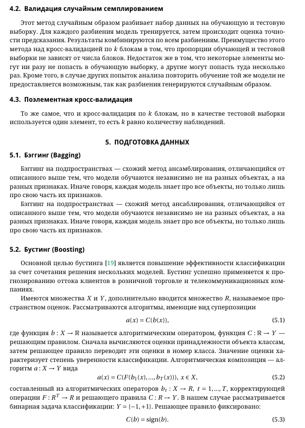

# БИЛЕТ №11
## 11. Методы дискретизации, метод интервалов, оценка выбросов по P-value, задача оттока, методы решения, использование теоремы Байеса для оценки вероятности оттока(ПО максимумум добавить инфу)

### Дискретизация и методы дискретизации
#### Что такое дискретизация?
Дискретизация – это процесс преобразования непрерывных данных (сигналов, функций) в дискретную форму, то есть представление данных в виде набора отдельных значений, упорядоченных по времени или другой переменной. Этот процесс необходим для работы с непрерывными данными в цифровых системах, таких как компьютеры.

#### Зачем нужна дискретизация?
1. **Обработка данных** в цифровой форме: Аналоговые сигналы (например, звук, температура) преобразуются в цифровые, чтобы их можно было анализировать, хранить или передавать.
2. **Уменьшение объема данных**: Непрерывные данные представляют бесконечное множество значений, а дискретизация позволяет использовать конечное множество.
3. **Математическое моделирование**: Дискретные данные легче поддаются обработке в математических алгоритмах.

---

#### Основные этапы дискретизации:
1. **Выбор частоты дискретизации**:
   - Частота дискретизации определяет, как часто берутся точки из непрерывного сигнала. Чем выше частота, тем точнее результат.
   - **Теорема Котельникова-Шеннона**: Частота дискретизации должна быть не менее удвоенной частоты максимального сигнала (частота Найквиста), чтобы избежать потери информации (алиасинга).
   
2. **Квантизация**:
   - Преобразование амплитуды сигнала в конечное количество уровней.
   - Чем больше уровней (глубина квантизации), тем выше точность, но увеличивается объем данных.
   
3. **Кодирование**:
   - Представление квантованных значений в цифровой форме, например, в виде двоичных кодов.

---

#### Методы дискретизации:
1. **Равномерная дискретизация**:
   - Сигнал измеряется через равные промежутки времени.
   - Простой и широко используемый метод.
   - Пример: Аудиозапись с фиксированной частотой дискретизации (например, 44.1 кГц для CD).

2. **Нерегулярная дискретизация**:
   - Сигнал измеряется через нерегулярные интервалы времени.
   - Применяется, когда сигнал имеет редкие события или изменяется неравномерно.

3. **Дискретизация по уровню**:
   - Дискретизация проводится по значениям сигнала, а не по времени.
   - Применяется, когда важна детализация изменений амплитуды.

4. **Дискретизация на основе событий**:
   - Точки дискретизации выбираются в моменты значительных изменений сигнала.
   - Эффективна при анализе событийных данных.

---

#### Проблемы и решения при дискретизации:
1. **Алиасинг**:
   - Происходит при недостаточной частоте дискретизации.
   - Решение: Увеличить частоту дискретизации или использовать **антиалиасинговые фильтры**.

2. **Ошибки квантизации**:
   - Потеря информации из-за округления значений.
   - Решение: Увеличить глубину квантизации.

3. **Шум и искажения**:
   - Проблемы с качеством исходного сигнала могут ухудшить результаты дискретизации.
   - Решение: Использовать фильтрацию перед дискретизацией.

---

#### Применение дискретизации:
1. Обработка аудиосигналов (музыка, голос).
2. Анализ изображений (пикселизация).
3. Обработка данных в телекоммуникациях.
4. Моделирование в науке и технике.

--- 


# Доверительный интервал

Доверительный интервал (CI) - это диапазон значений, полученных на основе выборочной статистики, который, вероятно, содержит значение неизвестного параметра совокупности. Он предоставляет оценку значения параметра с определенным уровнем достоверности, обычно выражаемым в процентах. Интервал построен таким образом, что при многократном повторении одной и той же процедуры указанный процент интервалов будет содержать параметр.

Для совокупности Среднее значение mu с известным стандартным отклонением генеральной совокупности sigma:
# CI = $\bar{x} \pm Z_{\alpha/2} \times \frac{\sigma} {\sqrt{n}}$

$\bar{x}$: Выборочное среднее значение
$Z_{\альфа/2}$: Z-балл, соответствующий желаемому уровню достоверности
$\sigma$: Стандартное отклонение генеральной совокупности
n: размер выборки

#### Зачем нужен доверительный интервал?
1. **Оценка параметра совокупности**: Например, определение среднего роста людей в популяции на основе данных выборки.
2. **Учёт неопределенности**: Поскольку выборка – это лишь часть совокупности, доверительный интервал помогает отразить возможные отклонения.
3. **Интерпретация результатов**: Позволяет дать более полное представление о данных, чем просто точечная оценка.
--- 
#### Ключевые понятия:
1. **Точечная оценка**:
   - Это конкретное значение, полученное из выборки, которое служит основой для построения интервала (например, среднее значение выборки).

2. **Уровень достоверности**:
   - Это вероятность того, что интервал действительно содержит истинное значение параметра совокупности. Обычно используют 90%, 95% или 99%.
   - Пример: 95%-й доверительный интервал означает, что при повторении эксперимента в 95% случаев построенный интервал будет содержать истинное значение параметра.

3. **Ширина интервала**:
   - Ширина доверительного интервала зависит от:
     - Размер выборки: Чем больше выборка, тем уже интервал.
     - Разброса данных: Чем больше разброс, тем шире интервал.
     - Уровня достоверности: Более высокий уровень достоверности даёт более широкий интервал.

---

#### Как интерпретировать доверительный интервал?
Пример: Для среднего роста людей получен 95%-й доверительный интервал [165 см, 175 см].  
Это означает, что с вероятностью 95% истинное среднее значение роста находится в этом диапазоне.

---

#### Факторы, влияющие на доверительный интервал:
1. **Размер выборки**:
   - Увеличение размера выборки уменьшает неопределенность и сужает интервал.
2. **Вариативность данных**:
   - Чем больше разброс данных, тем шире интервал.
3. **Уровень достоверности**:
   - Более высокий уровень достоверности (например, 99%) приводит к более широкому интервалу, так как мы хотим быть более уверенными.

---

#### Преимущества использования доверительного интервала:
1. **Гибкость**: Можно оценивать любые параметры, такие как среднее, доля, разница средних и т.д.
2. **Наглядность**: Предоставляет ясное представление о диапазоне возможных значений.
3. **Дополняет точечные оценки**: Делает результаты анализа более полными.

---

#### Ограничения:
1. **Предположения о данных**:
   - Расчёт доверительного интервала часто предполагает нормальное распределение данных или использование большого объёма выборки.
2. **Не гарантирует точность**:
   - Указанная вероятность относится к долгосрочному результате, а не к конкретному интервалу.
3. **Зависимость от качества выборки**:
   - Если выборка нерепрезентативна, интервал может быть некорректным.

---

#### Где применяется доверительный интервал?
1. **Научные исследования**: Оценка среднего значения показателей, например, веса, роста, скорости реакции.
2. **Медицина**: Определение эффективности лекарств или процента выздоровления пациентов.
3. **Бизнес и экономика**: Анализ рыночных показателей, оценка доли клиентов, удовлетворённых услугой.
4. **Социальные исследования**: Изучение уровня поддержки определённых идей или политиков.

---


# Метод интервалов для анализа данных и машинного обучения
Метод интервалов используется для оценки неопределенности в данных и моделях. Он помогает определить диапазоны значений, в которых с определенной вероятностью могут находиться параметры или предсказания модели. Это полезно в задачах, где важно учитывать ошибки, нестабильности или неопределенности в прогнозах.

## 2. Интервалы предсказаний (Prediction Intervals)

Интервалы предсказаний используются для прогнозирования диапазона значений для новых наблюдений, учитывая как вариацию модели, так и случайную ошибку.

### Формула для интервала предсказания:

Если модель линейной регрессии использует параметры $\hat{\beta}_0$ и $\hat{\beta}_1$, то интервал предсказания для нового наблюдения $y_{new}$ на основе предсказания $\hat{y}$ будет выглядеть следующим образом:

$$
\hat{y} \pm t_{\alpha/2, n-2} \cdot \sqrt{\hat{\sigma}^2 \left( 1 + \frac{1}{n} + \frac{(x_{new} - \bar{x})^2}{S_{XX}} \right)}
$$

где:
- $\hat{y}$ — предсказанное значение для $x_{new}$,
- $t_{\alpha/2, n-2}$ — критическое значение $t$-распределения для уровня значимости $\alpha$ и $n-2$ степеней свободы,
- $\hat{\sigma}^2$ — оценка дисперсии ошибки модели,
- $n$ — размер выборки,
- $S_{XX}$ — сумма квадратов отклонений $x$ от среднего $\bar{x}$.

### Пример:
Предсказание для нового значения $x_{new}$ с учетом вариации модели и ошибок будет иметь некоторый диапазон значений, определяемый этим интервалом.

## 3. Байесовский подход к интервалам

Вместо использования точечных оценок и стандартных интервалов, в байесовском подходе используются вероятностные интервалы для параметров модели, где каждый параметр рассматривается как случайная величина, обладающая определенным распределением.

### Пример:
Для параметра $\theta$ (например, среднего значения в нормальном распределении), байесовский интервал для уровня доверия $1 - \alpha$ можно найти, используя кумулятивную плотность вероятности:

$$
P(\theta \in [\theta_L, \theta_U]) = 1 - \alpha
$$

где $[\theta_L, \theta_U]$ — это интервал, в котором с вероятностью $1 - \alpha$ находится параметр $\theta$.

## Преимущества метода интервалов

- **Оценка неопределенности**: Метод позволяет оценить степень неопределенности в данных или в результатах модели.
- **Прогнозирование**: Интервалы предсказаний дают более полное представление о возможных значениях, чем просто точечные предсказания.
- **Гибкость**: Интервалы могут быть адаптированы под различные типы распределений и моделей.

## Недостатки метода интервалов

- **Предположения о распределении**: Для построения точных интервалов требуется, чтобы данные удовлетворяли определенным статистическим предположениям (например, нормальное распределение).
- **Часто требуются большие выборки**: Для точных интервалов нужны большие объемы данных, особенно в случае оценки параметров модели или сложных предсказаний.

## Заключение

Метод интервалов является важным инструментом для учета неопределенности в анализе данных и машинном обучении. Он позволяет не только давать точечные оценки, но и предоставлять диапазоны значений, в которых с высокой вероятностью могут находиться интересующие параметры или предсказания.


# P-value


# Прогнозирование оттока

Прогнозирование оттока – это процесс разработки моделей машинного обучения, которые позволяют предсказать, сколько и какие клиенты вероятно покинут компанию в определенный период времени. Предупреждение о возможном оттоке дает компаниям возможность принять меры по удержанию клиентов, что может существенно снизить потери и повысить общую прибыль.

### Подготовка данных
Подготовим наши данные.
```
# A. Загрузка данных клиентов
data = {
    'CustomerID': [1, 2, 3, 4, 5],
    'Age': [32, 45, 29, 56, 38],
    'Gender': ['Male', 'Female', 'Female', 'Male', 'Male'],
    'TotalSpend': [1000, 1500, 500, 2000, 800],
    'NumOfPurchases': [5, 3, 7, 2, 4],
    'Churn': [0, 1, 0, 1, 0]  # 0 - остается, 1 - ушел
}

# B. Импорт необходимых библиотек
import pandas as pd
from sklearn.preprocessing import LabelEncoder, StandardScaler

# Преобразуем данные в DataFrame
df = pd.DataFrame(data)

# C. Очистка данных: обработка пропущенных значений и дубликатов
# Проверим наличие пропущенных значений
print("Количество пропущенных значений:")
print(df.isnull().sum())

# В данном примере предположим, что у нас нет пропущенных значений, поэтому нет необходимости в дополнительной обработке.
# Однако, если бы в данных были пропуски, то мы могли бы обработать их с помощью метода fillna() для заполнения пропусков 
# определенными значениями, либо удалить строки с пропущенными значениями с помощью dropna().

# Проверим и удалим дубликаты, если они есть
df.drop_duplicates(inplace=True)

# D. Преобразование данных: кодирование категориальных признаков и масштабирование числовых признаков
# Кодируем категориальный признак "Gender" в числовой формат, чтобы модель машинного обучения могла работать с ним.
le = LabelEncoder()
df['Gender'] = le.fit_transform(df['Gender'])

# Масштабируем числовые признаки для их нормализации и уменьшения влияния различных единиц измерения.
# В данном примере мы используем StandardScaler для приведения признаков к стандартному нормальному распределению 
# со средним значением 0 и стандартным отклонением 1.
scaler = StandardScaler()
df[['Age', 'TotalSpend', 'NumOfPurchases']] = scaler.fit_transform(df[['Age', 'TotalSpend', 'NumOfPurchases']])

# Выведем окончательный результат
print("\nПодготовленные данные:")
print(df)
```


### Исследовательский анализ данных

Основные статистики о клиентах
Для начала, давайте рассмотрим основные статистики о клиентах, чтобы получить общее представление о нашем наборе данных.
```
# Посмотрим на первые несколько строк данных
print("Первые 5 строк данных:")
print(df.head())

# Получим основные статистические показатели о клиентах
print("\nОсновные статистики о клиентах:")
print(df.describe())
```


### Визуализация данных для лучшего понимания распределений

Для визуализации данных и получения более глубокого понимания распределения признаков, давайте построим графики и диаграммы.
```
import matplotlib.pyplot as plt
import seaborn as sns

# Построим гистограмму возраста клиентов
plt.figure(figsize=(8, 5))
sns.histplot(df['Age'], bins=10, kde=True, color='skyblue')
plt.xlabel('Возраст')
plt.ylabel('Частота')
plt.title('Распределение возраста клиентов')
plt.show()

# Построим гистограмму общего объема расходов
plt.figure(figsize=(8, 5))
sns.histplot(df['TotalSpend'], bins=10, kde=True, color='salmon')
plt.xlabel('Общий объем расходов')
plt.ylabel('Частота')
plt.title('Распределение общего объема расходов клиентов')
plt.show()

### Построим гистограмму количества покупок
plt.figure(figsize=(8, 5))
sns.histplot(df['NumOfPurchases'], bins=10, kde=True, color='orange')
plt.xlabel('Количество покупок')
plt.ylabel('Частота')
plt.title('Распределение количества покупок клиентов')
plt.show()

### Построим диаграмму рассеяния для визуализации связи между признаками Age и TotalSpend
plt.figure(figsize=(8, 5))
sns.scatterplot(x='Age', y='TotalSpend', data=df, hue='Churn', palette='viridis', s=100)
plt.xlabel('Возраст')
plt.ylabel('Общий объем расходов')
plt.title('Диаграмма рассеяния: Возраст vs. Общий объем расходов')
plt.legend(title='Churn', labels=['Остается', 'Ушел'])
plt.show()
```


В итоге получили визуализации, которые помогают нам лучше понять распределение признаков. Гистограммы позволяют нам увидеть, какие значения признаков чаще всего встречаются, а диаграмма рассеяния показывает возможные связи между признаками «Возраст» и «Общий объем расходов», а также как фактор оттока (Churn) может влиять на эти связи.

### Исследование корреляции между признаками
Корреляция между признаками позволяет нам определить, какие признаки сильно связаны друг с другом, что помогает в идентификации важных факторов.
```
# Построим матрицу корреляции между признаками
correlation_matrix = df.corr()

# Визуализируем матрицу корреляции с помощью тепловой карты
plt.figure(figsize=(10, 8))
sns.heatmap(correlation_matrix, annot=True, cmap='coolwarm', fmt='.2f', linewidths=0.5)
plt.title('Матрица корреляции')
plt.show()
```


Матрица корреляции позволяет нам оценить силу и направление связи между признаками. Самая яркая точка на диагонали (значение 1) представляет собой корреляцию признака с самим собой (что логично, так как корреляция признака с самим собой всегда равна 1). Важным для анализа является взаимосвязь между оттоком (Churn) и другими признаками. Значения корреляции близкие к 1 или -1 указывают на сильную связь, в то время как значения близкие к 0 указывают на отсутствие линейной зависимости.


### Построение модели прогнозирования оттока
Выбор алгоритма машинного обучения
Для прогнозирования оттока клиентов, мы выберем три алгоритма машинного обучения: логистическую регрессию, случайный лес и градиентный бустинг. Эти алгоритмы широко используются для задач классификации, таких как прогнозирование оттока, и позволяют получить хорошие результаты при правильной настройке гиперпараметров.
```
from sklearn.linear_model import LogisticRegression
from sklearn.ensemble import RandomForestClassifier, GradientBoostingClassifier

# Инициализируем модели
logreg_model = LogisticRegression(random_state=42)
rf_model = RandomForestClassifier(random_state=42)
gb_model = GradientBoostingClassifier(random_state=42)

# Обучение моделей будет произведено в следующей части, когда данные разделены на обучающую и тестовую выборки.
```
### Разделение данных на обучающую и тестовую выборки

Перед обучением модели необходимо разделить данные на обучающую и тестовую выборки. Обучающая выборка будет использоваться для обучения модели, а тестовая выборка для оценки ее производительности.
```
from sklearn.model_selection import train_test_split

# Разделяем данные на обучающую (80%) и тестовую (20%) выборки
X_train, X_test, y_train, y_test = train_test_split(X, y, test_size=0.2, random_state=42)

Обучение модели на обучающей выборке

Теперь обучим выбранные модели на обучающей выборке.

# Обучение моделей на обучающей выборке
logreg_model.fit(X_train, y_train)
rf_model.fit(X_train, y_train)
gb_model.fit(X_train, y_train)
```

### Оценка производительности модели на тестовой выборке

После обучения моделей на обучающей выборке, необходимо оценить их производительность на тестовой выборке.
```
from sklearn.metrics import accuracy_score, precision_score, recall_score, f1_score, roc_auc_score

# Функция для оценки производительности модели
def evaluate_model(model, X_test, y_test):
    y_pred = model.predict(X_test)
    accuracy = accuracy_score(y_test, y_pred)
    precision = precision_score(y_test, y_pred)
    recall = recall_score(y_test, y_pred)
    f1 = f1_score(y_test, y_pred)
    roc_auc = roc_auc_score(y_test, y_pred)
    return accuracy, precision, recall, f1, roc_auc

# Оценка производительности моделей
logreg_accuracy, logreg_precision, logreg_recall, logreg_f1, logreg_roc_auc = evaluate_model(logreg_model, X_test, y_test)
rf_accuracy, rf_precision, rf_recall, rf_f1, rf_roc_auc = evaluate_model(rf_model, X_test, y_test)
gb_accuracy, gb_precision, gb_recall, gb_f1, gb_roc_auc = evaluate_model(gb_model, X_test, y_test)

# Вывод результатов
print("Результаты оценки производительности моделей на тестовой выборке:")
print("Логистическая регрессия:")
print(f"Точность: {logreg_accuracy:.4f}, Полнота: {logreg_recall:.4f}, F1-мера: {logreg_f1:.4f}, ROC-AUC: {logreg_roc_auc:.4f}")
print("Случайный лес:")
print(f"Точность: {rf_accuracy:.4f}, Полнота: {rf_recall:.4f}, F1-мера: {rf_f1:.4f}, ROC-AUC: {rf_roc_auc:.4f}")
print("Градиентный бустинг:")
print(f"Точность: {gb_accuracy:.4f}, Полнота: {gb_recall:.4f}, F1-мера: {gb_f1:.4f}, ROC-AUC: {gb_roc_auc:.4f}")
```
Мы обучили три различные модели машинного обучения (логистическую регрессию, случайный лес и градиентный бустинг) на обучающей выборке и оценили их производительность на тестовой выборке. Результаты оценки включают значения точности, полноты, F1-меры и ROC-AUC для каждой модели. При оценке производительности моделей, мы можем определить, какая модель лучше всего справляется с задачей прогнозирования оттока пользователей.

### Заключение
Анализ данных клиентов и прогнозирование оттока играют важную роль для компаний, позволяя предпринимать меры по удержанию клиентов и оптимизации бизнес-процессов. Результаты данного исследования помогут компании лучше понять своих клиентов, выделить ключевые факторы, влияющие на отток.


# Методы решения задач оттока





В рамках исследования, целью которого являлась демонстрация превосходства ме
тода CatBoost в мерах эффективности классификаторов, проведенные работы имели, по
мимо теоретической ценности, еще и практическую. Применение алгоритмов к реаль
ным данным активизирует впоследствии действия компании, направленные на удер
жаниеклиентов.Успешнореализованпрототипрабочейпрограммы,используемойрос
сийской мобильной компаниейдляпредсказания оттока абонентов.


# Использование теоремы Байеса для оценки вероятности оттока

Теорема Байеса — это мощный инструмент для обновления вероятностей в условиях неопределенности. В контексте анализа оттока клиентов (churn) её можно использовать для оценки вероятности того, что клиент уйдет, на основе имеющихся данных о клиенте и предыдущих наблюдениях.

### 1. Общее представление задачи

Пусть $P(\text{Churn})$ — это вероятность того, что клиент уйдет, а $P(\text{Retention})$ — вероятность того, что клиент останется. Мы хотим оценить вероятность оттока клиента на основе имеющихся данных о его поведении и характеристиках.

Теорема Байеса позволяет обновить наши оценки, основываясь на новых данных. В частности, если мы имеем некоторое условие $X$ (например, поведение клиента или его действия), то вероятность оттока можно вычислить как:

$$
P(\text{Churn} \mid X) = \frac{P(X \mid \text{Churn}) \cdot P(\text{Churn})}{P(X)}
$$

где:
- $P(\text{Churn} \mid X)$ — это вероятность оттока клиента, если известно его поведение $X$ (обновленная вероятность),
- $P(X \mid \text{Churn})$ — вероятность наблюдения поведения $X$, если клиент действительно уйдет,
- $P(\text{Churn})$ — априорная вероятность оттока,
- $P(X)$ — вероятность наблюдения поведения $X$.

### 2. Интерпретация формул

#### 2.1. Априорная вероятность оттока ($P(\text{Churn})$)

Априорная вероятность оттока — это вероятность того, что клиент уйдет, прежде чем мы получим информацию о его поведении. Эту вероятность можно оценить на основе исторических данных или опросов.

$$
P(\text{Churn}) = \frac{\text{Количество клиентов, ушедших}}{\text{Общее количество клиентов}}
$$

#### 2.2. Вероятность наблюдения поведения при оттоке ($P(X \mid \text{Churn})$)

$P(X \mid \text{Churn})$ — это вероятность того, что клиент с оттоком проявит конкретное поведение $X$. Например, это может быть частота использования продукта, количество обращений в службу поддержки или другие поведенческие признаки. Для оценки этой вероятности можно использовать методы машинного обучения, такие как логистическая регрессия или деревья решений.

#### 2.3. Нормализующая константа ($P(X)$)

Нормализующая константа $P(X)$ — это общая вероятность того, что клиент проявит поведение $X$. Это может быть вычислено как сумма вероятностей поведения $X$ для всех клиентов:

$$
P(X) = P(X \mid \text{Churn}) \cdot P(\text{Churn}) + P(X \mid \text{Retention}) \cdot P(\text{Retention})
$$

где $P(X \mid \text{Retention})$ — это вероятность наблюдения поведения $X$ для клиентов, которые остаются.

#### 2.4. Вероятность того, что клиент останется ($P(\text{Retention})$)

Аналогично априорной вероятности оттока, вероятность того, что клиент останется, можно вычислить на основе исторических данных:

$$
P(\text{Retention}) = 1 - P(\text{Churn})
$$

### 3. Пример вычисления вероятности оттока

Предположим, что из исторических данных известно следующее:
- Вероятность оттока (априорная): $P(\text{Churn}) = 0.3$ (30% клиентов уходят),
- Вероятность того, что клиент с оттоком проявит поведение $X$ (например, снизит активность): $P(X \mid \text{Churn}) = 0.8$,
- Вероятность того, что клиент с удержанием проявит поведение $X$: $P(X \mid \text{Retention}) = 0.2$,
- Вероятность проявления поведения $X$: $P(X) = 0.3$.

Теперь можно рассчитать вероятность оттока при условии наблюдения поведения $X$:

$$
P(\text{Churn} \mid X) = \frac{P(X \mid \text{Churn}) \cdot P(\text{Churn})}{P(X)} = \frac{0.8 \cdot 0.3}{0.3} = 0.8
$$

Таким образом, если клиент проявляет поведение $X$ (например, снижает активность), вероятность того, что он уйдет, составляет 80%.

### 4. Преимущества использования теоремы Байеса

- **Динамическое обновление**: Теорема Байеса позволяет обновлять наши оценки с учетом новых данных, что делает модель гибкой.
- **Учет неопределенности**: Байесовский подход дает возможность учитывать неопределенности в оценках, что особенно важно в сложных и изменчивых бизнес-средах.
- **Прогнозирование на основе данных**: Вместо того чтобы полагаться только на предположения, теорема Байеса позволяет использовать реальные данные для оценки вероятности оттока.

### 5. Заключение

Теорема Байеса предоставляет эффективный способ оценки вероятности оттока на основе поведения клиентов. Она позволяет не только строить прогнозы, но и обновлять эти прогнозы по мере появления новых данных. Важно учитывать, что результаты сильно зависят от точности оценки априорных вероятностей и вероятностей поведения клиентов, что требует использования качественных данных и моделей.
