# Ответы на вопросы по теории

# Билет №1
1. [Распределения, виды основных распределений, параметры распределений, центральная предельная теорема, функция распределения, плотность вероятности и гистограмма]
1.1. [Описание и оценки случайных величин. Характеристики распределений.](#1-описание-и-оценки-случайных-величин-характеристики-распределений)
1.2. [Нормальное распределение. Стандартное и с параметрами μ, σ. Определение, функция распределения и свойства](#2-нормальное-распределение-стандартное-и-с-параметрами-μ-σ-определение-функция-распределения-и-свойства)

# Билет №2
2. [2. Проверка гипотез, критерии для среднего и доли, T-критерии и Z-критерии, доверительный интервал, P-value, параметрические и непараметрические критерии, бутстрэп метод]
2.1. [Проверка параметрических гипотез - общие обозначения. Виды задач. (слайды + САД-Практика-Задачи к практике Проверка статистических гипотез)](#13-проверка-параметрических-гипотез---общие-обозначения-виды-задач)
2.2. [Z-критерий. Условия для проведения проверки. Пример.(слайды)](#14-z-критерий-условия-для-проведения-проверки-пример)
2.3. [t-критерий Стьюдента. Условия для проведения проверки. Пример.](#16-t-критерий-стьюдента-условия-для-проведения-проверки-пример)
2.4. [Проверка непараметрических гипотез. Виды задач и варианты двухвыборочных гипотез.](#20-проверка-непараметрических-гипотез-виды-задач-и-варианты-двухвыборочных-гипотез)
2.5. [Квантили и построение доверительных интервалов. (слайды + САД-Практика (с теорией)-Статистические оценки параметров распределения)](#6-квантили-и-построение-доверительных-интервалов)
2.6. [Доверительные интервалы. Интервальные оценки с помощью квантилей. Правило двух сигм. Предсказательный интервал. Отличия предсказательного и доверительного интервалов](#7-доверительные-интервалы-интервальные-оценки-с-помощью-квантилей-правило-двух-сигм-предсказательный-интервал-отличия-предсказательного-и-доверительного-интервалов)
2.7. [Построение доверительных интервалов для среднего. z-интервал. t-интервал](#9-построение-доверительных-интервалов-для-среднего-z-интервал-t-интервал)
2.8. [Построение доверительных интервалов для доли.](#10-построение-доверительных-интервалов-для-доли)
2.9. [Построение доверительных интервалов для двух долей](#11-построение-доверительных-интервалов-для-двух-долей)
2.10. [Бутстреп и бутстреповский доверительный интервал. (слайды 51-56)](#12-бутстреп-и-бутстреповский-доверительный-интервал)


# Билет №3( здесь нужно по максимуму дописать тк совсем нет нужной инфы)
3. [Множественная проверка гипотез, поправки, плюсы и минусы использования]


# Билет №4(здесь мало инфы про регуляризацию и борьбу с выбросами)
4. Линейная регрессия, метод наименьших квадратов, регуляризация, борьба с выбросами
## 4.1. [Метод наименьших квадратов. Коэффициент детерминации. Сравнение двух (и более) уравнений линейной регрессии.]()
## 4.2. [Множественная регрессия. Тестирование гипотез для множественной регрессии. Коэффициент детерминации. Мультиколлинеарность.](#34-множественная-регрессия-тестирование-гипотез-для-множественной-регрессии-коэффициент-детерминации-мультиколлинеарность)
## 4.3. [Анализ остатков регрессии. Критерий Дарбина-Уотсона. Критерий Харке-Бера. Критерий Бройша-Пагана. Требования к выборке для проведения регрессионного анализа.](#35-анализ-остатков-регрессии-критерий-дарбина-уотсона-критерий-харке-бера-критерий-бройша-пагана-требования-к-выборке-для-проведения-регрессионного-анализа)
## 4.4. [Требования к выборке для проведения регрессионного анализа. Нелинейная регрессия. ANCOVA.](#36-требования-к-выборке-для-проведения-регрессионного-анализа-нелинейная-регрессия-ancova)


# Билет №5
## 5. Кластеризация, типы: метрические, модельные, иерархические, плюсы/минусы. Гиперпараметры, методы поиска гиперпараметров, внешняя и внутренняя оценка качества.(ПО максимумум добавить инфу)


# Билет №6
## 6. Тематическое моделирование, принципы построения, LSA/LDA, примеры (ПО максимумум добавить инфу)


# БИЛЕТ №7
## 7. Преобразование Фурье, Хаара, Уолша, Хартли. Прямое и обратное преобразование (ПО максимумум добавить инфу)


# БИЛЕТ №8
## 8. Методы спектральной оценки - оконное преобразование Фурье и параметрическое спектральное оценивание(ПО максимумум добавить инфу)


# БИЛЕТ №9
## 9. Выбросы, методы их поиска и борьбы с ними(ПО максимумум добавить инфу)


# БИЛЕТ №10
## 10. Повышение и понижение размерностей, методы. Проклятие размерностей(ПО максимумум добавить инфу)


# БИЛЕТ №11
## 11. Методы дискретизации, метод интервалов, оценка выбросов по P-value, задача оттока, методы решения, использование теоремы Байеса для оценки вероятности оттока(ПО максимумум добавить инфу)


# БИЛЕТ №12
## 12. Корреляция - линейная и ранговая. Значимость корреляции и размер эффекта. Интерпретация корреляции
## 12.1. [Коэффициент корреляции. Диаграмма рассеяния. Коэффициент корреляцииПирсона. Факторы, влияющие на коэффициент корреляции. Требование к выборке для тестирования гипотезы о коэффициенте корреляции Пирсона.](#32-коэффициент-корреляции-диаграмма-рассеяния-коэффициент-корреляции-пирсона-факторы-влияющие-на-коэффициент-корреляции-требование-к-выборке-для-тестирования-гипотезы-о-коэффициенте-корреляции-пирсона)


# БИЛЕТ №13
## 13. Поиск правил. Алгоритмы Apriori и FP-tree(ПО максимумум добавить инфу)


# БИЛЕТ №1
## 1. **Распределения, виды основных распределений, параметры распределений, центральная предельная теорема, функция распределения, плотность вероятности и гистограмма**
---

**Теория:**

- **Распределения**: Это функции, описывающие вероятности появления значений случайной величины.
  - **Основные распределения:**
    - Нормальное распределение (Gaussian)
    - Биномиальное
    - Пуассона
    - Экспоненциальное
    - Равномерное

- **Параметры распределений**:
  - Среднее (μ)
  - Дисперсия (σ²)
  - Стандартное отклонение (σ)
  - Медиана, мода

- **Центральная предельная теорема**:
  - Гласит, что сумма большого числа независимых случайных величин с одинаковым распределением стремится к нормальному распределению.

- **Функция распределения**:
  - \( F(x) = P(X \leq x) \), где \( P \) — вероятность.

- **Плотность вероятности**:
  - Функция \( f(x) \), где интеграл \( \int f(x) dx = 1 \).

- **Гистограмма**:
  - График, отображающий частоту значений.

**Код:**

```python
import numpy as np
import matplotlib.pyplot as plt
from scipy.stats import norm, binom, poisson

# Нормальное распределение
x = np.linspace(-5, 5, 1000)
pdf = norm.pdf(x, loc=0, scale=1)
cdf = norm.cdf(x, loc=0, scale=1)

plt.figure(figsize=(12, 6))
plt.subplot(1, 2, 1)
plt.plot(x, pdf, label='Плотность вероятности (PDF)')
plt.title('Нормальное распределение (PDF)')
plt.legend()

plt.subplot(1, 2, 2)
plt.plot(x, cdf, label='Функция распределения (CDF)')
plt.title('Нормальное распределение (CDF)')
plt.legend()
plt.show()

# Генерация гистограммы
data = np.random.normal(0, 1, 1000)
plt.hist(data, bins=30, density=True, alpha=0.6, color='g')
plt.title("Гистограмма нормального распределения")
plt.show()
```

---


## 1.1 Описание и оценки случайных величин. Характеристики распределений

### Описание случайных величин

Вероятность случайного события - доля испытаний, завершившихся наступлением события, в бесконечном эксперименте. Вероятность изменяется от 0 до 1. 

Случайные величины являются более обобщенным понятием случайного события. Случайные величины могут быть дискретными или непрерывными. Дискретная случайная величина может принимать только определенные значения с определенной вероятностью.

Дискретная случайная величина 𝑋 принимает счётное множество значений 𝐴= {𝑎1, 𝑎2, ..., 𝑎n} с вероятностями 𝑝1, 𝑝2,...,𝑝n

$\sum_i p_1=1$

𝑓𝑋(𝑎𝑖) = P(𝑋=𝑎𝑖) = 𝑝𝑖— **функция вероятности**. 

Для описания как дискретных, так и непрерывных случайных величин используется **функция распределения вероятности**. Пусть Х - случайная величина и х - ее любое значение. Функция распределения вероятности определяется следующим образом:

$$ F_X(x)=\mathbf{P}(X \leqslant x)$$

Примеры функций распределения вероятности:


Функция распределения вероятности не всегда удобна для расчетов. Часто удобнее использовать не саму функцию $F_X(x)$, а ее производную. Она называется **плотностью распределения вероятности**.

Физический смысл $f(x)$ состоит в том, что произведение $f(x)dx$ представляет вероятность попадания случайной величины $Х$ в интервал от $х$ до $х+dx$ , т.е.

$$ f(x)dx=\mathbf{P}(x \leqslant X \leqslant x+dx)$$

### Оценки случайных величин

Оценка случайной величины — это численное значение, которое приближенно характеризует ту или иную характеристику случайной величины на основе выборки данных. Основными оценками случайных величин являются:

1. **Выборочное среднее**
2. **Выборочная дисперсия**
3. **Выборочная медиана**
4. **Выборочный интерквартильный размах**

#### 1. Выборочное среднее

Выборочное среднее ($\overline{X}$) оценивает математическое ожидание случайной величины. Оно вычисляется как сумма всех значений выборки, деленная на размер выборки:

$$
\overline{X} = \frac{1}{n} \sum_{i=1}^{n} X_i
$$

где $X_i$ — значения выборки, $n$ — размер выборки.

#### 2. Выборочная дисперсия

Выборочная дисперсия ($s^2$) оценивает разброс данных вокруг выборочного среднего и является оценкой дисперсии случайной величины. Она вычисляется как среднее квадратическое отклонение значений выборки от выборочного среднего:

$$
s^2 = \frac{1}{n-1} \sum_{i=1}^{n} (X_i - \overline{X})^2
$$

где $X_i$ — значения выборки, $\overline{X}$ — выборочное среднее, $n$ — размер выборки.

#### 3. Выборочная медиана

Выборочная медиана — это значение, которое делит упорядоченную выборку на две равные части. Для нечетного размера выборки медиана — это центральное значение, для четного размера — среднее значение двух центральных значений.

#### 4. Выборочный интерквартильный размах

Выборочный интерквартильный размах (IQR) оценивает разброс данных, исключая крайние 25% значений. Он определяется как разница между третьим квартилем ($Q3$) и первым квартилем ($Q1$):

$$
\text{IQR} = Q3 - Q1
$$

- **Первый квартиль ($Q1$)** — это значение, ниже которого находится 25% наблюдений.
- **Третий квартиль ($Q3$)** — это значение, ниже которого находится 75% наблюдений.

### Характеристики распределений


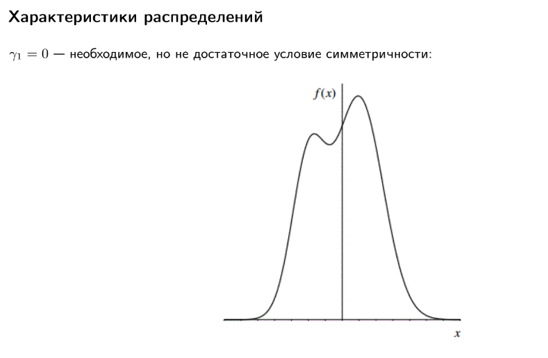


#### Математическое ожидание

Математическое ожидание $E(X)$ случайной величины $X$ — это взвешенная сумма всех возможных значений этой случайной величины, где веса соответствуют вероятностям этих значений.

Для дискретной случайной величины $X$, которая принимает значения $x_1, x_2, ..., x_n$ с вероятностями $p_1, p_2, ..., p_n$, математическое ожидание определяется как:

$$ E(X) = \sum_{i=1}^n x_i p_i $$

Для непрерывной случайной величины $X$ с плотностью вероятности $f_X(x)$, математическое ожидание определяется как:

$$ E(X) = \int_{-\infty}^\infty x f_X(x) \, dx $$

#### Дисперсия

Дисперсия $\mathrm{D}(X)$ случайной величины $X$ — это математическое ожидание квадрата отклонения случайной величины от её математического ожидания.

Для дискретной случайной величины $X$, которая принимает значения $x_1, x_2, \ldots, x_n$ с вероятностями $p_1, p_2, \ldots, p_n$, дисперсия определяется как:

$$
\mathrm{D}(X) = E[(X - E(X))^2] = \sum_{i=1}^n (x_i - E(X))^2 p_i
$$

Для непрерывной случайной величины $X$ с плотностью вероятности $f_X(x)$:

$$
\mathrm{D}(X) = E[(X - E(X))^2] = \int_{-\infty}^{\infty} (x - E(X))^2 f_X(x) \, dx
$$

#### Квантиль и медиана

Квантиль порядка $p$ случайной величины $X$ — это значение $x_p $, такое что вероятность того, что $X$ меньше или равно $x_p $, равна $p$. 

Иными словами, квантиль порядка $p$ — это значение $x_p$, удовлетворяющее следующему условию:

$$
P(X \leq x_p) = p
$$

где $0 < p < 1$.

**Медиана** — квантиль порядка $p = 0.5$: $x_{0.5}$
    Медиана делит распределение случайной величины на две равные части.

#### Интерквартильный размах

Интерквартильный размах определяется как разница между третьим квартилем ($Q_\text{0,75}$) и первым квартилем ($Q_\text{0,25}$):

$$
\text{IQR} = Q_\text{0,75} - Q_\text{0,25}
$$

- **Первый квартиль ($Q_\text{0,25}$)** — это значение, ниже которого находится 25% наблюдений.
- **Третий квартиль ($Q_\text{0,75}$)** — это значение, ниже которого находится 75% наблюдений.

#### Мода

Пусть $X = \{x_1, x_2, \ldots, x_n\}$ — выборка данных. Модой набора данных $X$ называется значение $x_m$, такое что количество элементов в $X$, равных $x_m$, максимально. Формально:

$$
\text{Mode}(X) = \{x_i \mid \forall x_j \neq x_i, \, f(x_i) \geq f(x_j) \}
$$

где $f(x)$ — функция частоты (число вхождений $x$ в набор данных $X$).

#### Коэффициент асимметрии

Коэффициент асимметрии (или коэффициент скошенности) используется для описания степени асимметрии распределения данных относительно его среднего значения. Формула коэффициента асимметрии следующая:

$$\gamma_1 = \frac{\mu_3}{\sigma^3}$$

где $\mu_3$ — третий центральный момент, а $\sigma$ — стандартное отклонение.

Третий центральный момент вычисляется как:

$$\mu_3 = \mathbb {E} \left[(X-\mathbb {E} X)^{3}\right]$$

А стандартное отклонение:
$$\sigma ={\sqrt {\mathrm {D} [X]}}$$

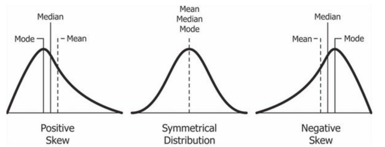

#### Коэффициент эксцесса

Коэффициент эксцесса (или куртозис) измеряет степень пиковости распределения данных. Он вычисляется по следующей формуле:

$$\gamma_2 = \frac{\mu_4}{\sigma^4} - 3$$

где $\mu_4$ — четвертый центральный момент, а $\sigma$ — стандартное отклонение.

Четвертый центральный момент вычисляется как:

$$\mu_4 = \mathbb {E} \left[(X-\mathbb {E} X)^{4}\right]$$


## 1.2. Нормальное распределение. Стандартное и с параметрами μ, σ. Определение, функция распределения и свойства

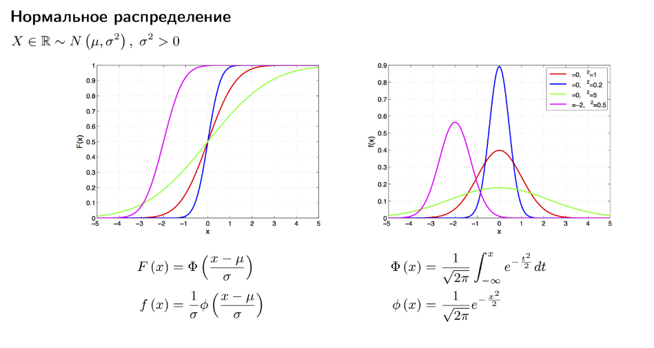

Нормальное распределение, также называемое распределением Гаусса или Гаусса — Лапласа — непрерывное распределение вероятностей с пиком в центре и симметричными боковыми сторонами, которое в одномерном случае задаётся функцией плотности вероятности, совпадающей с функцией Гаусса:

$$f(x)={\frac {1}{\sigma {\sqrt {2\pi }}}}e^{-{\frac {1}{2}}\left({\frac {x-\mu }{\sigma }}\right)^{2}}$$

где параметр 𝜇 — математическое ожидание (среднее значение), медиана и мода распределения, а параметр 
𝜎 — среднеквадратическое отклонение, $\sigma ^{2}$ — дисперсия распределения.

### Определение стандартного нормального распределения

Стандартным нормальным распределением называется нормальное распределение с математическим ожиданием $\mu =0$ и стандартным отклонением $\sigma =1$.

### Определение нормального распределения с параметрами μ, σ

Каждое нормальное распределение — это вариант стандартного нормального распределения, область значений которого растягивается множителем $\sigma$ (стандартное отклонение) и переносится на 𝜇 (математическое ожидание):

$$f(x\mid \mu ,\sigma ^{2})={\frac {1}{\sigma }}\varphi \left({\frac {x-\mu }{\sigma }}\right),$$
где 𝜇, 𝜎 являются параметрами нормального распределения. Плотность вероятности должна нормироваться 
${\frac {1}{\sigma }}$, так что интеграл равен 1.

### Функция распределения

Функция распределения стандартного нормального распределения (нормальное интегральное распределение) обычно обозначается заглавной греческой буквой $\Phi$ (фи), ещё называется функцией Лапласа и представляет собой интеграл:
$$\Phi (x)={\frac {1}{\sqrt {2\pi }}}\int \limits _{-\infty }^{x}e^{-t^{2}/2}\,dt$$

### Свойства

#### Моменты
Если 𝑋 имеет нормальное распределение, то для неё существуют (конечные) моменты при всех 𝑝 с действительной частью больше −1. Для неотрицательных целых 𝑝 центральные моменты таковы:

$$\mathbb {E} \left[X^{p}\right]={\begin{cases}0&p=2n+1,\\\sigma ^{p}\,\left(p-1\right)!!&p=2n.\end{cases}}$$

#### Преобразование Фурье и характеристическая функция
Преобразование Фурье нормального распределения дает другую нормальную функцию, а характеристическая функция нормального распределения имеет вид $e^{it\mu - \frac{1}{2}t^2\sigma^2}$, где i - мнимая единица.

#### Бесконечная делимость
Нормальное распределение бесконечно делимо, что означает, что для любого положительного целого числа $n$ можно найти $n$ независимых идентично распределённых случайных величин, сумма которых имеет то же нормальное распределение.

#### Максимальная энтропия
Нормальное распределение имеет максимальную энтропию среди всех непрерывных распределений с заданными средним и дисперсией.


# БИЛЕТ №2
## 2. Проверка гипотез, критерии для среднего и доли, T-критерии и Z-критерии, доверительный интервал, P-value, параметрические и непараметрические критерии, бутстрэп метод

---

**Теория:**

- **Проверка гипотез**:
  - Нулевая гипотеза (\(H_0\)): базовое утверждение.
  - Альтернативная гипотеза (\(H_1\)): противоположное утверждение.

- **T-критерии и Z-критерии**:
  - T-тест: для малых выборок, неизвестна дисперсия.
  - Z-тест: для больших выборок, известна дисперсия.

- **P-value**:
  - Вероятность получить результаты, такие же экстремальные или более экстремальные, если \(H_0\) верна.

- **Бутстрэп**:
  - Метод переподборки для оценки параметров распределения.

**Код:**

```python
from scipy.stats import ttest_ind, norm

# Генерация данных
group1 = np.random.normal(50, 10, 30)
group2 = np.random.normal(55, 10, 30)

# T-тест
t_stat, p_val = ttest_ind(group1, group2)
print(f"T-статистика: {t_stat}, P-значение: {p_val}")

# Бутстрэп
bootstrap_samples = 1000
means = []
for _ in range(bootstrap_samples):
    sample = np.random.choice(group1, size=len(group1), replace=True)
    means.append(np.mean(sample))

plt.hist(means, bins=30, alpha=0.7)
plt.title("Бутстрэп распределение среднего")
plt.show()
```

---

## 2.1. Проверка параметрических гипотез - общие обозначения. Виды задач.

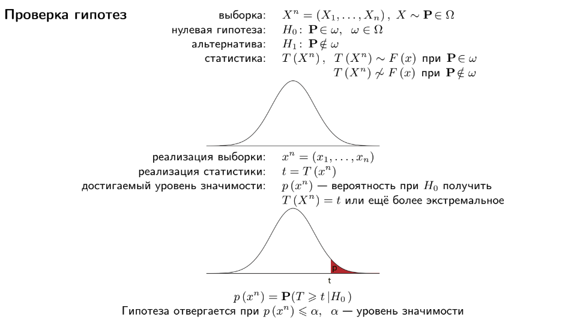


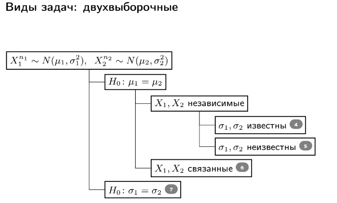


## 2.2. Z-критерий. Условия для проведения проверки. Пример.

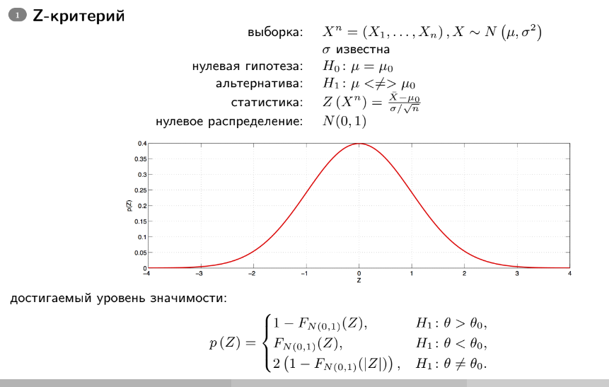

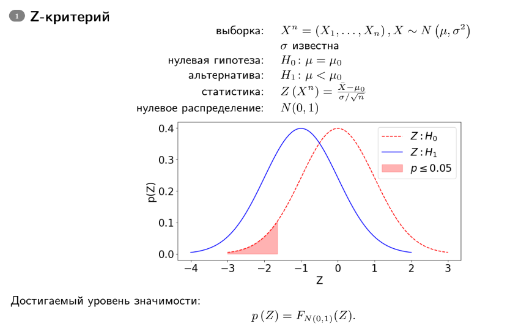

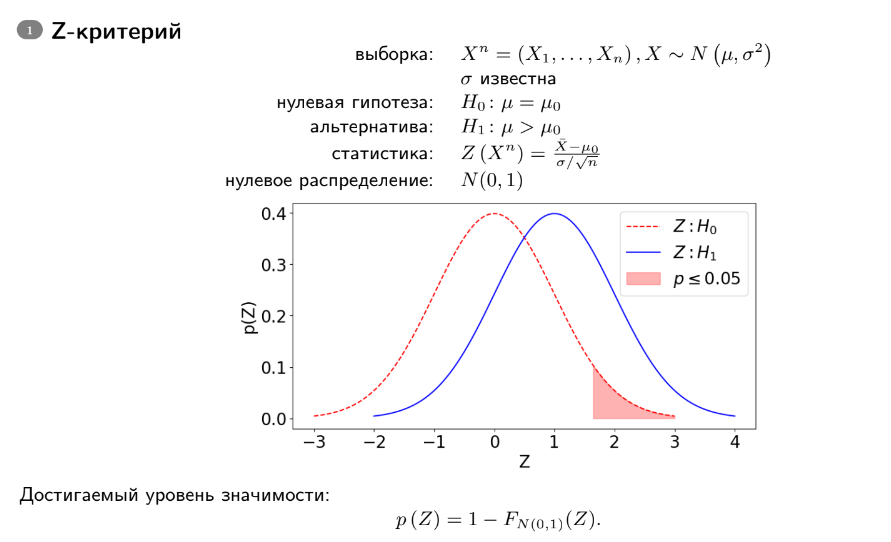

Z-тест, известный также как z-критерий Фишера, представляет собой набор статистических методов для проверки гипотез, которые базируются на предположении о нормальном распределении данных. Эти методы часто используются для анализа, являются ли средние значения двух наборов данных одинаковыми, при условии, что дисперсия генеральной совокупности известна. Расчёт Z-статистики производится путём деления разности между анализируемой случайной величиной и её математическим ожиданием на стандартную ошибку этой величины:

$$z={\frac {{\overline {X}}-\,m}{\mathrm {SE} }}$$

где X случайная величина выборочного среднего, m - значение математического ожидания, SE - стандартная ошибка этой величины.

### Условия для проведения теста

Чтобы результаты Z-теста были валидными, необходимо использовать случайную выборку из генеральной совокупности. Случайная выборка дает репрезентативность данных, что важно для точности выводов, сделанных на основе статистического анализа.

Z-тест требует, чтобы анализируемые данные были непрерывными. Непрерывные данные могут принимать любое значение внутри определенного диапазона и часто измеряются с использованием дробных или десятичных чисел.

Данные должны следовать нормальному распределению. Однако благодаря центральной предельной теореме, это предположение можно игнорировать, если размер выборки достаточно велик , что позволяет распределению средних выборочных значений приближаться к нормальному распределению даже если распределение в генеральной совокупности отличается от нормального.

В случае сравнения двух выборок, Z-тест требует, чтобы выборки были независимы. Это означает, что данные одной выборки не должны влиять на данные другой.

Ну и наконец, необходимо знать стандартное отклонение генеральной совокупности. Это требование отличает Z-тест от t-теста, который используется, когда стандартное отклонение генеральной совокупности неизвестно.

### Пример

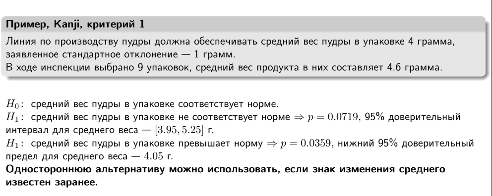

### Шаги решения задачи с помощью Z-критерия:

1. **Формулировка гипотез:**
   - **H0 (нулевая гипотеза):** Средний вес пудры в упаковке равен 4 граммам.
   - **H1 (альтернативная гипотеза):** Средний вес пудры в упаковке не равен 4 граммам.

2. **Известные данные:**
   - Средний вес в выборке (среднее выборочное) $\bar{x} = 4.6$ грамма.
   - Заявленное стандартное отклонение $\sigma = 1$ грамм.
   - Число наблюдений $n = 9$.

3. **Расчёт статистики Z:**
   Статистика Z для среднего значения вычисляется по формуле:
   
   $$Z = \frac{\bar{x} - \mu}{\frac{\sigma}{\sqrt{n}}}$$

   Где:
   - $\bar{x}$ — среднее выборочное (наблюдаемое среднее).
   - $\mu$ — гипотетическое среднее (в данном случае 4 грамма).
   - $\sigma$ — стандартное отклонение генеральной совокупности.
   - $n$ — размер выборки.

   Подставляя известные значения:

   $$Z = \frac{4.6 - 4}{\frac{1}{\sqrt{9}}} = \frac{0.6}{\frac{1}{3}} = 1.8$$

4. **Принятие решения:**
   - Для двусторонней альтернативы (когда проверяется не равенство 4 граммам) критическое значение Z для уровня значимости $\alpha = 0.05$ (двусторонняя проверка) составляет приблизительно 1.96.
   - Так как полученное значение Z (1.8) меньше критического значения (1.96), нет оснований отвергать нулевую гипотезу на уровне значимости 0.05. Это означает, что средний вес пудры в упаковке не отличается статистически значимо от заявленного норматива 4 грамма.

5. **Вывод:**
   - На основе Z-критерия можно заключить, что данных недостаточно, чтобы отвергнуть заявленную нулевую гипотезу о том, что средний вес пудры в упаковке равен 4 граммам.


## 2.3. t-критерий Стьюдента. Условия для проведения проверки. Пример.

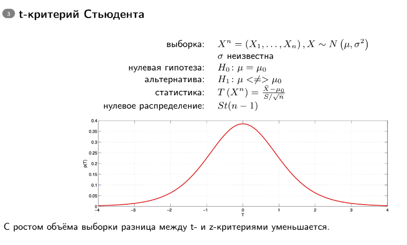

t-критерий Стьюдента — общее название для класса методов статистической проверки гипотез (статистических критериев), основанных на распределении Стьюдента. Наиболее частые случаи применения t-критерия связаны с проверкой равенства средних значений в двух выборках.

t-статистика строится обычно по следующему общему принципу: в числителе — случайная величина с нулевым математическим ожиданием (при выполнении нулевой гипотезы), а в знаменателе — выборочное стандартное отклонение этой случайной величины, получаемое как квадратный корень из несмещённой оценки дисперсии.

### Условия для проведения проверки

Для применения данного критерия необходимо, чтобы выборочные средние имели нормальное распределение. При маленьких выборках это означает требование нормальности исходных значений. В случае применения двухвыборочного критерия для независимых выборок также необходимо соблюдение условия равенства дисперсий. Существуют, однако, альтернативы критерию Стьюдента для ситуации с неравными дисперсиями.

Также не вполне корректно применять t-критерий Стьюдента при наличии в данных значительного числа выбросов. При несоблюдении этих условий при сравнении выборочных средних должны использоваться аналогичные методы непараметрической статистики, среди которых наиболее известными являются U-критерий Манна — Уитни (в качестве двухвыборочного критерия для независимых выборок), а также критерий знаков и критерий Уилкоксона (используются в случаях зависимых выборок).

### Пример

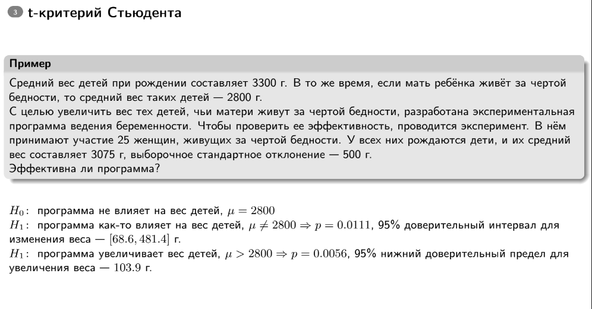

1. **Формулировка гипотез:**
   - **H0 (нулевая гипотеза):** Программа не влияет на вес детей, средний вес равен 2800 г.
   - **H1 (альтернативная гипотеза):** Программа влияет на вес детей, средний вес отличается от 2800 г.

2. **Известные данные:**
   - Средний вес детей при рождении в контрольной группе (матери живут за чертой бедности): $\bar{x} = 3075$ г.
   - Выборочное стандартное отклонение в контрольной группе: $s = 500$ г.
   - Размер выборки (число наблюдений): $n = 25$.
   - Гипотетическое среднее (для нулевой гипотезы): $\mu_0 = 2800$ г.

3. **Вычисление статистики t:**
   Статистика t для среднего значения вычисляется по формуле:
   
   $$t = \frac{\bar{x} - \mu_0}{\frac{s}{\sqrt{n}}}$$

   Где:
   - $\bar{x}$ — среднее выборочное (наблюдаемое среднее).
   - $\mu_0$ — гипотетическое среднее (в данном случае 2800 г).
   - $s$ — выборочное стандартное отклонение.
   - $n$ — размер выборки.

   Подставляя известные значения:
   
   $$t = \frac{3075 - 2800}{\frac{500}{\sqrt{25}}} = \frac{275}{100} = 2.75$$

4. **Определение критической области и принятие решения:**
   - Для двусторонней альтернативы (когда проверяется не равенство 2800 г) и уровня значимости $\alpha = 0.05$, критическое значение t с 24 степенями свободы составляет примерно 2.064.
   - Так как полученное значение t (2.75) больше критического значения (2.064), мы отвергаем нулевую гипотезу на уровне значимости 0.05.
   - Это означает, что есть статистически значимые доказательства в пользу того, что программа влияет на вес детей, чьи матери живут за чертой бедности.

5. **Вывод:**
   - На основе t-критерия Стьюдента можно сделать вывод о статистической значимости эффекта программы на вес новорожденных детей.


## 2.4. Проверка непараметрических гипотез. Виды задач и варианты двухвыборочных гипотез.

Непараметрические гипотезы в статистике касаются тестов, которые не предполагают конкретную форму распределения данных. В отличие от параметрических методов, которые предполагают, что данные следуют определенному распределению (например, нормальному), непараметрические методы более гибки и могут использоваться для анализа данных, которые не подчиняются этим предположениям.

Вот несколько ключевых моментов о непараметрических гипотезах:

- Отсутствие предположений о распределении: Непараметрические методы не требуют предположений о форме распределения данных, что делает их полезными в ситуациях, когда форма распределения неизвестна или не является нормальной.

- Применение к малым выборкам: Эти методы часто применяются к малым выборкам, где параметрические методы могут быть ненадежными.

- Примеры тестов: К наиболее известным непараметрическим тестам относятся критерий знаков, критерий Манна-Уитни, критерий Краскела-Уоллиса и критерий Каплана-Мейера. Эти тесты используются для сравнения медиан, рангов или выживаемости между группами.

- Использование рангов: Многие непараметрические тесты основаны на ранжировании данных, что позволяет им быть устойчивыми к выбросам и отклонениям от нормальности.

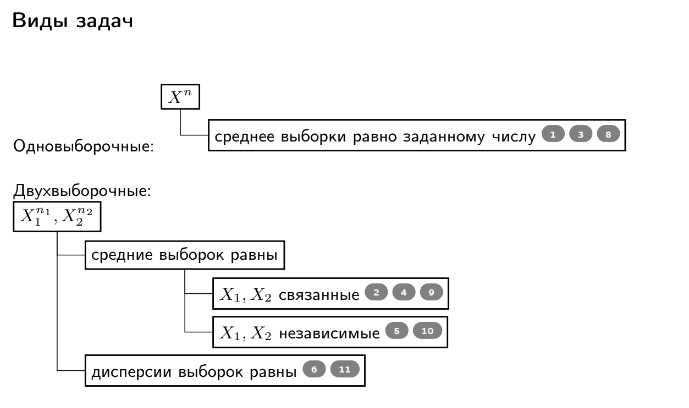

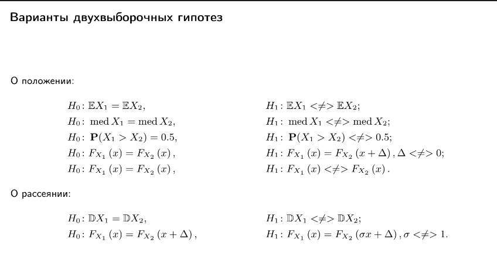


## 2.5. Квантили и построение доверительных интервалов.

### Квантили

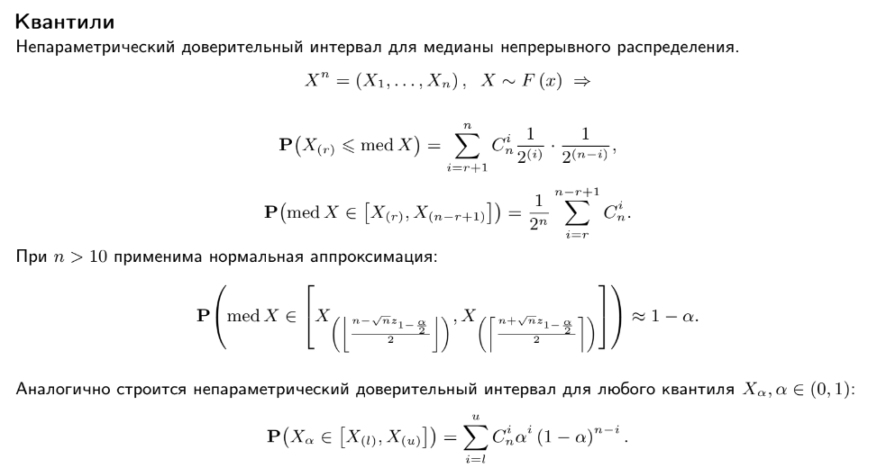

**Квантили** — это значения, разделяющие упорядоченный набор данных на равные доли. Например, медиана является вторым квартилем (т.е. 50%-квантилью).

### Выборочный $\alpha$-квантиль
Выборочный $\alpha$-квантиль $Q_\alpha$ — это значение, которое делит упорядоченную выборку так, что доля элементов выборки, меньших $Q_\alpha$, равна $\alpha$.

### Построение доверительных интервалов

**Доверительный интервал** — это интервал, который оценивает неизвестный параметр генеральной совокупности на основе выборочных данных с заданной вероятностью.

#### Параметрический метод

Параметрический метод используется, когда предполагается известная форма распределения данных и известные параметры этого распределения. Например, если данные приближаются нормальным распределением, то используются формулы для построения доверительных интервалов на основе стандартного нормального распределения или распределения Стьюдента в зависимости от известности или неизвестности дисперсии.

**Пример**

Доверительный интервал для среднего с известной дисперсией:
  $$\left( \overline{X} - z_{\alpha/2} \frac{\sigma}{\sqrt{n}}, \; \overline{X} + z_{\alpha/2} \frac{\sigma}{\sqrt{n}} \right)$$
  
  где $\overline{X}$ — выборочное среднее, $\sigma$ — известное стандартное отклонение, $z_{\alpha/2}$ — квантиль стандартного нормального распределения.

#### Наивный метод

Наивный метод (или метод "по-быстрому") используется без предположений о распределении данных или их параметрах. Он основывается на статистической интуиции и может быть применен в ситуациях, когда нет точной информации о распределении или мало данных для более сложных методов.

**Пример:**

Доверительный интервал для доли:
  $$\left( \hat{p} - z_{\alpha/2} \sqrt{\frac{\hat{p}(1 - \hat{p})}{n}}, \; \hat{p} + z_{\alpha/2} \sqrt{\frac{\hat{p}(1 - \hat{p})}{n}} \right)$$

  где $\hat{p}$ — выборочная доля, $z_{\alpha/2}$ — квантиль стандартного нормального распределения.

#### Бутстрэп

Бутстрэп — это метод, который позволяет оценить распределение выборочной статистики путем повторного выбора элементов из исходной выборки с возвращением. Этот метод особенно полезен, когда данные сложно распределены или необходимо оценить нестандартные статистики.

**Пример:**

Процесс бутстрэпа:
  1. Сгенерировать много подвыборок (бутстреп-выборок) из исходной выборки.
  2. Для каждой бутстреп-выборки вычислить интересующую статистику (например, среднее, медиану, долю и т.д.).
  3. Построить распределение статистики на основе бутстреп-выборок и вычислить доверительный интервал, например, через квантили полученного распределения.

Бутстрэп позволяет оценить доверительные интервалы для статистик даже в случае сложных данных или нестандартных распределений, где параметрические методы могут быть неприменимы.

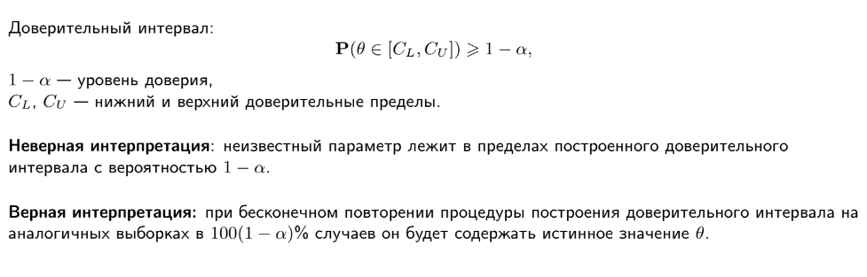


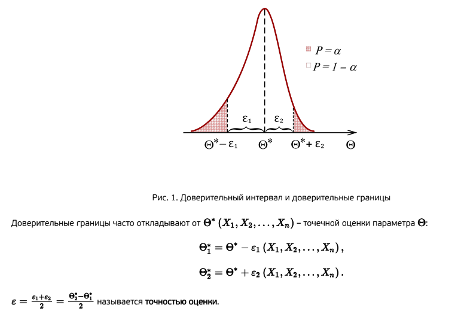


## 2.6. Доверительные интервалы. Интервальные оценки с помощью квантилей. Правило двух сигм. Предсказательный интервал. Отличия предсказательного и доверительного интервалов.

### Доверительные интервалы

**Определение**

Доверительный интервал — это интервал значений, который с заданной вероятностью содержит истинное значение параметра генеральной совокупности. Он используется для оценки неизвестных параметров на основе выборочных данных.

### Интервальные оценки с помощью квантилей

**Определение**

Интервальные оценки с помощью квантилей используются для оценки диапазона значений параметра с заданной вероятностью.

**Пример использования**

Интервальная оценка с использованием квантилей может быть построена для среднего значения, медианы или других параметров на основе выборочных данных и соответствующих квантилей распределений.

### Правило двух сигм

Правило двух сигм основано на нормальном распределении данных и гласит, что примерно 95% всех наблюдений лежат в интервале, равном двум стандартным отклонениям в обе стороны от выборочного среднего.

### Предсказательный интервал

Предсказательный интервал используется для оценки диапазона значений будущего наблюдения или значения случайной величины с учетом неопределенности в данных или модели.

### Отличия предсказательного и доверительного интервалов
**Суть различия**

**Доверительный интервал** оценивает параметры генеральной совокупности с заданной вероятностью.

**Предсказательный интервал** оценивает будущие наблюдения или значения с учетом неопределенности в данных или модели.


## 2.7. Построение доверительных интервалов для среднего. z-интервал. t-интервал

### Построение доверительных интервалов для среднего

Построение доверительных интервалов для среднего состоит в нахождении интервала значений, в котором с определенной степенью уверенности (обычно 95% или 99%) находится истинное среднее значение генеральной совокупности. Этот процесс включает несколько шагов в зависимости от того, известна ли дисперсия генеральной совокупности и от размера выборки. 

### z-интервал

z-интервал используется для построения доверительного интервала для среднего, когда известна дисперсия генеральной совокупности и размер выборки достаточно большой (обычно $n > 30$).

#### Формула
Если $X_1, X_2, \ldots, X_n$ — выборка из нормального распределения с известной дисперсией $\sigma^2$, то доверительный интервал для среднего $\mu$ с уровнем доверия $(1 - \alpha)$ вычисляется по формуле:

$$\left( \overline{X} - z_{\alpha/2} \frac{\sigma}{\sqrt{n}}, \; \overline{X} + z_{\alpha/2} \frac{\sigma}{\sqrt{n}} \right)$$

- $\overline{X}$ — выборочное среднее,
- $\sigma$ — известное стандартное отклонение,
- $n$ — размер выборки,
- $z_{\alpha/2}$ — квантиль стандартного нормального распределения уровня $1 - \frac{\alpha}{2}$.

#### Пример
Пусть $\overline{X} = 100$, $\sigma = 15$, $n = 50$, и уровень доверия $95\%$ ($\alpha = 0.05$):

$$z_{0.025} \approx 1.96$$

$$\left( 100 - 1.96 \cdot \frac{15}{\sqrt{50}}, \; 100 + 1.96 \cdot \frac{15}{\sqrt{50}} \right)$$

$$\left( 100 - 4.15, \; 100 + 4.15 \right)$$

$$\left( 95.85, \; 104.15 \right)$$

### t-интервал

t-интервал используется для построения доверительного интервала для среднего, когда дисперсия генеральной совокупности неизвестна и размер выборки малый (обычно $n \leq 30$).

#### Формула
Если $X_1, X_2, \ldots, X_n$ — выборка из нормального распределения с неизвестной дисперсией, то доверительный интервал для среднего $\mu$ с уровнем доверия $(1 - \alpha)$ вычисляется по формуле:

$$ \left( \overline{X} - t_{\alpha/2, n-1} \frac{S}{\sqrt{n}}, \; \overline{X} + t_{\alpha/2, n-1} \frac{S}{\sqrt{n}} \right) $$

- $\overline{X}$ — выборочное среднее,
- $S$ — выборочное стандартное отклонение,
- $n$ — размер выборки,
- $t_{\alpha/2, n-1}$ — квантиль распределения Стьюдента с $n-1$ степенями свободы.

#### Пример
Пусть $\overline{X} = 100$, $S = 15$, $n = 20$, и уровень доверия $95\%$ ($\alpha = 0.05$):

$$t_{0.025, 19} \approx 2.093$$

$$\left( 100 - 2.093 \cdot \frac{15}{\sqrt{20}}, \; 100 + 2.093 \cdot \frac{15}{\sqrt{20}} \right)$$

$$\left( 100 - 7.01, \; 100 + 7.01 \right)$$

$$\left( 92.99, \; 107.01 \right)$$


## 2.8. Построение доверительных интервалов для доли.

Построение доверительного интервала для доли используется для оценки истинной доли (пропорции) в генеральной совокупности на основе выборочных данных. Доверительный интервал дает диапазон значений, в котором с заданной вероятностью находится истинная доля.

### Формула

Если $p$ — выборочная доля, $n$ — размер выборки, и $z_{\alpha/2}$ — квантиль стандартного нормального распределения уровня $1 - \frac{\alpha}{2}$, то доверительный интервал для истинной доли $P$ с уровнем доверия $(1 - \alpha)$ вычисляется по формуле:

$$\left( p - z_{\alpha/2} \sqrt{\frac{p(1 - p)}{n}}, \; p + z_{\alpha/2} \sqrt{\frac{p(1 - p)}{n}} \right)$$

где:
- $p = \frac{x}{n}$ — выборочная доля (отношение числа успехов $x$ к общему числу наблюдений $n$),
- $z_{\alpha/2}$ — квантиль стандартного нормального распределения уровня $1 - \frac{\alpha}{2}$.

### Пример
Пусть $x = 120$ — число успехов, $n = 200$ — размер выборки, и уровень доверия $95\%$ ($\alpha = 0.05$):

- Выборочная доля:

  $$p = \frac{120}{200} = 0.60$$

- Квантиль стандартного нормального распределения:

  $$z_{0.025} \approx 1.96$$

- Доверительный интервал:

  $$\left( 0.60 - 1.96 \sqrt{\frac{0.60 \cdot (1 - 0.60)}{200}}, \; 0.60 + 1.96 \sqrt{\frac{0.60 \cdot (1 - 0.60)}{200}} \right)$$

  $$\left( 0.60 - 1.96 \sqrt{\frac{0.24}{200}}, \; 0.60 + 1.96 \sqrt{\frac{0.24}{200}} \right)$$

  $$\left( 0.60 - 1.96 \sqrt{0.0012}, \; 0.60 + 1.96 \sqrt{0.0012} \right)$$

  $$\left( 0.60 - 1.96 \cdot 0.0346, \; 0.60 + 1.96 \cdot 0.0346 \right)$$

  $$\left( 0.60 - 0.0678, \; 0.60 + 0.0678 \right)$$

  $$\left( 0.5322, \; 0.6678 \right)$$

Таким образом, с уровнем доверия $95\%$ истинная доля находится в интервале от $0.5322$ до $0.6678$.

## Условия применения
- Размер выборки должен быть достаточно большим, чтобы центральная предельная теорема была применима (обычно $np \geq 5$ и $n(1 - p) \geq 5$).
- Выборка должна быть случайной и независимой.


## 2.9. Построение доверительных интервалов для двух долей

Построение доверительного интервала для разности двух долей используется для оценки разности между двумя пропорциями (долями) в двух независимых выборках. Доверительный интервал дает диапазон значений, в котором с заданной вероятностью находится истинная разность долей.

### Формула
Пусть $p_1$ и $p_2$ — выборочные доли из двух независимых выборок размером $n_1$ и $n_2$ соответственно, и $z_{\alpha/2}$ — квантиль стандартного нормального распределения уровня $1 - \frac{\alpha}{2}$. Тогда доверительный интервал для разности истинных долей $P_1 - P_2$ с уровнем доверия $(1 - \alpha)$ вычисляется по формуле:

$$\left( (p_1 - p_2) - z_{\alpha/2} \sqrt{\frac{p_1(1 - p_1)}{n_1} + \frac{p_2(1 - p_2)}{n_2}}, \; (p_1 - p_2) + z_{\alpha/2} \sqrt{\frac{p_1(1 - p_1)}{n_1} + \frac{p_2(1 - p_2)}{n_2}} \right)$$

где:
- $p_1 = \frac{x_1}{n_1}$ — выборочная доля первой выборки (отношение числа успехов $x_1$ к общему числу наблюдений $n_1$),
- $p_2 = \frac{x_2}{n_2}$ — выборочная доля второй выборки (отношение числа успехов $x_2$ к общему числу наблюдений $n_2$),
- $z_{\alpha/2}$ — квантиль стандартного нормального распределения уровня $1 - \frac{\alpha}{2}$.

### Пример
Пусть $x_1 = 120$ — число успехов в первой выборке размером $n_1 = 200$, $x_2 = 150$ — число успехов во второй выборке размером $n_2 = 250$, и уровень доверия $95\%$ ($\alpha = 0.05$):
- Выборочная доля первой выборки:

  $$p_1 = \frac{120}{200} = 0.60$$

- Выборочная доля второй выборки:

  $$p_2 = \frac{150}{250} = 0.60$$

- Квантиль стандартного нормального распределения:

  $$z_{0.025} \approx 1.96$$

- Доверительный интервал:

  $$\left( (0.60 - 0.60) - 1.96 \sqrt{\frac{0.60(1 - 0.60)}{200} + \frac{0.60(1 - 0.60)}{250}}, \; (0.60 - 0.60) + 1.96 \sqrt{\frac{0.60(1 - 0.60)}{200} + \frac{0.60(1 - 0.60)}{250}} \right)$$

  $$\left( 0 - 1.96 \sqrt{\frac{0.24}{200} + \frac{0.24}{250}}, \; 0 + 1.96 \sqrt{\frac{0.24}{200} + \frac{0.24}{250}} \right)$$

  $$\left( 0 - 1.96 \sqrt{0.0012 + 0.00096}, \; 0 + 1.96 \sqrt{0.0012 + 0.00096} \right)$$

  $$\left( 0 - 1.96 \sqrt{0.00216}, \; 0 + 1.96 \sqrt{0.00216} \right)$$

  $$\left( 0 - 1.96 \cdot 0.0465, \; 0 + 1.96 \cdot 0.0465 \right)$$

  $$\left( -0.0911, \; 0.0911 \right)$$

Таким образом, с уровнем доверия $95\%$ истинная разность долей находится в интервале от $-0.0911$ до $0.0911$.

### Условия применения
- Размер выборок должен быть достаточно большим, чтобы центральная предельная теорема была применима (обычно $n_1 p_1 \geq 5$, $n_1 (1 - p_1) \geq 5$, $n_2 p_2 \geq 5$, и $n_2 (1 - p_2) \geq 5$).
- Выборки должны быть случайными и независимыми.


## 2.10. Бутстреп и бутстреповский доверительный интервал.

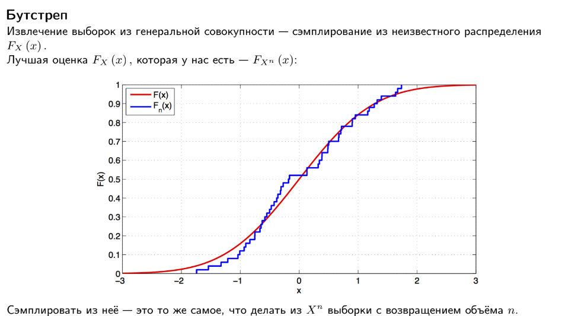


## Бутстреп и бутстреповский доверительный интервал

Бутстреп (bootstrap) — это метод, который используется для оценки распределения выборочной статистики путём многократного извлечения выборок из исходной выборки с возвращением. Он позволяет оценивать стандартные ошибки и доверительные интервалы для различных статистик без необходимости предполагать конкретное распределение исходной генеральной совокупности.

### Принцип работы бутстрепа:

1. **Исходная выборка**: Представляет собой набор данных, доступных для анализа.

2. **Ресемплирование с замещением**: Из исходной выборки случайным образом выбираются выборки того же размера, что и исходная, с замещением (то есть одни и те же элементы могут попасть в бутстрепную выборку несколько раз).

3. **Вычисление статистики интереса**: На каждой бутстрепной выборке вычисляется статистика интереса (например, среднее значение, медиана, стандартное отклонение и т.д.).

4. **Формирование распределения**: Собираются значения статистики интереса из множества бутстрепных выборок.

5. **Оценка доверительного интервала**: На основе полученного распределения вычисляются квантили для получения доверительного интервала заданного уровня.

### Преимущества бутстрепа:

- **Непараметрический метод**: Не требует предположений о форме распределения исходной генеральной совокупности.
- **Универсальность**: Может быть применён для оценки практически любой статистики, включая квантили, корреляции, регрессионные коэффициенты и другие.
- **Робастность**: Обычно дает хорошие результаты даже при наличии небольших выборок или выбросов.

### Пример бутстреповского доверительного интервала:

Предположим, что у нас есть выборка размера $n$, и мы хотим построить 95%-й бутстреповский доверительный интервал для среднего значения. Мы бы ресемплировали выборки из исходной выборки, вычисляли бы среднее значение на каждой бутстрепной выборке и затем находили бы 2.5% и 97.5% квантили полученного распределения для получения доверительного интервала.


## БИЛЕТ №3

## 3. **Множественная проверка гипотез, поправки, плюсы и минусы использования**
# ---

**Теория:**

- Проблема множественной проверки: увеличение ложноположительных результатов.
- **Поправки**:
  - Метод Бонферрони.
  - Метод Холма.
  - FDR (False Discovery Rate).
  
- **Плюсы и минусы**:
  - Плюсы: уменьшение ложных открытий.
  - Минусы: уменьшение статистической мощности.

**Код:**

```python
from statsmodels.stats.multitest import multipletests

# Генерация p-значений
p_values = np.random.uniform(0, 0.1, 20)
adjusted_p = multipletests(p_values, method='bonferroni')[1]

print("Оригинальные P-значения:", p_values)
print("Поправленные P-значения:", adjusted_p)
```

# ---


# Билет №4(здесь мало инфы про регуляризацию и борьбу с выбросами)
## 4. Линейная регрессия, метод наименьших квадратов, регуляризация, борьба с выбросами

# ---

**Теория:**

- Линейная регрессия:
  \( y = \beta_0 + \beta_1 x + \epsilon \)
  
- Метод наименьших квадратов:
  - Минимизирует сумму квадратов отклонений.

- Регуляризация:
  - L1-регуляризация (Lasso)
  - L2-регуляризация (Ridge)

**Код:**

```python
from sklearn.linear_model import LinearRegression, Ridge
from sklearn.model_selection import train_test_split
from sklearn.metrics import mean_squared_error

# Генерация данных
X = np.random.rand(100, 1) * 10
y = 3 * X.squeeze() + np.random.randn(100) * 3

# Линейная регрессия
model = LinearRegression()
model.fit(X, y)

# Прогноз
y_pred = model.predict(X)

plt.scatter(X, y, alpha=0.6, label="Данные")
plt.plot(X, y_pred, color='r', label="Модель")
plt.legend()
plt.show()

# Регуляризация
ridge = Ridge(alpha=1.0)
ridge.fit(X, y)
ridge_pred = ridge.predict(X)

plt.scatter(X, y, alpha=0.6, label="Данные")
plt.plot(X, ridge_pred, color='g', label="Ridge")
plt.legend()
plt.show()
```
# ---

## 4.1. Метод наименьших квадратов. Коэффициент детерминации. Сравнение двух (и более) уравнений линейной регрессии.

### Метод наименьших квадратов

Метод наименьших квадратов (МНК) используется для нахождения параметров линейной регрессии, минимизируя сумму квадратов отклонений наблюдаемых значений от предсказанных. 

#### Основная формула

Для линейной регрессии вида:

$$y = \beta_0 + \beta_1 x + \epsilon$$

где:
- $y$ — зависимая переменная,
- $x$ — независимая переменная,
- $\beta_0$ и $\beta_1$ — коэффициенты регрессии,
- $\epsilon$ — ошибка.

Метод наименьших квадратов минимизирует сумму квадратов ошибок:

$$S = \sum_{i=1}^{n} (y_i - (\beta_0 + \beta_1 x_i))^2$$

Путем дифференцирования $S$ по $\beta_0$ и $\beta_1$ и приравнивания производных к нулю, получаем следующие нормальные уравнения:

$$\sum_{i=1}^{n} y_i = n\beta_0 + \beta_1 \sum_{i=1}^{n} x_i$$

$$\sum_{i=1}^{n} x_i y_i = \beta_0 \sum_{i=1}^{n} x_i + \beta_1 \sum_{i=1}^{n} x_i^2$$

Решив систему этих уравнений, мы находим $\beta_0$ и $\beta_1$.

#### Коэффициент детерминации ($R^2$)

Коэффициент детерминации $R^2$ измеряет долю вариации зависимой переменной, объясняемой регрессионной моделью.

$$R^2 = 1 - \frac{SS_{res}}{SS_{tot}}$$

где:
- $SS_{res}$ — сумма квадратов остатков (ошибок),
- $SS_{tot}$ — общая сумма квадратов (вариация зависимой переменной).

$$SS_{res} = \sum_{i=1}^{n} (y_i - \hat{y}_i)^2$$

$$SS_{tot} = \sum_{i=1}^{n} (y_i - \bar{y})^2$$

Значение $R^2$ варьируется от 0 до 1. Чем ближе значение $R^2$ к 1, тем лучше модель объясняет вариацию данных.

### Сравнение двух (и более) уравнений линейной регрессии

Для сравнения двух или более уравнений линейной регрессии используются различные подходы, включая сравнение коэффициентов регрессии и тестирование значимости различий между моделями.

#### 1. Сравнение коэффициентов регрессии

Сравнение коэффициентов регрессии между двумя моделями можно осуществить с помощью теста гипотез. Например, для проверки гипотезы о равенстве двух коэффициентов $\beta_1$ и $\beta_2$ из двух моделей:

$$H_0: \beta_{1,1} = \beta_{1,2}$$

$$H_1: \beta_{1,1} \neq \beta_{1,2}$$

#### 2. Тестирование значимости различий между моделями

Для проверки значимости различий между моделями можно использовать F-тест:

$$F = \frac{(SS_{res1} - SS_{res2}) / (df_1 - df_2)}{SS_{res2} / df_2}$$

где:
- $SS_{res1}$ и $SS_{res2}$ — сумма квадратов остатков для первой и второй модели,
- $df_1$ и $df_2$ — степени свободы для первой и второй модели.

Если значение $F$ превышает критическое значение для заданного уровня значимости, нулевая гипотеза отвергается, что указывает на значимые различия между моделями.

#### Пример

Предположим, у нас есть данные о продажах ($y$) и рекламе ($x$) для двух разных регионов. Мы строим две модели линейной регрессии для каждого региона:

Модель 1: $y_1 = \beta_{0,1} + \beta_{1,1} x + \epsilon_1$

Модель 2: $y_2 = \beta_{0,2} + \beta_{1,2} x + \epsilon_2$

1. **Расчет коэффициентов регрессии:**
   Используя метод наименьших квадратов, находим $\beta_{0,1}, \beta_{1,1}$ для первой модели и $\beta_{0,2}, \beta_{1,2}$ для второй модели.

2. **Вычисление $R^2$:**
   Вычисляем $R^2$ для обеих моделей, чтобы оценить, какая модель лучше объясняет вариацию данных.

3. **Сравнение моделей:**
   Применяем F-тест для проверки значимости различий между двумя моделями. Если нулевая гипотеза отвергается, это указывает на значимые различия между двумя регрессионными моделями.

Этот процесс позволяет оценить, насколько хорошо каждая модель описывает данные и существуют ли значимые различия между различными регрессионными моделями.


## 4.2. Множественная регрессия. Тестирование гипотез для множественной регрессии. Коэффициент детерминации. Мультиколлинеарность.

### Множественная регрессия

Множественная регрессия расширяет простую линейную регрессию, включив в модель несколько независимых переменных. Формула множественной регрессии выглядит следующим образом:

$$y = \beta_0 + \beta_1 x_1 + \beta_2 x_2 + \ldots + \beta_k x_k + \epsilon$$

где:
- $y$ — зависимая переменная,
- $x_1, x_2, \ldots, x_k$ — независимые переменные,
- $\beta_0, \beta_1, \beta_2, \ldots, \beta_k$ — коэффициенты регрессии,
- $\epsilon$ — ошибка.

### Тестирование гипотез для множественной регрессии

#### Тестирование значимости модели

Нулевая гипотеза ($H_0$): Все коэффициенты $\beta_1, \beta_2, \ldots, \beta_k$ равны нулю.
Альтернативная гипотеза ($H_1$): По крайней мере, один из коэффициентов $\beta_i$ не равен нулю.

Для тестирования этой гипотезы используется F-тест:

$$F = \frac{(SSR / k)}{(SSE / (n - k - 1))}$$

где:
- $SSR$ (Sum of Squares Regression) — сумма квадратов регрессии,
- $SSE$ (Sum of Squares Error) — сумма квадратов ошибок,
- $k$ — число независимых переменных,
- $n$ — общее число наблюдений.

Если $F$ превышает критическое значение, нулевая гипотеза отвергается, что означает, что модель значима.

#### Тестирование значимости отдельных коэффициентов

Нулевая гипотеза ($H_0$): Коэффициент $\beta_i = 0$.
Альтернативная гипотеза ($H_1$): Коэффициент $\beta_i \neq 0$.

Для тестирования этой гипотезы используется t-тест:

$$t = \frac{\hat{\beta}_i}{SE(\hat{\beta}_i)}$$

где $\hat{\beta}_i$ — оценка коэффициента $\beta_i$, $SE(\hat{\beta}_i)$ — стандартная ошибка коэффициента.

Если $|t|$ превышает критическое значение, нулевая гипотеза отвергается, что означает, что данный коэффициент значим.

### Коэффициент детерминации ($R^2$)

Коэффициент детерминации $R^2$ измеряет долю вариации зависимой переменной, объясняемой регрессионной моделью:

$$R^2 = 1 - \frac{SSE}{SST}$$

где:
- $SSE$ (Sum of Squares Error) — сумма квадратов ошибок,
- $SST$ (Total Sum of Squares) — общая сумма квадратов.

Значение $R^2$ варьируется от 0 до 1. Чем ближе значение $R^2$ к 1, тем лучше модель объясняет вариацию данных.

### Мультиколлинеарность

Мультиколлинеарность возникает, когда независимые переменные в модели сильно коррелированы друг с другом. Это может привести к нестабильности оценок коэффициентов регрессии и затруднить интерпретацию результатов.

#### Признаки мультиколлинеарности

1. **Высокие значения коэффициентов корреляции** между независимыми переменными.
2. **Высокие стандартные ошибки** коэффициентов регрессии.
3. **Низкие значения t-статистики** для значимых переменных.
4. **Высокие значения показателя VIF (Variance Inflation Factor)**:

   $$VIF = \frac{1}{1 - R_j^2}$$

   где $R_j^2$ — коэффициент детерминации для регрессии $x_j$ на остальные независимые переменные. Если $VIF > 10$, это указывает на серьезную мультиколлинеарность.

#### Методы борьбы с мультиколлинеарностью

1. **Удаление одной из коррелированных переменных.**
2. **Снижение размерности данных** с помощью методов, таких как анализ главных компонент (PCA).
3. **Регуляризация** (например, Ridge регрессия или Lasso регрессия), которая добавляет штраф за большие значения коэффициентов.

### Пример множественной регрессии

Предположим, у нас есть данные о продажах ($y$), рекламе на телевидении ($x_1$) и рекламе в интернете ($x_2$). Мы хотим построить модель множественной регрессии, чтобы предсказать продажи на основе рекламы.

1. **Модель:**

   $$y = \beta_0 + \beta_1 x_1 + \beta_2 x_2 + \epsilon$$

2. **Оценка коэффициентов:**
   Используя метод наименьших квадратов, находим $\beta_0, \beta_1, \beta_2$.

3. **Тестирование гипотез:**
   Проверяем значимость модели и отдельных коэффициентов с помощью F-теста и t-тестов.

4. **Вычисление $R^2$:**
   Оцениваем, насколько хорошо модель объясняет вариацию данных.

5. **Проверка на мультиколлинеарность:**
   Рассчитываем VIF для независимых переменных и проверяем наличие мультиколлинеарности.

6. **Интерпретация результатов:**
   Анализируем значимость переменных и их вклад в предсказание продаж.

Этот процесс позволяет построить и оценить модель множественной регрессии, а также принять меры для улучшения ее качества при необходимости.


## 4.3. Анализ остатков регрессии. Критерий Дарбина-Уотсона. Критерий Харке-Бера. Критерий Бройша-Пагана. Требования к выборке для проведения регрессионного анализа.

### Анализ остатков регрессии

Анализ остатков регрессии необходим для проверки соответствия модели регрессии предположениям и выявления возможных проблем. Основные этапы анализа остатков включают проверку на:

1. **Нормальность остатков**
2. **Гомоскедастичность (постоянная дисперсия остатков)**
3. **Автокорреляцию остатков**
4. **Отсутствие мультиколлинеарности**

### Критерий Дарбина-Уотсона

Критерий Дарбина-Уотсона (DW-тест) используется для обнаружения автокорреляции остатков. Нулевая гипотеза заключается в отсутствии автокорреляции:

$$H_0: \text{Нет автокорреляции}$$

Статистика Дарбина-Уотсона рассчитывается следующим образом:

$$d = \frac{\sum_{t=2}^n (e_t - e_{t-1})^2}{\sum_{t=1}^n e_t^2}$$

где $e_t$ — остатки регрессионной модели в момент времени $t$.

Значение $d$ варьируется от 0 до 4:
- $d \approx 2$ указывает на отсутствие автокорреляции.
- $d < 2$ указывает на положительную автокорреляцию.
- $d > 2$ указывает на отрицательную автокорреляцию.

### Критерий Харке-Бера

Критерий Харке-Бера (JB-тест) проверяет нормальность распределения остатков. Нулевая гипотеза заключается в нормальности остатков:

$$H_0: \text{Остатки нормальны}$$

Статистика Харке-Бера определяется следующим образом:

$$JB = \frac{n}{6} \left(S^2 + \frac{(K - 3)^2}{4}\right)$$

где:
- $n$ — размер выборки,
- $S$ — коэффициент асимметрии остатков,
- $K$ — коэффициент эксцесса остатков.

Если значение JB-статистики велико и превышает критическое значение, нулевая гипотеза отвергается, что указывает на ненормальность распределения остатков.

### Критерий Бройша-Пагана

Критерий Бройша-Пагана (BP-тест) используется для проверки гетероскедастичности (непостоянной дисперсии) остатков. Нулевая гипотеза заключается в гомоскедастичности:

$$H_0: \text{Гомоскедастичность (постоянная дисперсия)}$$

Процедура теста:
1. Оцените регрессию и получите остатки $e_t$.
2. Постройте вспомогательную регрессию: $e_t^2 = \alpha_0 + \alpha_1 x_{1t} + \alpha_2 x_{2t} + \ldots + \alpha_k x_{kt} + u_t$.
3. Рассчитайте статистику BP-теста:

$$BP = n \cdot R^2$$

где $n$ — размер выборки, $R^2$ — коэффициент детерминации вспомогательной регрессии.

Если значение BP-статистики велико и превышает критическое значение, нулевая гипотеза отвергается, что указывает на наличие гетероскедастичности.

### Требования к выборке для проведения регрессионного анализа

Для корректного проведения регрессионного анализа должны выполняться следующие предположения:

1. **Линейность**: Зависимость между зависимой и независимыми переменными должна быть линейной.
2. **Независимость наблюдений**: Наблюдения должны быть независимыми друг от друга.
3. **Нормальность остатков**: Остатки регрессионной модели должны быть нормально распределены.
4. **Гомоскедастичность**: Дисперсия остатков должна быть постоянной.
5. **Отсутствие мультиколлинеарности**: Независимые переменные не должны быть сильно коррелированы между собой.
6. **Отсутствие автокорреляции**: Остатки не должны быть автокоррелированы.

Если данные не соответствуют этим предположениям, могут быть использованы различные методы для коррекции модели, такие как трансформация переменных, регуляризация или использование более сложных моделей.

### Пример

Предположим, у нас есть данные о продажах ($y$) и двух независимых переменных: реклама на телевидении ($x_1$) и реклама в интернете ($x_2$). Мы строим модель множественной регрессии:

$$y = \beta_0 + \beta_1 x_1 + \beta_2 x_2 + \epsilon$$

1. **Оценка модели**:
   Используя метод наименьших квадратов, находим $\beta_0, \beta_1, \beta_2$.

2. **Анализ остатков**:
   Проверяем нормальность остатков с помощью критерия Харке-Бера, гомоскедастичность с помощью критерия Бройша-Пагана и автокорреляцию с помощью критерия Дарбина-Уотсона.

3. **Выводы**:
   Если предположения выполняются, делаем выводы о значимости модели и коэффициентов. Если предположения нарушаются, принимаем меры для улучшения модели, такие как трансформация переменных или применение более сложных методов анализа.


## 4.4. Требования к выборке для проведения регрессионного анализа. Нелинейная регрессия. ANCOVA.

### Требования к выборке для проведения регрессионного анализа

Для корректного проведения регрессионного анализа необходимо выполнение ряда предположений и требований к выборке:

1. **Линейность**: Зависимость между зависимой и независимыми переменными должна быть линейной. Это можно проверить с помощью графического анализа (например, диаграммы рассеяния).

2. **Независимость наблюдений**: Наблюдения должны быть независимыми друг от друга. Нарушение этого предположения может привести к неверным выводам.

3. **Нормальность остатков**: Остатки регрессионной модели должны быть нормально распределены. Это предположение можно проверить с помощью графиков нормального распределения остатков или тестов на нормальность (например, теста Харке-Бера).

4. **Гомоскедастичность**: Дисперсия остатков должна быть постоянной. Гомоскедастичность можно проверить с помощью графика остатков против предсказанных значений или с помощью теста Бройша-Пагана.

5. **Отсутствие мультиколлинеарности**: Независимые переменные не должны быть сильно коррелированы между собой. Это предположение проверяется с помощью анализа корреляционной матрицы или расчета показателя VIF (Variance Inflation Factor).

6. **Отсутствие автокорреляции**: Остатки не должны быть автокоррелированы. Это предположение проверяется с помощью критерия Дарбина-Уотсона.

### Нелинейная регрессия

Нелинейная регрессия используется для моделирования зависимостей, которые не являются линейными. Формула нелинейной регрессии может выглядеть следующим образом:

$$
y = f(x_1, x_2, \ldots, x_k; \beta_1, \beta_2, \ldots, \beta_k) + \epsilon
$$

где $f$ — нелинейная функция, зависящая от независимых переменных $x_1, x_2, \ldots, x_k$ и параметров $\beta_1, \beta_2, \ldots, \beta_k$.

#### Пример модели нелинейной регрессии

Полиномиальная регрессия:

$$y = \beta_0 + \beta_1 x + \beta_2 x^2 + \ldots + \beta_k x^k + \epsilon$$

Экспоненциальная регрессия:

$$y = \beta_0 e^{\beta_1 x} + \epsilon$$

Логистическая регрессия:

$$P(y=1) = \frac{1}{1 + e^{-(\beta_0 + \beta_1 x)}}$$

### ANCOVA (анализ ковариации)

ANCOVA (Analysis of Covariance) — это метод, который объединяет дисперсионный анализ (ANOVA) и регрессионный анализ для изучения влияния одной или нескольких независимых категориальных переменных на зависимую переменную, при этом контролируя влияние одной или нескольких непрерывных ковариат (ковариационных переменных).

#### Основная модель ANCOVA

$$y_{ij} = \mu + \tau_i + \beta (x_{ij} - \bar{x}) + \epsilon_{ij}$$

где:
- $y_{ij}$ — значение зависимой переменной для $j$-го наблюдения в $i$-й группе,
- $\mu$ — общая средняя,
- $\tau_i$ — эффект $i$-й группы,
- $\beta$ — коэффициент регрессии для ковариаты $x_{ij}$,
- $x_{ij}$ — значение ковариаты для $j$-го наблюдения в $i$-й группе,
- $\bar{x}$ — среднее значение ковариаты,
- $\epsilon_{ij}$ — ошибка.

#### Шаги проведения ANCOVA

1. **Проверка предположений**: Линейность отношения между ковариатой и зависимой переменной, гомоскедастичность и нормальность остатков.
2. **Проведение ANOVA**: Оценка значимости категориальных переменных.
3. **Регрессионный анализ**: Оценка значимости ковариат.
4. **Оценка модели ANCOVA**: Оценка общей модели, включающей как категориальные переменные, так и ковариаты.

### Пример ANCOVA

Предположим, что мы исследуем влияние вида рекламы (телевизионная реклама, интернет-реклама) на продажи, контролируя влияние бюджета рекламы.

1. **Категориальная переменная**: Вид рекламы (телевизионная реклама, интернет-реклама).
2. **Ковариата**: Бюджет рекламы.
3. **Зависимая переменная**: Продажи.

Модель ANCOVA будет выглядеть следующим образом:

$$\text{Продажи} = \mu + \tau_{\text{вид рекламы}} + \beta (\text{Бюджет рекламы} - \bar{\text{Бюджет рекламы}}) + \epsilon$$

В этой модели мы оцениваем, как вид рекламы влияет на продажи, контролируя влияние бюджета рекламы.

ANCOVA позволяет учесть влияние непрерывных переменных и улучшить оценку влияния категориальных переменных, что делает его полезным инструментом для более точного анализа данных в различных областях исследования.


# БИЛЕТ №5
## 5. --- **Кластеризация, типы: метрические, модельные, иерархические, плюсы/минусы. Гиперпараметры, методы поиска гиперпараметров, внешняя и внутренняя оценка качества.**

# ---

**Теория:**

- **Кластеризация**:
  - Разделение данных на группы (кластеры) на основе сходства.
  
- **Типы кластеризации**:
  1. **Метрическая** (например, K-средних):
     - Использует расстояние между точками.
     - Плюсы: простота.
     - Минусы: чувствительность к шуму и выбросам.
  2. **Модельная** (например, Gaussian Mixture Models):
     - Предполагает вероятностную модель для кластеров.
     - Плюсы: более гибкие.
     - Минусы: сложность выбора модели.
  3. **Иерархическая**:
     - Построение дерева кластеров (дендрограммы).
     - Плюсы: визуализация.
     - Минусы: вычислительная сложность.

- **Гиперпараметры**:
  - Количество кластеров (K).
  - Расстояния (евклидово, косинусное).

- **Методы оценки качества кластеризации**:
  - **Внутренние**: силуэт, инерция.
  - **Внешние**: ARI, NMI (если известна разметка).

**Код:**

```python
from sklearn.cluster import KMeans
from sklearn.metrics import silhouette_score
from sklearn.datasets import make_blobs

# Генерация данных
X, y = make_blobs(n_samples=300, centers=4, cluster_std=0.6, random_state=42)

# K-средних
kmeans = KMeans(n_clusters=4, random_state=42)
y_kmeans = kmeans.fit_predict(X)

# Визуализация
plt.scatter(X[:, 0], X[:, 1], c=y_kmeans, cmap='viridis', alpha=0.6)
plt.scatter(kmeans.cluster_centers_[:, 0], kmeans.cluster_centers_[:, 1], s=300, c='red', marker='X')
plt.title("Кластеризация K-средних")
plt.show()

# Силуэт
sil_score = silhouette_score(X, y_kmeans)
print(f"Силуэт оценка: {sil_score}")
```

# ---


# БИЛЕТ №6
6. ### 6. **Тематическое моделирование, принципы построения, LSA/LDA, примеры**

# ---

**Теория:**

- **Тематическое моделирование**:
  - Выделение тем из текстов.

- **LSA (Latent Semantic Analysis)**:
  - Метод SVD для анализа взаимосвязи терминов.

- **LDA (Latent Dirichlet Allocation)**:
  - Генеративная вероятностная модель.

**Код:**

```python
from sklearn.decomposition import LatentDirichletAllocation
from sklearn.feature_extraction.text import CountVectorizer

# Пример текстов
texts = [
    "I love programming and data analysis.",
    "Data science is about analyzing data and building models.",
    "Python is great for machine learning.",
    "Machine learning and AI are transforming industries."
]

# Векторизация текста
vectorizer = CountVectorizer(stop_words='english')
X = vectorizer.fit_transform(texts)

# Тематическое моделирование с LDA
lda = LatentDirichletAllocation(n_components=2, random_state=42)
lda.fit(X)

# Вывод тем
terms = vectorizer.get_feature_names_out()
for idx, topic in enumerate(lda.components_):
    print(f"Тема {idx + 1}:")
    print([terms[i] for i in topic.argsort()[-5:]])
```

# ---


# БИЛЕТ №7
## 7. **Преобразование Фурье, Хаара, Уолша, Хартли. Прямое и обратное преобразование**

# ---

**Теория:**

- **Преобразование Фурье**:
  - Разложение сигнала на синусоиды разной частоты.

  #### Преобразование Фурье и характеристическая функция
Преобразование Фурье нормального распределения дает другую нормальную функцию, а характеристическая функция нормального распределения имеет вид $e^{it\mu - \frac{1}{2}t^2\sigma^2}$, где i - мнимая единица.

#### Бесконечная делимость
Нормальное распределение бесконечно делимо, что означает, что для любого положительного целого числа $n$ можно найти $n$ независимых идентично распределённых случайных величин, сумма которых имеет то же нормальное распределение.

#### Максимальная энтропия
Нормальное распределение имеет максимальную энтропию среди всех непрерывных распределений с заданными средним и дисперсией.


- **Преобразование Хаара**:
  - Применяется в сжатии данных, используется в вейвлет-анализе.

- **Преобразование Уолша**:
  - Использует прямоугольные функции.

- **Преобразование Хартли**:
  - Альтернатива преобразованию Фурье, используется в цифровой обработке сигналов.

**Код:**

```python
import numpy as np
import matplotlib.pyplot as plt

# Преобразование Фурье
t = np.linspace(0, 1, 1000, endpoint=False)
signal = np.sin(2 * np.pi * 5 * t) + np.sin(2 * np.pi * 10 * t)

# Прямое преобразование
fft = np.fft.fft(signal)
freq = np.fft.fftfreq(len(t), d=t[1] - t[0])

# Визуализация
plt.subplot(2, 1, 1)
plt.plot(t, signal)
plt.title("Оригинальный сигнал")

plt.subplot(2, 1, 2)
plt.plot(freq[:len(freq)//2], np.abs(fft[:len(fft)//2]))
plt.title("Спектр (FFT)")
plt.show()
```

# ---


# БИЛЕТ №8
## 8. Методы спектральной оценки - оконное преобразование Фурье и параметрическое спектральное оценивание

# ---

**Теория:**

- **Оконное преобразование Фурье**:
  - Анализ частот с учетом временной локализации.
  - Использует окно (например, Ханна, Хэмминга).

- **Параметрическое спектральное оценивание**:
  - Основано на моделях ARMA.

**Код:**

```python
from scipy.signal import spectrogram, hamming

# Оконное преобразование Фурье
f, t, Sxx = spectrogram(signal, fs=1000, window=hamming(256), nperseg=256)

plt.pcolormesh(t, f, 10 * np.log10(Sxx), shading='gouraud')
plt.title("Спектрограмма")
plt.ylabel("Частота (Hz)")
plt.xlabel("Время (s)")
plt.colorbar(label="Амплитуда (dB)")
plt.show()
```

# ---


# БИЛЕТ №9
## 9. Выбросы, методы их поиска и борьбы с ними

# ---

**Теория:**

- **Выбросы**:
  - Наблюдения, которые значительно отклоняются от остальных данных.
  
- **Методы обнаружения выбросов**:
  - Статистические:
    - Z-оценка.
    - Метод межквартильного размаха (IQR).
  - Машинное обучение:
    - Isolation Forest.
    - DBSCAN.

- **Борьба с выбросами**:
  - Удаление.
  - Замена средним/медианой.
  - Трансформация (например, логарифмирование).

**Код:**

```python
from sklearn.ensemble import IsolationForest
from scipy.stats import zscore

# Генерация данных
np.random.seed(42)
data = np.random.normal(50, 10, 100)
data = np.append(data, [100, 120])  # Добавление выбросов

# Z-оценка
z_scores = np.abs(zscore(data))
outliers = np.where(z_scores > 3)
print(f"Выбросы по Z-оценке: {data[outliers]}")

# Isolation Forest
clf = IsolationForest(contamination=0.05, random_state=42)
outlier_pred = clf.fit_predict(data.reshape(-1, 1))

plt.scatter(range(len(data)), data, c=outlier_pred, cmap='coolwarm', label='Выбросы')
plt.title("Обнаружение выбросов с помощью Isolation Forest")
plt.legend()
plt.show()
```

# ---


# БИЛЕТ №10
## 10. Повышение и понижение размерностей, методы. Проклятие размерностей

# ---

**Теория:**

- **Проклятие размерностей**:
  - Увеличение размерности данных делает анализ сложным из-за разреженности.

- **Методы повышения размерности**:
  - Полиномиальные признаки.
  - Преобразование с ядровыми методами.

- **Методы понижения размерности**:
  - PCA (Principal Component Analysis).
  - t-SNE.
  - UMAP.

**Код:**

```python
from sklearn.decomposition import PCA
from sklearn.manifold import TSNE
from sklearn.datasets import make_classification

# Генерация данных
X, y = make_classification(n_samples=500, n_features=10, random_state=42)

# PCA
pca = PCA(n_components=2)
X_pca = pca.fit_transform(X)

plt.scatter(X_pca[:, 0], X_pca[:, 1], c=y, cmap='viridis', alpha=0.6)
plt.title("Понижение размерности с помощью PCA")
plt.show()

# t-SNE
tsne = TSNE(n_components=2, random_state=42)
X_tsne = tsne.fit_transform(X)

plt.scatter(X_tsne[:, 0], X_tsne[:, 1], c=y, cmap='viridis', alpha=0.6)
plt.title("Понижение размерности с помощью t-SNE")
plt.show()
```

# ---


# БИЛЕТ №11
## 11. Методы дискретизации, метод интервалов, оценка выбросов по P-value, задача оттока, методы решения, использование теоремы Байеса для оценки вероятности оттока

# ---

**Теория:**

- **Дискретизация**:
  - Разделение непрерывных данных на интервалы.
  - Методы:
    - Равные интервалы.
    - Квантильная дискретизация.

- **Оценка выбросов по P-value**:
  - Проверка, что значения попадают в доверительный интервал.

- **Задача оттока**:
  - Задача классификации клиентов, которые уйдут.

- **Теорема Байеса**:
  \( P(A|B) = \frac{P(B|A)P(A)}{P(B)} \).

**Код:**

```python
from sklearn.preprocessing import KBinsDiscretizer
from sklearn.naive_bayes import GaussianNB

# Дискретизация
data = np.random.rand(100) * 100
kbins = KBinsDiscretizer(n_bins=5, encode='ordinal', strategy='uniform')
data_binned = kbins.fit_transform(data.reshape(-1, 1))

plt.hist(data, bins=20, alpha=0.7)
plt.title("Оригинальные данные")
plt.show()

plt.hist(data_binned, bins=5, alpha=0.7)
plt.title("Дискретизированные данные")
plt.show()

# Байес для задачи оттока
X = np.random.rand(100, 2)
y = np.random.choice([0, 1], size=100)  # Клиенты: 0 - остались, 1 - ушли
model = GaussianNB()
model.fit(X, y)
proba = model.predict_proba([[0.5, 0.5]])
print(f"Вероятность оттока: {proba[0][1]:.2f}")
```

# ---


# БИЛЕТ №12
## 12. Корреляция - линейная и ранговая. Значимость корреляции и размер эффекта. Интерпретация корреляции
# ---

**Теория:**

- **Типы корреляции**:
  - Линейная (Пирсона).
  - Ранговая (Спирмена).

- **Значимость корреляции**:
  - Проверяется с помощью P-value.

- **Размер эффекта**:
  - Интерпретируется через коэффициент корреляции \( r \).

**Код:**

```python
from scipy.stats import pearsonr, spearmanr

# Генерация данных
np.random.seed(42)
x = np.random.rand(100)
y = 2 * x + np.random.normal(0, 0.1, 100)

# Линейная корреляция
r, p = pearsonr(x, y)
print(f"Коэффициент корреляции Пирсона: {r}, P-значение: {p}")

# Ранговая корреляция
r_rank, p_rank = spearmanr(x, y)
print(f"Коэффициент корреляции Спирмена: {r_rank}, P-значение: {p_rank}")
```

# ---


## 12.1. Коэффициент корреляции. Диаграмма рассеяния. Коэффициент корреляции Пирсона. Факторы, влияющие на коэффициент корреляции. Требование к выборке для тестирования гипотезы о коэффициенте корреляции Пирсона.

### F-критерий

F-критерий используется для сравнения дисперсий двух или более выборок. Основное применение F-критерия - это дисперсионный анализ (ANOVA), который позволяет оценить, существуют ли значимые различия между средними значениями нескольких групп.

F-статистика рассчитывается как отношение между межгрупповой дисперсией ($MS_{between}$) и внутригрупповой дисперсией ($MS_{within}$):

$$F = \frac{MS_{between}}{MS_{within}}$$

где

$$MS_{between} = \frac{SS_{between}}{df_{between}}$$

$$MS_{within} = \frac{SS_{within}}{df_{within}}$$

и

$$SS_{between}$$ 

сумма квадратов между группами,

$$SS_{within}$$ 

сумма квадратов внутри групп,

$$df_{between}$$ 

степени свободы между группами,

$$df_{within}$$ 

степени свободы внутри групп.

### Связь с двухвыборочным t-критерием Стьюдента

Двухвыборочный t-критерий Стьюдента используется для сравнения средних значений двух независимых выборок. Существует связь между t-критерием и F-критерием: если у нас есть две группы, то квадрат t-статистики эквивалентен F-статистике.

Если $t$ - t-статистика для сравнения двух групп, то

$$F = t^2$$

Это означает, что если у нас есть только две группы, ANOVA и t-тест дадут идентичные результаты.

#### Требования к выборкам для проведения дисперсионного анализа (ANOVA)

Для корректного применения дисперсионного анализа необходимо соблюдать следующие условия:

1. **Независимость наблюдений**: Каждый участник или объект должен быть измерен независимо от других.
2. **Нормальность распределения**: Данные в каждой группе должны быть приблизительно нормально распределены. Это особенно важно для малых выборок.
3. **Гомогенность дисперсий**: Дисперсии в разных группах должны быть приблизительно равны. Это можно проверить с помощью теста Левена или Бартлетта.
4. **Равное число наблюдений** (желательно, но не обязательно): ANOVA более устойчива, если в каждой группе одинаковое количество наблюдений.

Если данные не соответствуют этим условиям, могут быть использованы непараметрические методы, такие как критерий Краскела-Уоллиса.

#### Пример

Предположим, у нас есть три группы студентов, каждая из которых прошла тест на время реакции. Мы хотим определить, различаются ли средние времена реакции между этими группами.

1. **Данные:**

   Группа 1: $[20, 22, 19, 24, 20]$  
   Группа 2: $[28, 30, 27, 31, 29]$  
   Группа 3: $[22, 24, 19, 23, 21]$

2. **Вычисление средних значений:**

   $$\bar{X}_1 = 21, \bar{X}_2 = 29, \bar{X}_3 = 21.8, \bar{X} = 23.27$$

3. **Вычисление дисперсий:**

   - **Межгрупповая дисперсия:**

     $$SS_{between} = 5(21 - 23.27)^2 + 5(29 - 23.27)^2 + 5(21.8 - 23.27)^2 = 153.35$$

   - **Внутригрупповая дисперсия:**

     $$SS_{within} = (20-21)^2 + (22-21)^2 + (19-21)^2 + (24-21)^2 + (20-21)^2 + \ldots + (23-21.8)^2 + (21-21.8)^2 = 32$$

4. **Вычисление F-статистики:**

   $$MS_{between} = \frac{SS_{between}}{df_{between}} = \frac{153.35}{2} = 76.675$$

   $$MS_{within} = \frac{SS_{within}}{df_{within}} = \frac{32}{12} = 2.667$$

   $$F = \frac{MS_{between}}{MS_{within}} = \frac{76.675}{2.667} = 28.75$$

5. **Сравнение с критическим значением F** для заданного уровня значимости и степеней свободы (можно использовать F-таблицы или программное обеспечение).

#### Результаты:

Если $F$-статистика больше критического значения, нулевая гипотеза отвергается, что означает, что есть статистически значимые различия между средними значениями групп.


# БИЛЕТ №13
## 13. Поиск правил. Алгоритмы Apriori и FP-tree

# ---

**Теория:**

- **Алгоритм Apriori**:
  - Используется для поиска ассоциативных правил.
  - Частые наборы создаются поэтапно.

- **Алгоритм FP-tree**:
  - Более эффективный метод для построения частых наборов, использующий дерево.

**Код:**

```python
from mlxtend.frequent_patterns import apriori, association_rules
import pandas as pd

# Пример данных
data = pd.DataFrame({
    'milk': [1, 0, 1, 1],
    'bread': [1, 1, 1, 0],
    'butter': [0, 1, 0, 1],
})

# Частые наборы
frequent_itemsets = apriori(data, min_support=0.5, use_colnames=True)

# Правила
rules = association_rules(frequent_itemsets, metric="lift", min_threshold=1.0)
print(rules)
```

# ---

