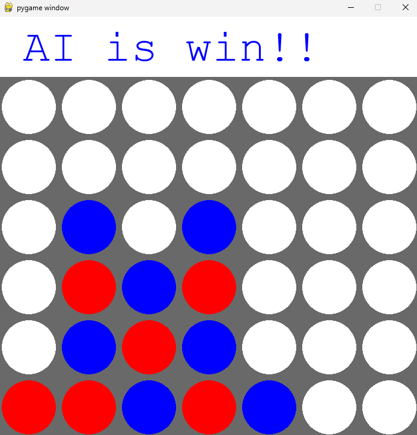

---

# Игра "Четыре в ряд"

В данном проекте реализована классическая игра "Четыре в ряд" (Connect Four), где один из игроков — человек, а другой — искусственный интеллект (AI). Игра происходит на прямоугольном поле размером 6x7 клеток, и цель игры — выстроить 4 фишки подряд по горизонтали, вертикали или диагонали. Искусственный интеллект использует алгоритм Minimax с альфа-бета отсечением для принятия решений и выбора наилучшего хода.

---

## Архитектура игры

1. **Графический интерфейс (GUI)**: 
   - Отображает игровое поле, фишки игроков и предоставляет интерфейс для взаимодействия с пользователем.

   
2. **Игровая логика**: 
   - Управляет ходом игры, проверяет условия победы, завершения игры и взаимодействует с искусственным интеллектом.
   
3. **Алгоритм искусственного интеллекта**: 
   - Использует алгоритм Minimax с альфа-бета отсечением для выбора оптимальных ходов.

### Игровое поле

Игровое поле представляет собой сетку размером 6x7. Каждая клетка может быть либо пустой, либо содержать фишку одного из игроков. Игроки поочередно опускают фишки в одну из колонок. Фишка падает до самой нижней пустой клетки в выбранной колонке.

### Логика работы игры

1. **Ход игры**:
   - Игроки поочередно делают ходы. Игрок управляет игрой с помощью мыши, выбирая столбец для падения своей фишки. После того как игрок сделал ход, ход передается искусственному интеллекту.
   - Игроки не могут делать ходы в полные колонки.

2. **Проверка победы**:
   - После каждого хода проверяется, не выстроены ли 4 фишки подряд по горизонтали, вертикали или диагонали. Если это так, игра завершена, и выводится сообщение о победе.

3. **Завершение игры**:
   - Игра завершается, когда один из игроков выиграл или если на поле нет доступных ходов, что приводит к ничьей.

---

**Основные функции**:
- **`minimax`**: Рекурсивная функция, которая ищет лучший ход для AI. Использует альфа-бета отсечение для повышения эффективности.
- **`score_position`**: Оценка текущего состояния игрового поля. Используется для выбора наилучшего хода AI.
- **`evaluate_window `**: Оценивает значение группы из 4 ячеек (window) на доске для заданного игрока. Возвращает числовую оценку.
- **`winning_move `**: Проверяет, есть ли у игрока с указанной фишкой (piece) 4 последовательных фишки по горизонтали, вертикали или диагонали. Возвращает True, если игрок выиграл.
- **`is_terminal_node `**: Проверяет, завершена ли игра. Возвращает True, если кто-то выиграл или нет доступных ходов.
- **`get_valid_location `**: Возвращает список столбцов, куда можно сделать ход.
---
