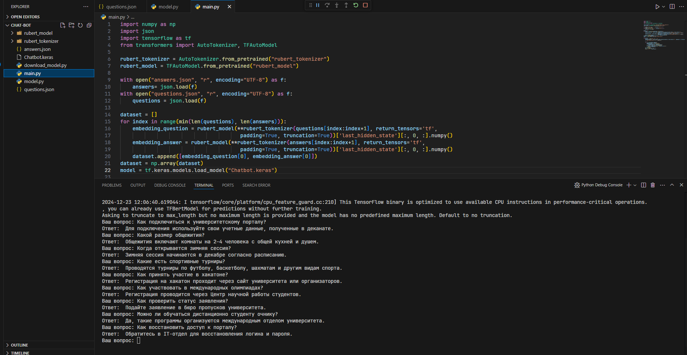

# Установка необходимых библиотек 
```bash
pip install -r requirements.txt
```

# Установка предобученной модели руберт 
```bash
python download_model.py
```

# Запускаем main.py 
```bash
python main.py
```

# Демонстрация работы
